# Export and import bots using solutions (preview)

[!INCLUDE [cc-beta-prerelease-disclaimer](includes/cc-beta-prerelease-disclaimer.md)]

You can export and import bots using [solutions](/power-platform/alm/solution-concepts-alm) so you can move your bots across multiple [environments](https://docs.microsoft.com/power-platform/admin/environments-overview).

This can be useful if you use different environments for different purposes, or you employ ring-deployment methodologies. For example, you might have a specific environment where you internally test and validate bots, another environment where you test bots for only a subset of users, and a final production environment where you share bots with customers and end users.

> 
> [!VIDEO https://www.microsoft.com/en-us/videoplayer/embed/RE4CsHl]
> 

>[!NOTE]
>You can only import and export bots with the Power Virtual Agents web app. The feature is not available in the Power Virtual Agents app in Microsoft Teams.

## Prerequisites

- [!INCLUDE [Medical and emergency usage](includes/pva-usage-limitations.md)]

- A maker will require the minimum System Customizer security roles to use this feature. Learn more about [configuring user security to resources in an environment](https://docs.microsoft.com/power-platform/admin/database-security).

- You must have at least one bot already in the new or existing environments where you are importing to. This ensures you have the correct configuration in your environment when you import a bot.

> [!IMPORTANT]
> These features are in preview, which means they are made available to you before general availability so you can test and evaluate them and provide feedback to Microsoft.  
>  
> Previews may employ reduced or different privacy, security, or compliance commitments than commercial versions. As such, previews are not meant to be used with any "live" or production Customer Data, Personal Data, or other data that is subject to heightened compliance requirements. Any use of "live" data is at your sole risk and it is your sole responsibility to notify your end users that they should not include sensitive information with their use of the Preview.  
>  
> These previews, and any support Microsoft may elect to provide, are provided "as-is," "with all faults," "as available," and without warranty.

## Add a bot to a solution

You use solutions to export bots from one environment and import them into another. The solution acts as a "carrier" for the bots, and you can import multiple bots in one solution. You must have at least one bot in a solution to properly export and import it to another environment.

**Create a solution to manage export and import**

1. Sign in to the Power Virtual Agents bot you want to export. 

1. Select **Settings**, and then select **General settings**.

    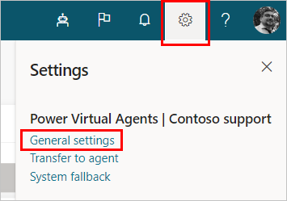

2. Under **Export/import bot**, select **Go to Power Apps Solutions**.
 
    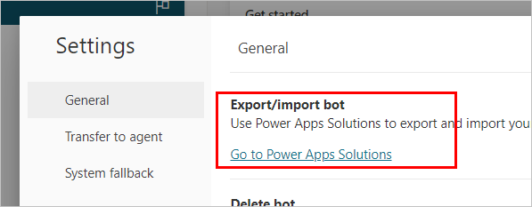

3. Sign in to Power Apps and select **New solution**. Enter the information for each of the fields as described in this table, then select **Create**.

    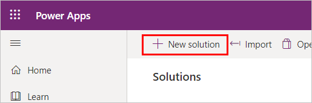

    Field | Description
    -- | --
    Display name | The name that is shown in the list of solutions. You can change this later.
    Name | The unique name of the solution. This is generated using the value you enter in the **Display name** field. You can edit this before you save the solution, but after you save the solution, you can’t change it.
    Publisher | You can select the default publisher or create a new publisher. We recommend that you create a publisher that you can use consistently across the environments where you'll use the solution. For more information, go to [Solution publisher overview](/powerapps/maker/common-data-service/change-solution-publisher-prefix).
    Version | Enter a number for the version of your solution. This is only important if you export your solution. The version number will be included in the file name when you export the solution.

If you don't see the **Export/import bot** section under **Settings**, you will need to upgrade your bot. Select **Upgrade bot**. This should take a few minutes.

> [!IMPORTANT]
> Only follow these steps if you don't see an option to **Export/import bot** on the Power Virtual Agents settings page.  
>
> Newly created bots don’t require an upgrade, and won't show an option to upgrade them.

> [!NOTE]
> A notice might appear that says, "The upgrade is taking longer than expected. No action is required." If the notice does not disappear after 10 minutes, try refreshing your browser. You can continue working on your bot without losing updates. 
>  
> If you still see the warning after a few days, create a support request with your Bot ID. Admins can use [Help + support](/power-platform/admin/get-help-support) in the Power Platform admin center to create a support request.  
>  
> 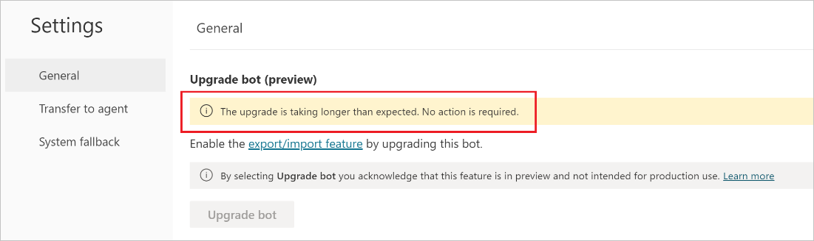

**Add your bot to the solution**

1. Select the solution you want to add your bot to.

1. Select **Add existing** and choose **Chatbot**.

    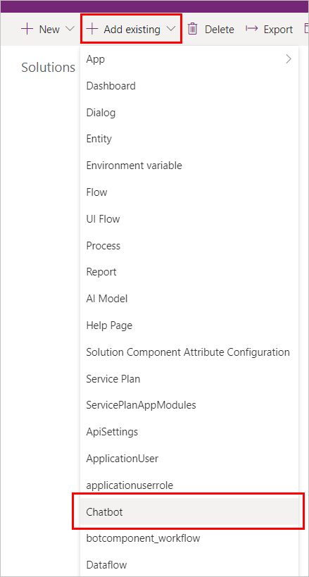

2. On the **Add existing chatbots** panel, select the bot (or bots) you want to export. Select **Add**.

    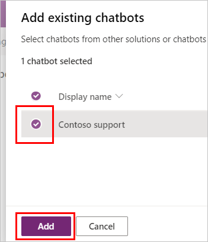

3. On the filter on the top menu, select **Chatbot** to see the bot (or bots) you've added to the solution. Selecting the name of the bot will open it in the Power Virtual Agents portal.

3. If your bot doesn’t have [skills](configuration-add-skills.md), you don't need to complete this step. 

    If your bot does have skills, you need to add the respective environment variables in the solution. Each skill has two environment variables: `AppID` and `manifestURL`.

    1. Select the solution you want to add your bot to.

    1. Select **Add existing** and choose **Environment variables**.

    1. On the **Add existing environment variables** panel, select the environment variables for your bot’s skills. Each skill has two environment variables. The environment variables **Display name** column will show the bot name in square brackets. For example, *[Bot name] Skill name*.

        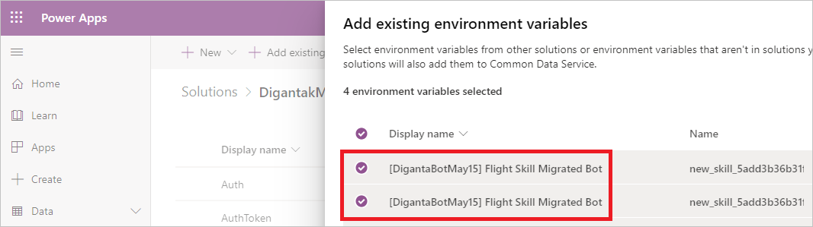
 
    1. Select the environment variables of the bot’s skills. 

    1. Select **Next** to add them to the solution.

> [!NOTE]
> Removing a bot from a solution doesn't remove its components from a solution. Removal of the components should be done separately.  

> [!WARNING]
> Do not remove any unmanaged chatbot subcomponents (such as bot topics) directly from the Power Apps portal, unless you have removed the bot itself from the solution.  
> 
> You should only make changes to topics from within the Power Virtual Agents portal.  
>
> Removing or changing the chatbot subcomponents from within Power Apps will cause the export and import to fail.

## Export and import bots

You export and import bots by exporting and importing their containing solutions from one environment to another.

**Export the solution with your bot**

1. In the list of solutions, select the solution that contains the bot you want to export. Select **Export**. 

    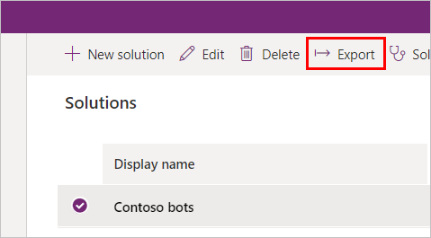

    > [!NOTE]
    > You can't export managed solutions. When you create a solution, by default it will not be managed. If you change it to a managed solution you won't be able to export it, and will need to create a new solution.
    >
    > If your bot has a large number of components (for example, more than 250 topics or more than 100 entities), export the bot using classic Power Apps portal instead.
    >
    > 

2. Select **Next** in the **Before you export** panel.

4. The **Export this solution** panel appears. Enter or select from the following options, and then select **Export**:
    
    Option | Description
    - | -
    Version number | Power Virtual Agents automatically increments your solution version while displaying the current version. You can accept the default version or enter your own.
    Export as | Select the package type, either **Managed** or **Unmanaged**. Learn more about [managed and unmanaged solutions](/power-platform/alm/solution-concepts-alm#managed-and-unmanaged-solutions).

The export can take several minutes to complete. Once finished, a .zip file will be downloaded by your web browser. The file will be in the format `SolutionName_Version_ManagementType.zip`.

**Import the solution with your bot**

> [!NOTE]
> You must have at least one bot already in the new or existing environments where you are importing to. This ensures you have the correct configuration in your environment when you import a bot.

1. On the top menu, select the environment name and select the environment where you want to import your bot.

    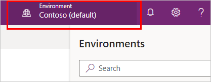

2. Go to the **Solutions** tab, and on the command bar, select **Import**.
 
    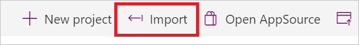

1. In the **Select Solution Package** window, select **Choose File** and locate the .zip file that contains the solution with the bot you want to import.

1. Select **Next**.

1. Information about the solution is displayed. Select **Import**.

1. You might need to wait a few moments while the import completes. View the results and then select **Close**.

    If the import isn’t successful, you'll see a report showing any errors or warnings that were captured. Select **Download Log File** to capture details about what caused the import to fail in an XML file.  

      
    The most common cause for an import to fail is that the solution didn't contain some required components. For example, you might not have any upgraded bots in the environment.

1. After import, open the imported solution. Use the filter menu on the top menu to select **Environment variable**. Enter the values as described in the section **[Add a bot to a solution](#add-a-bot-to-a-solution)**.

1. If your bot has any of the following, you need to configure them after importing for the first time:

    - [Power Automate flows](/power-automate/import-flow-solution): Configure any flow connections for the first time. You don't need to reconfigure the flow connections for subsequent imports of the bot when updating the flow.  
    
      If you import a solution containing a bot that leverages Power Automate, and any new flows are included in that import operation, you'll need to visit the Power Virtual Agents portal and select the bot. 
      
    - [Skills](advanced-use-skills.md): Add the values for the skills’ environment variables.
    - [End-user authentication](configuration-end-user-authentication.md): Configure end-user authentication in the bot so it can take actions on the user’s behalf. The bot can be set up with any [OAuth2 identity provider](/azure/active-directory/develop/v2-oauth2-auth-code-flow), such as Azure Active Directory (Azure AD), a Microsoft account, or Facebook.
    - [Customer service hand-off](advanced-hand-off.md): Configure external services that hand off bot escalations to a human agent.
    - Multichannel: Configure external channels, such as Facebook, and internal non-Power Virtual Agents services, such as Microsoft Teams:

        - [Facebook documentation](publication-add-bot-to-facebook.md)
        - [Microsoft Teams documentation](publication-add-bot-to-microsoft-teams.md)

1. Use the filter menu to select **Chatbot**. You can then select the bot's name to open the bot in the Power Virtual Agents portal. You can also navigate to the portal directly and open the imported bot under the environment you imported to.

    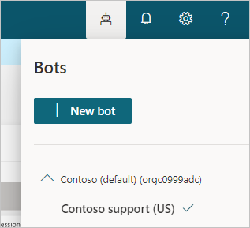

> [!IMPORTANT]
> You must [publish your newly imported bot](publication-fundamentals-publish-channels.md) before it can be shared.

## Upgrade or update a solution with a chatbot

If you add new bot components (such as new topics or flows) to your bot in the PVA portal, you will also need to update those changes to the bot in your target environment. You do this by adding the components to the unmanaged solution by selecting **Add required components** under the **...** menu next to the name of the bot.

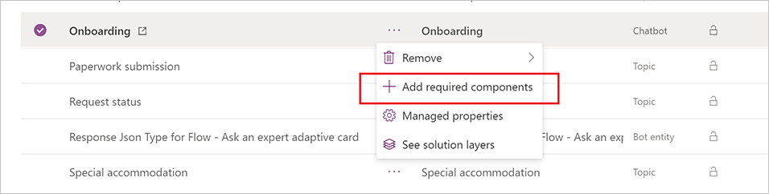

There are times when you need to update an existing managed solution. To learn more, go to [Upgrade or update a solution](/powerapps/maker/common-data-service/update-solutions).

## Remove an unmanaged layer from a managed chatbot 
Managed and unmanaged solutions exist at different levels within a Microsoft Dataverse environment. To learn more, go to [Solution layers](/powerapps/maker/common-data-service/solution-layers).

A managed component (for example, a topic or flow) gets an unmanaged "Active" layer when you edit it, which means you won't see the latest changes after you deploy the solution. 
 
To show the latest updates, you'll need to remove the unmanaged "Active" layer. 
 
Use the **See solution layers** option to see all solutions that a component is a part of. You can also see one "Active" solution on top of all other solutions if you have changed something directly.

1. Select **See solution layers** from the contextual **...** menu next to the component name.

   

2. In the **Solution layer** page, select the unmanaged layer and then select **Remove unmanaged layer** to remove the layer. 

 
 
