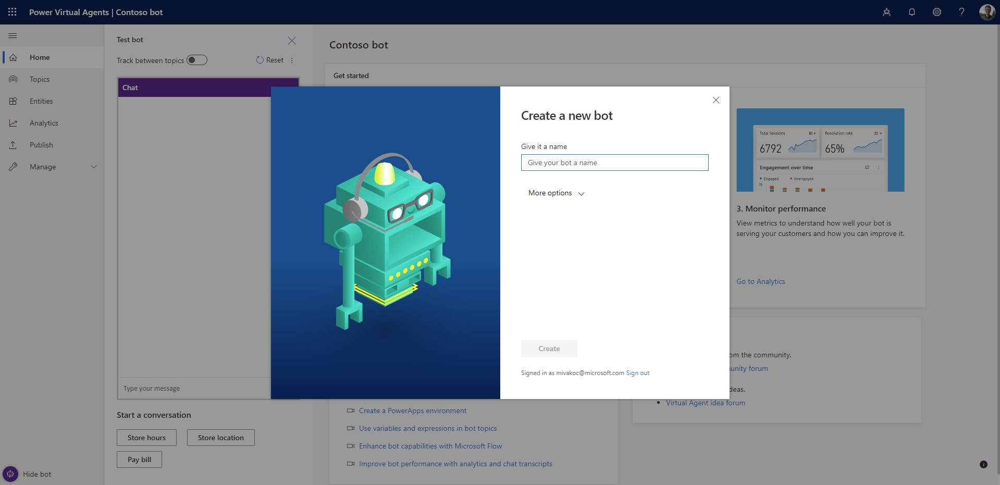

# Create your first Power Virtual Agents bot

To help get you started and tailor the bot to your specific needs, Power Virtual Agents lets you create a bot using built-in content building blocks containing topics, trigger phrases, and pre-authored bot conversations.

**Create your first bot:**

1. Go to [Power Vrtual Agents marketing page](https://go.microsoft.com/fwlink/?linkid=2106332) and select **Try Preview**. Sign in using your work account.

   If you don't have a license, you can sign up for one by following the prompts.
    
1. In the **Create a new bot** dialog box, enter a name for your bot. This can be something generic to your company or specific to the scenario you are tailoring your bot to.

   

1. Your virtual agent is created in the [default Power Apps environment for your organization or tenant](environments-first-run-experience.md). Usually this is sufficient, but if necessary you can choose a different environment by selecting **More options** to see a list of available environments.
  
1. Select **Create** to begin the bot-building process, which can take up to 15 minutes. 

   > [!NOTE]
   >
   > If you are the first user in an environment creating a bot, it can take up to 15 minutes to finish the creation.
   
During the building process, you'll see a notification at the top of the Power Virtual Agents portal indicating that the bot is still being built.

You can navigate to some tabs during this period, after which the banner will change and you'll have full access to the Power Virtual Agents portal. 
 

## Create additional bots

If you have already created a bot, you can create a new bot by selecting the icon on the title bar to open the **Bots** pane and then selecting **New bot**.

   

## Known issues with creating a bot

When you are creating your bot, you might encounter the following issues.

### Insufficient permissions for the selected environment

In this case, you see this error: "You do not have permissions to any environments. Please get access from an administrator."

You will need to [create a new environment](environments-first-run-experience.md). Use that environment to create your bot.

### The environment I created does not show up in the drop-down menu of Power Virtual Agents

Your environment might not show up in the drop-down menu due to one of the following:
 - The environment doesn't have a database created. To resolve this, go to [admin.powerplatform.com](https://admin.powerplatform.com) to [create a database in your environment](environments-first-run-experience.md#create-an-environment).
 - The environment is created in an unsupported region. Learn more about [supported data locations](data-location.md).
