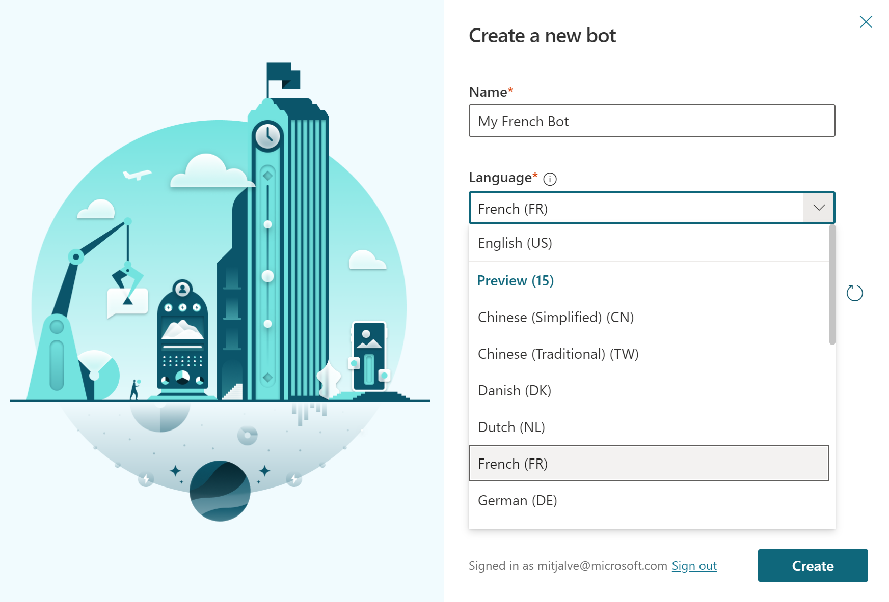
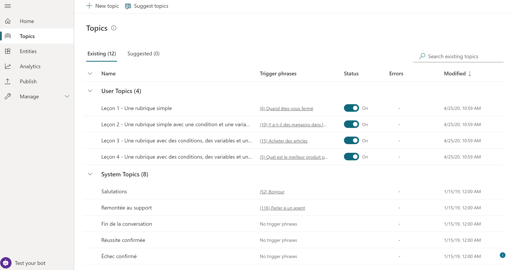
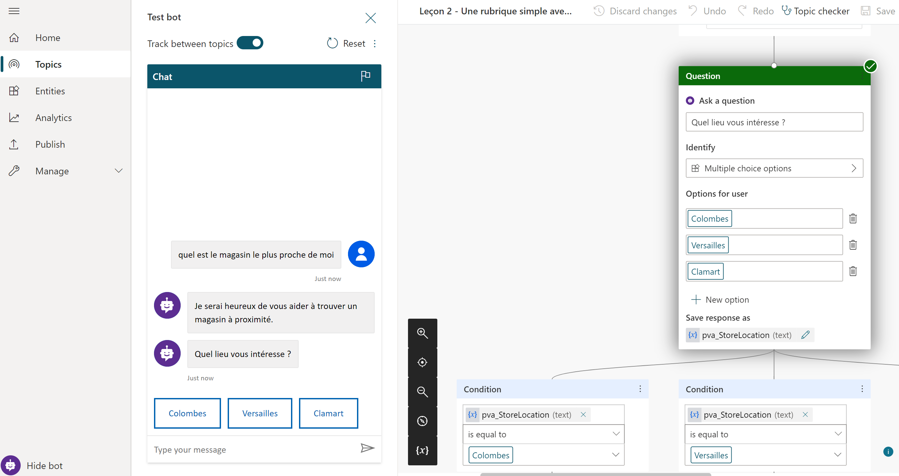

# Language support

[!INCLUDE 

You can create chatbots in Power Virtual Agents in a number of languages. This means your bots can reach a much broader audience and engage with more markets all around the world.

The current Public Preview experience of language expansion support allows bot authors to create a new bot in one of the languages listed below.

## Specify a language for your bot

You can specify the target language when you first [create a bot](authoring-first-bot.md).

**To create a new bot in your target language**

1. On the **Create a new bot** window, select **Language**.

2. Choose the language you want to use. Note that some languages are listed under **Preview**. 

    

## Default content in the target language

Once your new bot has been created, you'll notice that it already has content in the target language, including the **System Topics** and the template **User Topics**.

You can now move on to creating new topics for your bot, authoring bot trigger phrases, and creating bot messages in your target language.

When you've created your own topic in the target language, you can test the bot in the chat canvas and see how it understands user input and responds in the target language.

## List of supported languages

Power Virtual Agents supports the languages in General availability, Preview, and Experimental stages:

- General availability: All elements are localized, including the user interface, menus, tooltips, system and template topics.
- Preview: System and template topics are localized; the user interface, menus, and tooltips are not localized. Some localization issues might occur.
- Experimental: System and template topics are localized; the user interface, menus, and tooltips are not localized. Multiple localization issues might occur.

Language | Support  
  |  
Chinese (Simplified)        | Preview
Chinese (Traditional)       | Preview
Danish                      | Preview
Dutch                       | Preview
English                     | General availability
Experimental                | Experimental
French                      | Preview
German                      | Preview
Hindi                       | Experimental
Indonesian                  | Preview
Italian                     | Preview
Japanese                    | Preview
Korean                      | Experimental
Norwegian                   | Preview
Polish                      | Experimental
Portuguese                  | Preview
Russian                     | Preview
Spanish                     | Preview
Swedish                     | Preview
Turkish                     | Preview

