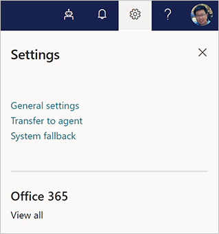
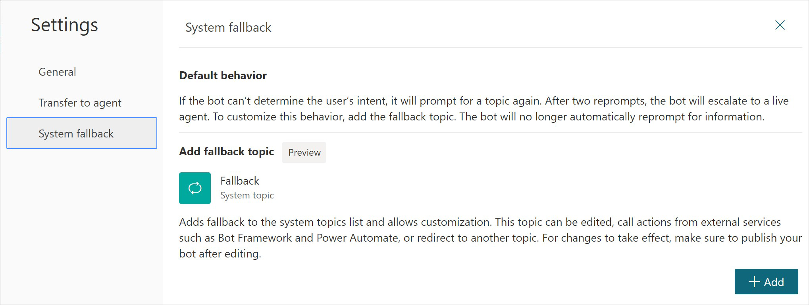
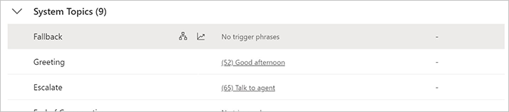
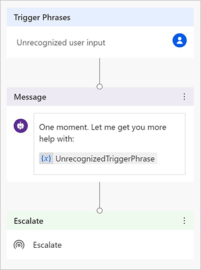
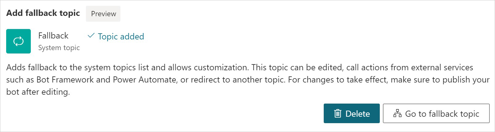

# Configure the system fallback topic in Power Virtual Agents

During a conversation, a Power Virtual Agents bot [triggers the appropriate topic based on the user’s input](authoring-create-edit-topics.md). If the bot can’t determine the user’s intent, it will prompt the user again. After two prompts, the bot will escalate to a live agent through the system **Escalate** topic.

In some scenarios, you may want to customize the bot behavior when no intent is triggered. For example, you could build a catch-all topic to capture unrecognized user intents, or use a topic to call back-end systems or route to existing services. 

You customize fallback by adding the system **Fallback** topic. You can also customize the fallback topic similar to most other system topics.

## Add fallback topic
1.	On the top navigation pane, select the **Settings** cog icon, and then select **System fallback**.

    

2.	Select **“+Add”**.

    
 
A system fallback topic is added. The bot goes to the system fallback topic when the bot can't find an appropriate topic or doesn't understand the user's input. 

A new option will appear on the **Settings** pane under the **System fallback** section: **Go to fallback topic**, which lets you customize the topic.
 
## Customize system fallback topic
After you add the system fallback topic, you can open it by selecting **Go to fallback topic** on the **Settings** pane. 

You’ll also see the **Fallback** topic listed under **System Topics** in the topic list. 

When you open this topic in the authoring canvas, you’ll see the default fallback topic contains two nodes: a **Message** node that rephrases the user input and an **Escalate** node that redirects to a live agent. 

 
You can customize this topic as with any other [system topic](authoring-create-edit-topics.md). You can also use the *UnrecognizedTriggerPhrase* variable that stores the user input the bot couldn't understand. For example, you could use the variable as an input and pass it to a [Power Automate flow](advanced-flow.md) or [Bot Framework Skill](advanced-use-skills.md).

>[!Note]
>The system fallback topic doesn’t have a trigger phrase. As with other system topics, its trigger phrases are not customizable.  

## Reset system fallback behavior by deleting the fallback topic
To reset the system fallback behavior and return it to its default behavior, go to **Settings** and then **System Fallback**. In the System fallback section, use the **Delete** button to remove the fallback topic. 

 
>[!WARNING]
>This will remove the fallback topic and any changes you made to it. 

