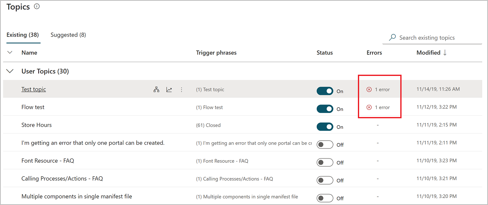
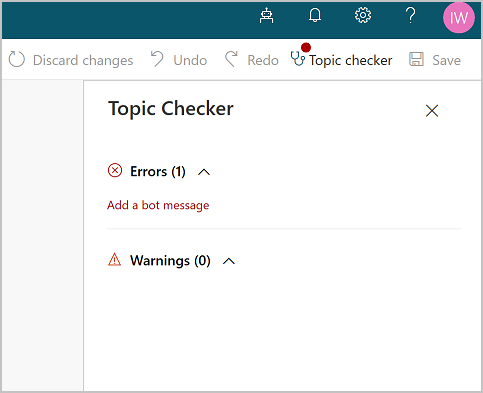
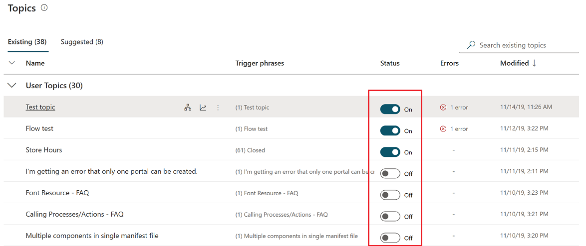

# Manage topics in Power Virtual Agents

As the number of topics in your bot grows, the following features will help you manage your topics so they are visible to end users only when they have been tested and ready to be invoked:

- [Topic errors](#topic-errors)
- [Topic status](#topic-status)
- [Copying a topic](#copying-a-topic)

## Prerequisites

- [!INCLUDE [Medical and emergency usage](includes/pva-usage-limitations.md)]

## Topic errors

The topic authoring canvas validates topics and shows errors and warnings. 

Warnings will not prevent the bot from functioning and will be overlooked while processing. 

Errors should be addressed to avoid unexpected behavior or failure during the chat experience.

You can see the error state of a topic on the Topics list page by clicking on the **Topics** tab. On the Topics list page, the column **Errors** indicates the number of errors found during validation. This does not include warnings since warnings do not prevent the bot from functioning. If there are no errors for a topic, a **-** is shown in the column.

You can click on the error count to see details about the errors. This will open the authoring canvas with the topic checker opened to the first error in the topic. As you fix the errors, they will disappear from the topic checker, either automatically or after saving the topic. 

>[!NOTE]
> You can save topics with errors. The errors will persist until they are addressed in the topic. Topics with errors cannot be deployed to production.

### Types of errors

There are four types of errors that appear in the topic checker and in the authoring canvas:

- *Node*: The entire node is erroneous and is highlighted red.
- *Field*: The field might be missing required data and is highlighted red.
- *Expression*: The expression might be invalid and is highlighted red.
- *Variable deletion*: A variable in a topic was deleted and is highlighted red wherever it was used. This causes the variable to become "orphaned", and it must be either removed or replaced.

## Topic status

Topics can have a status of **On** or **Off**. This refers to their ability to be used or triggered in a bot conversation. 

When a topic is **On**, it will trigger as expected, either as a result of its trigger phrases or when it is redirected to from another topic. The majority of your topics are likely to be in the **On** state.

When a topic is **Off**, it will not trigger at all. This means that if its trigger phrases are used in a bot conversation, it will not trigger, just as if the topic doesn't exist. An **Off** topic will also not be redirected to, even if another topic has specified that it should be.

When a bot is published, all topics (**On** or **Off**) will be published, but the **Off** topics will not trigger. The topics will also not trigger on the channels that the bot is published to, and the topics will not trigger in the test bot. 

>[!TIP]
>Turning a topic to **Off** allows you to work on a particular topic and leave it in a draft state while publishing changes to other topics that are ready to go live. 
>
>Leave the topic that you are still working on in **Off** status before publishing the bot. 

This control is presented as a toggle under the **Status** column. 

By default new topics will be created with their status set to **On**. 

   > [!NOTE]
   >
   > The Topic Checker will identify an error if a topic redirects to an 'off' topic.
   

## Copying a topic

Once you have created a few topics, you may want to use a previous topic as a baseline when creating new topics.

On the topic list page, hover on a topic, select the menu icon and then **Make a copy**. 

As the name suggests, this option creates a duplicate of the selected topic with *(Copy)* appended to the name. All of the topic content - such as the description, trigger phrases, and the entire conversation - is copied over to the new topic.

The new topic appears on either the top or bottom of the **User topics** list, depending on the page sort (ascending or descending). 

A copied topic has a status of **Off** by default when it is copied to avoid confusion on which topic will trigger, since the trigger phrases are the same as the original topic. 

Once you are done editing the new topic, you can turn it **On** to [test it in the Test bot](authoring-test-bot.md) and, when ready, publish the new topic.

There is no limit to the number of times a topic can be copied. A number will be appended to the name and each topic will have its own internal ID.

