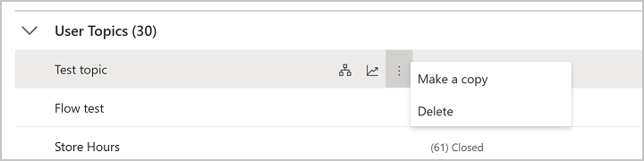

# Manage topics in Power Virtual Agents

> [!div class="op_single_selector"]
> - [Power Virtual Agents web app](authoring-topic-management.md)
> - [Power Virtual Agents app in Microsoft Teams](teams/authoring-topic-management-teams.md)

There are a number of ways you can manage your topics. Power Virtual Agents includes a topic checker that lets you know if there are errors in your topics, you can turn topics on or off so they don't appear to people chatting with your bot, and you can copy or duplicate topics to make it easier to create new ones.

- [Topic errors](#topic-errors)
- [Topic status](#topic-status)
- [Copying a topic](#copying-a-topic)

## Prerequisites

- [!INCLUDE [Medical and emergency usage](includes/pva-usage-limitations.md)]

## Topic errors

When you save a topic, you'll be notified if there are errors or warnings. Warnings won't stop the bot from working, but they may cause individual topics to not work as expected, so you should fix them when you see them.

Errors will prevent the bot from working and must be fixed before you can publish your bot.

:::image type="content" source="media/topics-errors-save.png" alt-text="The message indicates you have errors you should fix.":::

You can see the error state of a topic on the Topics page. 

>[!NOTE]
>The Topics page only shows errors as they will stop your bot from working, unlike warnings.

:::image type="content" source="media/topics-errors.png" alt-text="The topics page identifies the number of errors in your topic.":::

Select the error count to open the authoring canvas to where the first error is. Select **Topic checker** to see a list of the errors. Selecting each error goes directly to the error.  

:::image type="content" source="media/topics-checker.png" alt-text="The topic checker is on the top navigation bar and shows all errors and warnings.":::

>[!NOTE]
> You can save topics with errors. Topics with errors can't be published.

### Types of errors

There are four types of errors that appear in the topic checker and in the authoring canvas:

- *Node*: The entire node is incorrect and is highlighted red.
- *Field*: The field might be missing required data and is highlighted red.
- *Expression*: The expression might be invalid and is highlighted red.
- *Variable deletion*: A variable in a topic was deleted and is highlighted red wherever it was used. This causes the variable to become "orphaned", and it must be either removed or replaced.

## Topic status

Topics can have a status of **On** or **Off**. This refers to their ability to be used or triggered in a bot conversation. 

When a topic is **On**, it will trigger as expected, either as a result of its trigger phrases or when it is redirected to from another topic. The majority of your topics are likely to be in the **On** state.

When a topic is **Off**, it will not trigger at all. This means that if its trigger phrases are used in a bot conversation, it will not trigger, just as if the topic doesn't exist. An **Off** topic will also not be redirected to, even if another topic has specified that it should be.

When a bot is published, all topics (**On** or **Off**) will be published, but the **Off** topics will not trigger. 

>[!TIP]
>Turning a topic to **Off** allows you to work on a particular topic and leave it in a draft state while publishing changes to other topics that are ready to go live.  
>Leave the topic that you are still working on as **Off** before publishing the bot. 

You can change this with the toggle in the **Status** column on the Topics page. 

:::image type="content" source="media/topics-status.png" alt-text="The Status column shows each topic with an On or Off toggle switch.":::

By default new topics will be created with their status set to **On**. 

> [!NOTE]
> The Topic Checker will identify an error if a topic redirects to an 'off' topic.
   

## Copying a topic

Once you have created a few topics, you may want to use a previous topic as a baseline when creating new topics.

On the Topics page, select the menu icon on a topic's name and then **Make a copy**. 

This option creates a duplicate of the selected topic with *(Copy)* added to the name. All of the topic content - such as the description, trigger phrases, and the entire conversation - is copied over to the new topic.

A copied topic has a status of **Off** by default when it is copied to avoid confusion on which topic will trigger, since the trigger phrases are the same as the original topic. 

Once you are done editing the new topic, you can turn it **On** to [test it in the Test bot](authoring-test-bot.md) and, when ready, publish the new topic.

There is no limit to the number of times a topic can be copied. A number will be added to the name and each topic will have its own internal ID.

