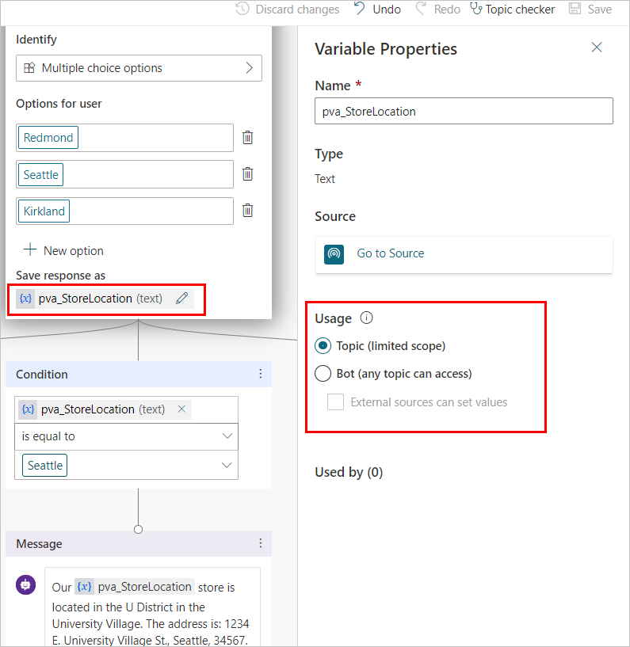
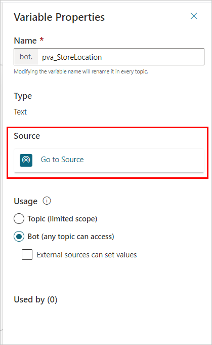
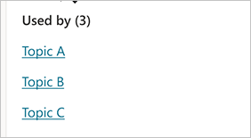
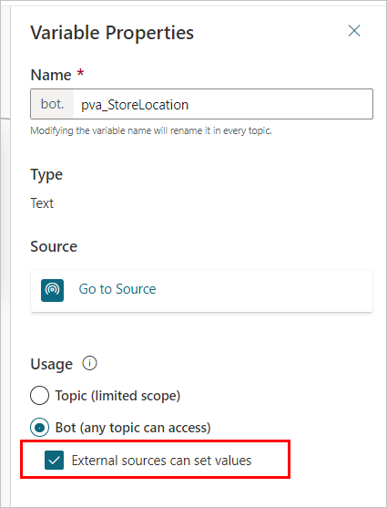

# Reuse variables across topics

[Variables](authoring-variables.md) let you save responses from your customers. For example, you can save a customer's name in a variable called `UserName`. The bot can then address the customer by name as the conversation continues.

By default, a variable’s value can be reused in the topic where this variable gets created. However, In some cases, you may want the bot to use the same value across topics, so that the bot can remember the necessary context when a conversation spans multiple topics. 

For example, in a Welcome topic, the bot asks for the customer’s name and email. Then when the conversation goes to another topic, such as an Appointment Booking topic, you want the bot to remember this customer’s name and email address. 

In some systems, these types of variables are known as **global variables**. In Power Virtual Agents, these variables are called **bot variables**, as they apply across the entire bot.

Bot variables apply during a single user session. You need to specify which variables should be treated as bot variables, to distinguish them from single-use variables. 

## Prerequisites

- [!INCLUDE [Medical and emergency usage](includes/pva-usage-limitations.md)] 

## Set bot variables

After a variable is set as a bot variable, it’ll be available to all topics. 

When you click on the `{x}` button in a message node or question node when composing a bot message, you’ll see the bot variable is available. The variables are sorted in alphabetic order, so you’ll find all bot variables are grouped together under the variable menu. 

When you use a condition node, a flow action node, or a skill node, you’ll also see bot variables available there. 
 
**Reuse a variable across topics by setting is as bot variable**

1. Select any variable in the authoring canvas.

1. On the **Variable properties** pane, under the **Usage** section, select **Bot (any topic can access) **.

1. The variable name will be given a prefix string `bot.`, to differentiate it from the topic level variables. For example, the variable `UserName` is now shown as `bot.UserName`. 

    
 
>[!NOTE]
>A bot variable’s name must be unique across all topics. In the case of a conflict , you’ll need to rename the variable before saving your change. 

## Manage bot variables

After you’ve created a bot variable, you can see where it is first defined as well as what other topics are using it. This can be useful if you’re working on a [newly imported bot](authoring-export-import-bots.md), or if you have multiple variables and [complex topic branching](authoring-create-edit-topics.md#branch-based-on-a-condition).

**Go to the source of a bot variable’s definition**

1. Select any variable in the authoring canvas.

1. In the **Variable properties** pane, select **Go to source**. 

    
 
This will take you to the node in the topic where this variable was created. 

**Find all topics using a bot variable**
1. Select any variable in the authoring canvas.

1. In the **Variable properties** pane, under the **Used by** section, select any of the topics where the variable is used to go straight to that topic and node. 

    
 
## Bot variable initialization

If a bot variable is triggered before it has been initialized (or “filled in”), the bot will automatically trigger the part of the topic where the bot variable is first defined before returning to the original topic. This allows the bot conversation to continue without breaking.  

For example, the customer starts the conversation on the Appointment Booking topic, in which a bot variable `bot.UserName` is used. However, the `bot.UserName` variable is first defined in the Welcome topic. When the bot conversation comes to the point in the Appointment Booking topic where `bot.UserName` is used, the bot will ask for the user’s name as how it’s defined in a question node in the Welcome topic. After the customer answers the question, the conversation will resume the Appointment Booking topic. 
 
## Set a bot variable’s value from external sources

You can set a bot variable to be initialized with an external source. This lets the bot start the conversation with some context. 

For example, a customer brings up a bot chat from your web site, and the site already knows the customer’s name. You let the bot know the user’s name before starting the conversation, so that the bot can have a more intelligent conversation with the customer, without having to repeat the question asking for their names. 

**Set bot variable from external source**

1. Select any variable in the authoring canvas.

1. In the **Variable properties** pane, under the **Usage** section, select the checkbox **External sources can set values**.

1. When embedding your bot on your website, append the variables and their definitions to the bot’s URL as [query string parameters](https://en.wikipedia.org/wiki/Query_string) (in the format of `botURL?variableName1=variableDefinition1&variableName2=variable2Definition2`).

    

    >[!NOTE]
    >The variable name in the query string must match that of the bot variable, without the `bot.` prefix. For example, a bot variable `bot.UserName` must be rendered as `UserName=`.

This will also work for the customers who bring their own [custom canvas](customize-default-canvas.md), through the corresponding APIs<link to the API>. 
 
The following example describes what the process would look like: 

- You have a bot variable named `bot.UserName`. 

- Your bot’s url is *https:// powerva.microsoft.com/webchat/bots/12345*.

- To pass in a user name when starting a bot conversation on a website, you can attach the `UserName=` query string as: *https:// powerva.microsoft.com/webchat/bots/12345?**UserName=Jeff***.

Note that the parameter name is case insensitive. This means `username=Jeff` will also work in the above case. 

## Related links
- [Use variables](authoring-variables.md)
- [Customize the look and feel of the bot](customize-default-canvas.md)

