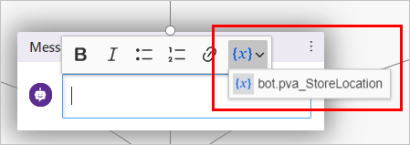
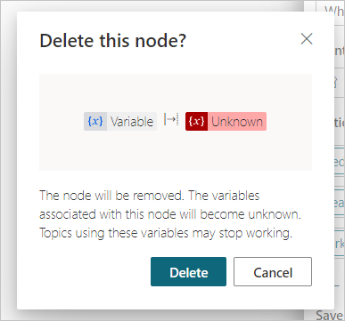

# Reuse variables across topics

Select the version of Power Virtual Agents you're using here:

> [!div class="op_single_selector"]
> - [Power Virtual Agents web app](authoring-variables-bot.md)
> - [Power Virtual Agents app in Microsoft Teams](teams/authoring-variables-bot-teams.md)

[Variables](authoring-variables.md) let you save responses from your customers. For example, you can save a customer's name in a variable called `UserName`. The bot can then address the customer by name as the conversation continues.

By default, a variable's value can only be used in the topic where this variable gets created. However, you might want the bot to use the same value across topics. This means the bot can remember the necessary context when a conversation spans multiple topics. 

For example, in a "Welcome" topic, the bot asks for the customer's name and email. Then when the conversation goes to another topic, such as an "Appointment booking" topic, you want the bot to remember this customer's name and email address. 

In some systems, these types of variables are known as **global variables**. In Power Virtual Agents, these variables are called **bot variables**, because they apply across the entire bot.

Bot variables apply during a single user session. You specify which variables should be treated as bot variables to distinguish them from topic-level variables.

## Prerequisites

- [!INCLUDE [Medical and emergency usage](includes/pva-usage-limitations.md)] 

## Set bot variables

After you set a bot variable, it will be available to all topics. 

When you select the `{x}` button in a message node or question node when you're composing a bot message, you'll see that the bot variable is available. Variables are sorted in alphabetical order, so you'll find that all bot variables are grouped together in the variable menu because they all begin with `bot.`.



When you use a condition node, a flow action node, or a skill node, you'll also see bot variables available there. 
 
**Reuse a variable across topics by setting it as a bot variable:**

1. Select any variable in the authoring canvas.

1. On the **Variable properties** pane, under **Usage**, select **Bot (any topic can access)**.

1. The variable name will be given a prefix string `bot.`, to differentiate it from the topic-level variables. For example, the variable `UserName` is now shown as `bot.UserName`. 

:::image type="content" source="media/bot-variable-set.png" alt-text="Screenshot showing the Variable Properties pane, with the Usage section highlighted":::


>[!NOTE]
>A bot variable's name must be unique across all topics. In the case of a conflict, you'll need to rename the variable before saving your change. 

## Manage bot variables

After you've created a bot variable, you can see where it's first defined and what other topics are using it. This can be useful if you're working on a new bot, or if you have multiple variables and [complex topic branching](authoring-create-edit-topics.md#add-a-condition).

**Go to the source of a bot variable's definition**

1. Select any variable in the authoring canvas.

1. On the **Variable properties** pane, select **Go to source**. 

:::image type="content" source="media/bot-variable-source.png" alt-text="Screenshot showing the Variable Properties pane, with the Go to Source button highlighted":::


This will take you to the node in the topic where the bot variable was created. 

**Find all topics using a bot variable**

1. Select any bot variable in the authoring canvas.

1. On the **Variable properties** pane, in the **Used by** section, select any of the topics where the variable is used to go straight to that topic and node. 

:::image type="content" source="media/bot-variable-used-by.png" alt-text="Screenshot showing the list of topics used by a variable in the Variable Properties pane":::

 
## Bot variable initialization

If a bot variable is triggered before it has been initialized (or "filled in"), the bot will automatically trigger the part of the topic where the bot variable is first defined&mdash;even when it's in a different topic&mdash;before returning to the original topic. This allows the bot to have all the variables filled in without interrupting the conversation.  

For example, the customer starts the conversation on the "Appointment booking" topic, in which a bot variable `bot.UserName` is used. However, the `bot.UserName` variable is first defined in the "Welcome" topic.

When the conversation comes to the point in the "Appointment booking" topic where `bot.UserName` is referenced, the bot will seamlessly pivot to the question node where `bot.UserName` is first defined.

After the customer answers the question, the bot will resume the "Appointment booking" topic. 

## Bot variable behavior when implementing Actions via Power Automate flows or skills

Sometimes, you might use a flow or skill to initialize or fill in a variable in a chatbot.

When a user interacts with the chatbot, however, the variable might be filled in at an earlier point in the conversation, or you may have [already set the variables externally](authoring-variables-bot.md#set-a-bot-variables-value-from-external-sources). 

In this situation, the flow or skill will still run and fill in the variable, overwriting whatever was previously stored in the variable.
 
## Set a bot variable's value from external sources

You can set a bot variable to be initialized with an external source. This lets the bot start the conversation with some context. 

For example, a customer brings up a bot chat from your web site, and the site already knows the customer's name. You let the bot know the user's name before starting the conversation, and the bot can have a more intelligent conversation with the customer without having to ask for their name again.

**Set bot variable from external source**

1. Select any variable in the authoring canvas.

1. On the **Variable properties** pane, in the **Usage** section, select the checkbox **External sources can set values**.

:::image type="content" source="media/bot-variable-external.png" alt-text="Screenshot of the Usage section on the Variable Properties pane, with the Bot option and External sources can set values checkbox both selected":::


1. You can append the variables and their definitions if you're simply [embedding your bot in a simple webpage](publication-connect-bot-to-web-channels.md#custom-website), or you can use a `<script>` code block to call and use variables programatically.

    >[!NOTE]
    >The variable name in the query string must match that of the bot variable, without the `bot.` prefix. For example, a bot variable `bot.UserName` must be rendered as `UserName=`.

In the examples described here, a simple declaration is made for the variables. In a production scenario, you might pass in as the query parameter or variable definition another variable that has already stored the user's name (for example, if you have the user name from a sign-in script).

**To add the variable to an embedded bot**

1. Append the variables and their definitions to the bot's URL as [query string parameters](https://en.wikipedia.org/wiki/Query_string) (in the format of `botURL?variableName1=variableDefinition1&variableName2=variableDefinition2`), for example:


    - You have a bot variable named `bot.UserName`. 

    - Your bot's URL is *https:// powerva.microsoft.com/webchat/bots/12345*.

    - To pass in the user name when starting a bot conversation on a website, you can attach the `UserName=` query string as: *https:// powerva.microsoft.com/webchat/bots/12345?**UserName=Renata***.

2. The parameter name is case-insensitive. This means `username=Renata` will also work in this example. 

**To add the variable to a [custom canvas](customize-default-canvas.md)**

1. In the `<script>` section on the page where you have your bot, define the variables as follows, substituting `variableName1` for the variable name without the `bot.` prefix and `variableDefinition1` for the definition. Separate multiple variables with commas `,`.

    ```html
       const store = WebChat.createStore({}, ({ dispatch }) => next => action => {
         if (action.type === 'DIRECT_LINE/CONNECT_FULFILLED') {
           dispatch({
              type: "WEB_CHAT/SEND_EVENT",
              payload: {
                name: "pvaSetContext",
                value: {
                   "variableName1": "variableDefinition1",
                   "variableName2": "variableDefinition2"
                }
              },
            });
          }
            return next(action);
        });
    ```

2. Within your `<script>` section, call the `store` when you embed your bot, as in the following example where `store` is called just above where `styleOptions` is called (you'll need to replace the `BOT_ID` with your ID):

    ```html
    const BOT_ID = "12345-5678";
    const theURL = "https://powerva.microsoft.com/api/botmanagement/v1/directline/directlinetoken?botId=" + BOT_ID;

    fetch(theURL)
        .then(response => response.json())
        .then(conversationInfo => {
            window.WebChat.renderWebChat(
                {
                    directLine: window.WebChat.createDirectLine({
                        token: conversationInfo.token,
                    }),
                    store,
                    styleOptions
                },
                document.getElementById('webchat')
            );
        })
        .catch(err => console.error("An error occurred: " + err));
    ```
 

## Delete bot variables

When removing a bot variable used in other topics, the references to that variable in the topics will be marked as `Unknown`. 

You'll receive a warning about deleting the bot variable before you can confirm the operation.


  
Nodes that contain references to the deleted bot variable will tell you they contain an unknown variable. 

:::image type="content" source="media/bot-variable-unknown-node.png" alt-text="Screenshot of a node with references to an unknown variable, which are marked as red within the message node's text, and indicated with a warning that says Bot message contains unknown variable":::


Topics with nodes that contain references to deleted bot variables might stop working. Ensure that you remove or correct all the topics that were using the deleted variable before publishing.

## Authentication-related bot variables

Depending on the bot's authentication setup, you will have a set of bot variables associated with the authentication provider available to you. For details about which set of variables are available and how to use them, see the [Add end-user authentication to a Power Virtual Agents bot](advanced-end-user-authentication.md) documentation topic.

## Related links

- [Use variables](authoring-variables.md)
- [Customize the look and feel of the bot](customize-default-canvas.md)
