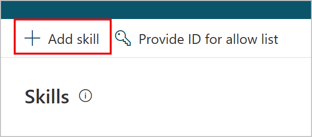

# How to use Skills to extend your virtual agent

You can use developer tools to build Azure Bot Framework Skills and embed them into any topic within a Power Virtual Agents bot.

Skills can be used to embed re-usable converational multi-turn actions to perform complex tasks like booking appointments, managing tasks, and more.

You can also convert your Power Virtual Agents bot into a Skill to let your subject matter experts use them. 

This article is intended for system administrators or IT professionals who are familiar with [Azure Bot Framework Skills](/azure/bot-service/bot-builder-skills-overview?view=azure-bot-service-4.0).

Once you've created and configured your Skill, you can [add it to Power Virtual Agents bot conversations](advanced-use-skills.md).

## Sample skills
You can use some [sample Skills provided by the Azure Bot Framework](/azure/bot-service/bot-builder-skills-overview?view=azure-bot-service-4.0#bot-framework-skills) to get started, or you can create and use your own Skill.

## Configure a Skill for use in Power Virtual Agents
You'll first need to [create a Power Virtual Agents bot](authoring-first-bot.md), and you'll need developers to [create and deploy a new Skill using pro-code tools](https://go.microsoft.com/fwlink/?linkid=2110533).

You'll then need to register the Skill by providing your bot's ID to your Skill developer so they can add it to the allow list.

**Add your bot to Skill's allow list:**

1. In the [Power Virtual Agents portal](https://powerva.microsoft.com), on the side navigation pane, expand the **Manage** menu and select **Skills**.

   

1. At the top of the Skills page, select **Provide ID for allow list**.
 
   

1. A window will show with your unique ID. Copy this and provide it to your Skills developer.

   

**Enter Skill manifest URL to add a Skill to your bot:**

A Skill's manifest contains vital information that your bot will need to trigger actions within a Skill. 

1. In the [Power Virtual Agents portal](https://powerva.microsoft.com), on the side navigation pane, expand the **Manage** menu and select **Skills**.

   

1. At the top of the Skills page, select **Add skill**.
 
   

1. Enter the URL to the Skill manifest. A Skill's manifest contains vital information that your bot will need to trigger actions within a Skill.

1. Select **Next** to begin the [validation process](#validation-performed-during-registering-a-skill). If successful, your Skill is added to your bot. You can now [use this Skill in your topics](advanced-use-skills.md). 

## Compliance considerations
Your bot agent may send customer information to a Skill if your Skill and bot are deployed in different regions. We restrict users from adding Skills that are deployed outside of your Azure tenant to protect your users' privacy.

## Validation performed during registering a Skill

A series of validation checks are made against the URL. The checks are described as follows - the failure of these checks may result in an error message as described in this table.

Validation step|Error message|Description or mitigation
---|---|---
Manifest URL is valid?|URL_MALFORMED(100); URL_NOT_HTTPS(101)|Url is not https (http, warning?); Url is not valid
Manifest can be retrieved|MANIFEST_FETCH_FAILED(200)|Network or http (not found, not authorized) errors getting the manifest; No response in 3 seconds
Manifest can be parsed|MANIFEST_TOO_LARGE(201), MANIFEST_MALFORMED(202)|Syntax errors in the manifest; Optional manifest properties are missing that CCI requires; Manifest larger than 500kb
Manifest skill unversioned|MANIFEST_UNVERSIONED(203)|Manifest doesn't have a skill version
Skill URL already registered?|MANIFEST_ALREADY_IMPORTED(204)|Already registered (with same version?)
Skill manifest endpoint mismatch|MANIFEST_ENDPOINT_ORIGIN_MISMATCH(206)|Attacker altered manifest and hosted on their website
Skill is 1st party?; (proposed)|APPID_NOT_IN_TENANT(400)|Skill is not registered in the tenant of the bot author
Too many actions|LIMITS_TOO_MANY_ACTIONS(300)|Too many actions in the skill
Too many inputs|LIMITS_TOO_MANY_INPUTS(301)|Too many inputs in the action
Too many outputs|LIMITS_TOO_MANY_OUTPUTS(302)|Too many outputs in the action
Too many skills (per bot)|LIMITS_TOO_MANY_SKILLS(303)|Too many skills for the bot
Skill authentication check|AUTHCONNECTION_MISMATCH(500)|Skill needs a token that parent bot does not have
Skill language check|N/A |Skill description is available in the language of the bot author
Skill action language check|MANIFEST_MISSING_ACTION_LANGUAGE(205)|Skill has actions with locales that are not a superset of languages supported by the bot
Acquire token to call skill|AADERROR_NOT_MULTITENANT(600)|Skill is not registered multi-tenant (because bot not registered in customer's tenant)
Acquire token to call skill|AADERROR_OTHER(601)|Other AAD issue - Power Virtual Agents AAD tenant is down
Health check successful|ENDPOINT_HEALTHCHECK_FAILED(700)|Network errors, http errors (not found, not authenticated)
Too many messages|TRUNCATED_TOO_MANY_ENTRIES (800)|Limit is 100

