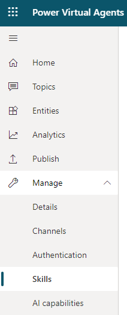

# Extend your bot using Bot Framework Skills
Power Virtual Agents allows you to extend your bot using Azure Bot Framework Skills. Skills can be used to embed re-usable converational multi-turn actions to perform complex tasks like booking appointments, managing tasks, and more. Existing bots built using Bot Framework's pro-code tools can be seamlessly embedded as Skills into Power Virtual Agent's no-code graphical conversation designer.

This article is intended for System administrators or IT professionals who are familiar with [Azure Bot Framework Skills](/azure/bot-service/bot-builder-skills-overview?view=azure-bot-service-4.0). Once a Skill has been registered, Bot authors can seamlessly [call Actions into bot conversations](advanced-use-skills.md).

## Configure a Skill for use in Power Virtual Agents
First, [create a Power Virtual Agents bot](authoring-first-bot.md) and [create and deploy Skill using pro-code tools](https://go.microsoft.com/fwlink/?linkid=2110533) into your organization.

Before registering the Skill, provide the bot's ID to your Skill developer to authorize the bot to call actions in the Skill.

**Add bot to Skill's allow list:**

1. In the [Power Virtual Agents portal](https://powerva.microsoft.com), on the side navigation pane, expand the **Manage** menu and select **Skills**.

   

1. At the top of the Skills page, select **Provide ID for allow list**.
 
   

1. A window will show with your unique ID. Copy this and provide it to your Skills developer.

   

**Enter Skill manifest URL to add a Skill to your bot:**

1. In the [Power Virtual Agents portal](https://powerva.microsoft.com), on the side navigation pane, expand the **Manage** menu and select **Skills**.

   

1. At the top of the Skills page, select **Add skill**.
 
   

1. Enter the URL to the Skill manifest. A Skill's manifest contains vital information that your bot will need to trigger actions within a Skill.

1. Select **Next** to begin the [validation process](#validation-performed-during-registering-a-skill). If successful, your Skill is added to your bot. You can now [use this Skill in your topics](advanced-use-skills.md). 

## Compliance considerations
To protect user's privacy, we restrict users from adding Skills that are deployed outside of the signed-in user's Azure tenant. However, your bot may send customer information to a Skill if your Skill and bot are deployed in different regions.

### Validation performed during registering a Skill

A series of validation checks are made against the URL. The checks are described as follows - the failure of these checks may result in an error message as described in this table.

Validation step|Error message|Description or mitigation
---|---|---
Valdate Skill manifest URL|URL_MALFORMED(100); URL_NOT_HTTPS(101)|Url is not https (http, warning?); Url is not valid
Validate if Skill manifest can be retrieved|MANIFEST_FETCH_FAILED(200)|Network or http (not found, not authorized) errors getting the manifest; No response in 3 seconds
Validate if Skill manifest can be read|MANIFEST_TOO_LARGE(201), MANIFEST_MALFORMED(202)|Syntax errors in the manifest; Optional manifest properties are missing that we need requires; Manifest larger than 500kb
Validate Skill manifest version|MANIFEST_UNVERSIONED(203)|Manifest doesn't have a skill version
Validate if Skill is previously registered|MANIFEST_ALREADY_IMPORTED(204)|Already registered (with same version?)
Validate Skill manifest endpoint origin|MANIFEST_ENDPOINT_ORIGIN_MISMATCH(206)|Attacker altered manifest and hosted on their website
Validate Skill is hosted in signed in user's tenant|APPID_NOT_IN_TENANT(400)|Skill is not registered in the tenant of the bot author
Validate Skill actions|LIMITS_TOO_MANY_ACTIONS(300)|There are too many Skill actions defined in Skill manigest. We only support registering Skills with 25 actions.
Validate Skill action input parameters|LIMITS_TOO_MANY_INPUTS(301)|There are too many Skill action input parameters. We only support Skill actions that have 25 input parameters.
Validate Skill action output parameters|LIMITS_TOO_MANY_OUTPUTS(302)|There are too many Skill action output parameters. We only support Skill actions that have 25 output parameters.
Validate Skill count|LIMITS_TOO_MANY_SKILLS(303)|There are too many Skills added into a bot. We only support a bot to have 25 registered Skills.
Validate Skill action language|MANIFEST_MISSING_ACTION_LANGUAGE(205)|Skill has actions with unsupported locales. We only support Skills with Actions in en-US.
Validate security token to trigger Skill|AADERROR_NOT_MULTITENANT(600)|Skill is not registered as a multi-tenant app (because bot not registered in customer's tenant)
Validate security token to trigger Skill|AADERROR_OTHER(601)|There may be a transient error to acquire a security token to trigger Skill. Please retry.
Validate Skill health|ENDPOINT_HEALTHCHECK_FAILED(700)|Network errors, http errors (not found, not authenticated)

