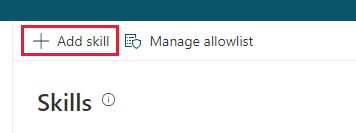

# Extend your bot using Bot Framework skills

Select the version of Power Virtual Agents you're using here:

> [!div class="op_single_selector"]
> - [Power Virtual Agents web app](configuration-add-skills.md)
> - [Power Virtual Agents app in Microsoft Teams](teams/configuration-add-skills-teams.md)

Power Virtual Agents enables you to extend your bot using [Bot Framework skills](/azure/bot-service/skills-conceptual?view=azure-bot-service-4.0&preserve-view=true). If you have already built and deployed bots in your organization (using Bot Framework SDK and pro-code tools) for specific scenarios, you can convert those bots into a skill and register that skill in a Power Virtual Agents bot.

This article is intended for system administrators or IT professionals who are familiar with [Bot Framework skills](/azure/bot-service/skills-conceptual?view=azure-bot-service-4.0&preserve-view=true). After a skill has been registered with a Power Virtual Agents bot, authors can seamlessly [trigger skill actions in conversation](advanced-use-skills.md).

## Prerequisites

- [!INCLUDE [Medical and emergency usage](includes/pva-usage-limitations.md)]
- [Review restrictions and validation for skills used in Power Virtual Agents](/azure/bot-service/skill-pva)

## Compare use of Flows and skills actions
The following table will help determine when to use skills for a conversation.

|    | **Flow actions** | **Skill actions** |
| -- | -- | -- |
| **Persona** | Bot authors can build reusable Flows to embed into any bot conversation | Developers can create, deploy, and host custom skills in their own environment |
| **Conversation** | Use Flows for simple, single-turn operations. For example, place an order, or get order status. | Use skills for complex, multi-turn operations. For example, schedule a meeting or book a flight. |
| **Response** | Use Flows to emit a bot response. For example, show a personalized message or inline images. | Use skills to emit any supported bot response. For example, show an adaptive card or send random responses. |
| **Actions** | Use Flows to trigger server-side single-turn actions. For example, call an HTTP API or trigger a custom connector. | Use skills to trigger server-side and client-side events and actions. For example, navigate to a page upon bot response. |

## Configure a skill for use in Power Virtual Agents
First, [create a Power Virtual Agents bot](authoring-first-bot.md) and [create and deploy skill using pro-code tools](https://go.microsoft.com/fwlink/?linkid=2110533) into your organization.

>[!NOTE]
>Power Virtual Agents only supports skills built using [Bot Framework SDK version 4.7](/azure/bot-service/skills-conceptual?view=azure-bot-service-4.0&preserve-view=true) or above.

Before registering the skill, provide the bot's ID to your skills developer to authorize the bot to call actions in the skill. [Learn more about skill allow list](https://go.microsoft.com/fwlink/?linkid=2123148).

**Add bot to skill's allow list:**

1. In the [Power Virtual Agents portal](https://powerva.microsoft.com), on the side navigation pane, expand the **Manage** menu and select **Skills**.

   

1. At the top of the skills page, select **Provide ID for allow list**.
 
   

1. A window will show with your unique ID. Copy this ID and provide it to your skills developer.

   

**Enter the skill manifest URL to add a skill to your bot:**

1. In the [Power Virtual Agents portal](https://powerva.microsoft.com), on the side navigation pane, expand the **Manage** menu and select **skills**.

   

1. At the top of the skills page, select **Add skill**.
 
   

1. Enter the URL to the skill manifest. A skill's manifest contains the information that your bot will need to trigger actions within a skill.

1. Select **Next** to begin the [validation process](#troubleshooting-errors-during-skill-registration). When successful, your skill is added to your bot. You can now [use this skill in your topics](advanced-use-skills.md). 

## Compliance considerations

To protect user privacy, we require skills to be registered as an app in the signed-in user's Azure Active Directory tenant.

### Troubleshooting errors during skill registration

A series of validation checks are made against the URL. These checks ensure compliance, governance, and usability of the skill being added to your bot. You will need to fix these errors prior to registering a skill.

Error message | Troubleshoot / Mitigation
---|---
We ran into problems getting the skill manifest. (`MANIFEST_FETCH_FAILED`)| Try opening your manifest URL in a web browser. If the URL renders the page within 10 seconds, re-register your skill.
The manifest is incompatible.  (`MANIFEST_MALFORMED`) | (a) Check if the manifest is a valid JSON file. (b) Check if the manifest contains required properties  For example, (`name`, `msaAppId`, single `endpoint`, `activities`/`id`, `activities`/`description`, `activities`/`type` (only `event` or `message` supported)).
There is a mismatch in your endpoints  (`MANIFEST_ENDPOINT_ORIGIN_MISMATCH`) | Check if your skill endpoint matches your Azure AD application registration's `Publisher domain` (preferred) or `Home page URL` field. [Learn more about setting the home page for endpoints](https://go.microsoft.com/fwlink/?linkid=2123145).
To add a skill, it must first be registered  (`APPID_NOT_IN_TENANT`) | Check if your skill's application ID is registered in your organization's Azure AD tenant. |
The link isn't valid; The link must begin with https://  (`URL_MALFORMED`, `URL_NOT_HTTPS`) | Re-enter the link as a secure URL. |
The manifest is too large;  (`MANIFEST_TOO_LARGE`)| Check size of the manifest. It must be less than or equal to 500KB. |
This skill has already been added to your bot.  (`MANIFEST_ALREADY_IMPORTED`)| Delete the skill and try registering again. |
The skill is limited to 25 actions.  (`LIMITS_TOO_MANY_ACTIONS`)|There are too many skill actions defined in skill manifest. Remove actions and try again. |
Actions are limited to 25 inputs.  (`LIMITS_TOO_MANY_INPUTS`)|There are too many skill action input parameters. Remove parameters and try again. |
Actions are limited to 25 outputs.  (`LIMITS_TOO_MANY_OUTPUTS`)|There are too many skill action output parameters. Remove parameters and try again. |
Your bot can have a maximum of 25 skills.  (`LIMITS_TOO_MANY_SKILLS`)| There are too many skills added into a bot. Remove an existing skill and try again. |
It looks like something went wrong. (`AADERROR_OTHER`)|There was a transient error while validating your skill. Retry.|
Something went wrong while checking your skill.  (`ENDPOINT_HEALTHCHECK_FAILED`, `HEALTH_PING_FAILED`) | Check if your skill endpoint is online and responding to messages.|
This skill has not allow-listed your bot  (`ENDPOINT_HEALTHCHECK_UNAUTHORIZED`) | Check if your bot has been added to the skills allowlist. [Learn more about adding a skill to the allowlist](https://go.microsoft.com/fwlink/?linkid=2123431). |

