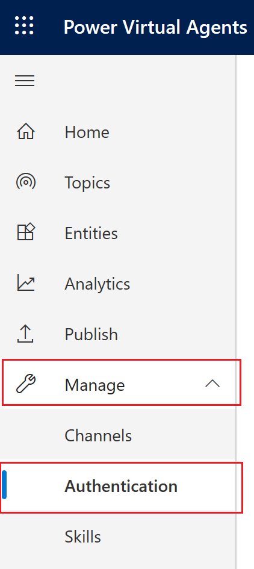

# How to configure user authentication in Power Virtual Agents

[!INCLUDE [cc-beta-prerelease-disclaimer](includes/cc-beta-prerelease-disclaimer.md)]

You can configure a Power Virtual Agents bot to provide authentication capabilities, so users can sign in with any OAuth2 identity providers, such as Azure Active Directory (Azure AD), a Microsoft account, and Facebook. 

To learn how to add authentication to a bot topic, see [Using user authentication on bot topics](advanced-end-user-authentication.md).

Power Virtual Agents supports any identity provider that is compliant with the OAuth2 standard.

## Registering a new app with your identity provider

You will need to register a new app with your identity provider and get a Client ID and Client Secret before you can configure authentication in Power Virtual Agents. 

Make sure to configure the redirect URL to be *https://token.botframework.com/.auth/web/redirect*, and that the assigned API permissions and scopes for the app are the same permissions you need the bot to access.

> [!IMPORTANT] 
> Your app registration redirect URL must be *https://token.botframework.com/.auth/web/redirect*. 
> Ensure that the app has the correct API permissions and its related scopes.

## Configure authentication

1. In Power Virtual Agents, select **Manage** on the side navigation pane, and then go to the **Authentication** tab.

   

2. Enter the information as described for each of the fields defined in the following table. The information required depends on your specific setup and provider. For questions about the required information, contact your administrator or identity provider.

3. Click **Save** to finish the configuration.

> [!NOTE]
> The examples provided below are for an Azure AD common endpoint.

Field name | Description
---|---
Connection name | Friendly name for your identity provider connection. This can be any string, but can't be changed once configured.
Service Provider | This field cannot be edited because Power Virtual Agents only supports generic OAuth2 providers.
Client ID | Your Client ID obtained from the identity provider.
Client Secret | Client Secret obtained from the identity provider registration.
Scope List delimiter | Separator character for the scope list. Empty spaces (' ') are not supported in this field, but can be used in the Scopes field if required by the identity provider. In that case, use a comma (',') for this field, and spaces in the Scopes field.
Authorization URL Template | URL template for authorization, defined by your identity provider.  For example, *https://login.microsoftonline.com/common/oauth2/v2.0/authorize*
Authorization URL Query String Template | Query template for authorization, provided by your identity provider.  For example, *?client_id={ClientId}&response_type=code&redirect_uri={RedirectUrl}&scope={Scopes}&state={State}* Keys in the query string template will vary depending on the identity provider. 
Token URL Template | URL Template for Tokens, provided by your identity provider.  For example, *https://login.microsoftonline.com/common/oauth2/v2.0/token*
Token URL Query String Template | Query string separator for the token URL. Usually a question mark '?'.
Token Body Template | Template for the token body.  For example, *code={Code}&grant_type=authorization_code&redirect_uri={RedirectUrl}&client_id={ClientId}&client_secret={ClientSecret}*
Refresh URL Template | URL template for refresh.  For example, *https://login.microsoftonline.com/common/oauth2/v2.0/token*
Refresh URL Query String Template | Refresh URL query string separator for the token URL. Usually a question mark '?'.
Refresh Body Template | Refresh Body Template.  For example, *refresh_token={RefreshToken}&redirect_uri={RedirectUrl}&grant_type=refresh_token&client_id={ClientId}&client_secret={ClientSecret}*
Scopes | List of scopes you want the authenticated users to have once signed in. Make sure you are only setting the necessary scopes, and follow the [Least privilege access control principle](/windows-server/identity/ad-ds/plan/security-best-practices/implementing-least-privilege-administrative-models).

## Test your configuration

Once the setup steps above are complete, save your configuration and test it by [creating a new topic using authentication](advanced-end-user-authentication.md).

## Remove the authentication configuration

1. Select **Manage** on the side navigation pane, and then go to the **Authentication** tab.
2. Select **Delete connection**.

### Permanently remove the authentication configuration

> [!Note]
> Deleting the authentication information from the bot does not remove it from Azure Bot Service. If you want to clear the configuration from Azure Bot Service, you will need to contact your subscription owner, who will need to follow these steps:

1. Sign in to the Azure Portal.
1. Select the Bot Service in the subscription.
1. Go to Settings.
1. Select the connection to be deleted.
1. Delete the connection.

<!--from editor: Is the following incomplete? -->

> [!WARNING]
> Does this apply even if you use a different IDP?
