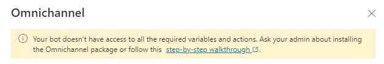
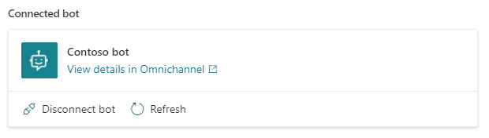
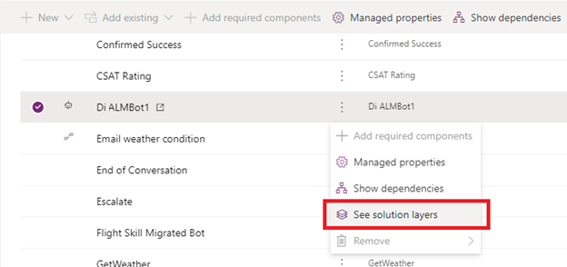
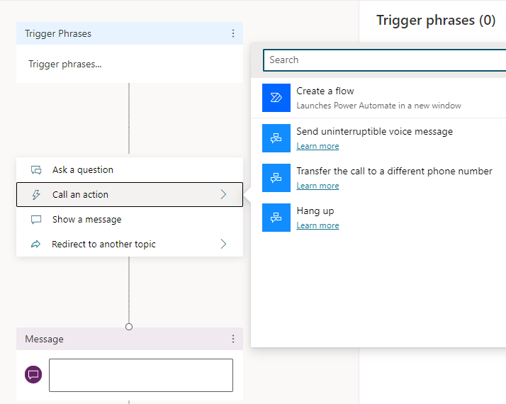
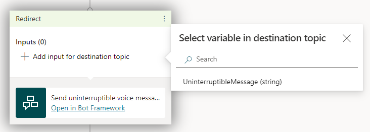
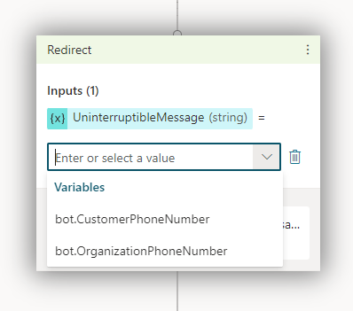
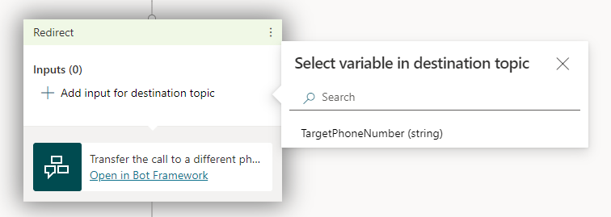
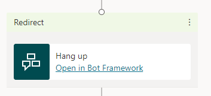

# Configure hand-off for voice and text bot conversations to Dynamics 365 Customer Service

With Power Virtual Agents, you can seamlessly and contextually hand off escalated Power Virtual Agents conversations to live (human) agents using the Chat Add-in for [Dynamics 365 Customer Service](/dynamics365/omnichannel/omnichannel-customer-service-guide). You can connect both voice-based and text-based bot conversations.

When you hand off a conversation, you share the full history of the conversation (the context) as well as all user-defined variables. This allows your omnichannel service to route incoming escalations to the right live agent queue and enables engaging live agents to review context from the prior conversation and resume the conversation.

To add hand off capabilities to your bot, you install the associated extension solutions to enable text- and voice-based hand off capabilities, and then connect your omnichannel instance to your Power Virtual Agents bot.

For more information about hand off, and how to use hand-off within a bot conversation, see the [Using Transfer to agent node](./advanced-hand-off.md) topic.

>[!NOTE]
>If you'd previously configured a bot to hand off for omnichannel capabilities (before November 2021), the **Omnichannel** tile's settings will appear as if they have not been configured. This is a known issue, and has no effect on the bot or the existing omnichannel connection, which will continue to run normally.  
>  
>You can force the settings display to refresh and show the actual connection details by selecting **Enable**.
>  
>If you want to add voice-based capabilities for hand off to your already-connected bot, you must disconnect and reconnect the bot from your omnichannel service.

## Prerequisites
* Environments:
  * You must install the [extension solutions](#install-extension-solutions) in the same environment where you have your bots.
  - Your bot (and extension solutions) environment and omnichannel environment must be in the same [geographical region](data-location.md#data-locations).
  - For voice-based capabilities, both your tenant _and_ environment must be in the [United States Azure geographic location](data-location.md#data-locations).
* You need a [product license for Power Virtual Agents](https://go.microsoft.com/fwlink/?LinkId=2092080&clcid=0x409) and a [product license with the Chat Add-in for Dynamics 365 Customer service](/dynamics365/customer-engagement/omnichannel/try-chat-for-dynamics365).
* You must be [assigned the omnichannel administrator role](/dynamics365/omnichannel/administrator/add-users-assign-roles#understand-roles-and-their-privileges) to connect bots with omnichannel.
* You'll need an [application registered in Azure](/azure/active-directory/develop/howto-create-service-principal-portal#create-an-azure-active-directory-application) before you can connect to omnichannel.
* [!INCLUDE [Medical and emergency usage](includes/pva-usage-limitations.md)]
* Your bot must be in a published state for end-to-end capabilities to work as expected. Ensure that you have [published your bot](./publication-fundamentals-publish-channels.md) prior to validating the integrated experience.  

## Install extension solutions

For your bot to hand off a conversation to your omnichannel interface, you have to install the appropriate extension solutions for Dynamics 365 Customer Service omnichannel integration and Power Virtual Agents:

- If you only want text-based (messaging) hand off capabilities, you must install the following extension:
    - [Omnichannel Power Virtual Agents Extension](https://appsource.microsoft.com/product/dynamics-365/mscrm.omnichannelpvaextension)

- If you want both text-based (messaging) and voice-based hand off capabilities, you must install each of the following extensions in the following order:

    1. [Power Virtual Agents telephony extension](https://appsource.microsoft.com/product/dynamics-crm/mscrm.mspva_telephony_extension)
    1. [Omnichannel Power Virtual Agents extension](https://appsource.microsoft.com/product/dynamics-365/mscrm.omnichannelpvaextension)
    1. [Omnichannel voice Power Virtual Agents extension](https://appsource.microsoft.com/product/dynamics-365/mscrm.omnichannelvoicepvaextension)

>[!IMPORTANT]
>You must install the [Omnichannel Power Virtual Agents Extension](https://appsource.microsoft.com/product/dynamics-365/mscrm.omnichannelpvaextension) for all omnichannel hand off scenarios.  

## Connect omnichannel to your Power Virtual Agents bot

Sign in to the Power Virtual Agents bot you want to connect to your omnichannel service.

1. On the side navigation pane, expand the **Manage** tab, go to **Agent transfers**, and then select the **Omnichannel** tile.
    
    :::image type="content" source="media/handoff-settings.png" alt-text="IMAGE-SHOWING-SETTINGS-PANEL-OPENED.":::

1. Select **Enable**. 
    * If you haven't installed any of the [extension solutions required for hand off](#install-extension-solutions), you'll see a notification that your bot doesn't have access to the variables or actions needed for hand off to omnichannel. You must [install at least the omnichannel extension solution](#install-extension-solutions) for hand off to Omnichannel to work.  
    
        

    * You may see a message that says we can't determine if omnichannel integration is enabled for the environment with the managed bot if you have [ALM enabled in your bot](#power-virtual-agent-bots-with-alm).

        :::image type="content" source="media/transfer-managed-bot.png" alt-text="Message that says we can't determine if this bot has omnichannel enabled or disabled.":::
        
1. Under **See the environment this bot is connected to**, select the environment where your omnichannel instance is provisioned. If you haven't set up omnichannel in the selected environment, you'll see a message inviting you to begin a trial.

    :::image type="content" source="media/transfer-no-oc.png" alt-text="Message that says you haven't set up omnichannel integration in this environment.":::

1. Follow the steps to create or reuse an existing Azure application ID. Copy the *Application (client) ID* and paste it in the text box provided.

    >[!IMPORTANT]
    >Omnichannel models bots as "application users" in the system. Therefore, the *Application (client) ID* that you use must be unique to your organization (your Microsoft Dataverse organization or environment).

1. Power Virtual Agents uses a [Teams channel](./publication-fundamentals-publish-channels.md) to communicate with Omnichannel for Customer Service. If a Teams channel is not enabled, a Teams channel will be enabled when you select **Next**. 

1. Select the **Go to Omnichannel** link to [continue configuring the bot connection in your omnichannel interface](/dynamics365/omnichannel/administrator/configure-bot-virtual-agent).

After you've configured the connection, you'll see your bot in the **Omnichannel** tile under **Agent transfers**. From here, you can disconnect the bot, refresh the connection, or view the connection details in your omnichannel interface.

You can also toggle voice capabilities on or off.

>[!IMPORTANT]
>If you want to test the bot on your custom website, you must use the embed code that is specified in the chat widget you set up in Omnichannel (see **Prerequisites** in the [Integrate a Power Virtual Agents bot](/dynamics365/omnichannel/administrator/configure-bot-virtual-agent#prerequisites) article). If you use the embed code from the Power Virtual Agents site, hand-off will not occur correctly.

### Power Virtual Agent bots with ALM
If you've [set up ALM for your Power Virtual Agents bots](/power-platform/alm/basics-alm), and are exporting and importing bots between [development (unmanaged) and test or production (managed) environments](/power-platform/alm/basics-alm#types-of-environments-used-in-alm), you might see a message that says we can't determine if omnichannel integration is enabled for the environment with the managed bot.

:::image type="content" source="media/transfer-managed-bot.png" alt-text="Message that says we can't determine if this bot has omnichannel enabled or disabled.":::

If the bot you exported _does_ have omnichannel capabilities enabled, you can ignore this message as the bot will still work properly. 
  
The message will disappear after you export the latest versions of your bot from your development environment (first confirming that omnichannel integration is enabled), and then import it into a targeted test or production environment with managed bots.

If the message continues to show after exporting and importing the latest version of your bot, ensure that you have removed any unmanaged layers from your managed bot:
  
1. Sign in to Power Apps and select the managed bot's environment.  

1. Select the **Solutions** tab on the side navigation pane, and then select the solution that contains the bot with the unmanaged layer.  

1. Select **See solution layers** from the contextual **...** menu next to the chatbot component in the solution.  

          
    
1. Select the unmanaged layer and then select **Remove unmanaged layer**.    

    
    
If the bot _doesn't_ have omnichannel capabilities enabled, the message will always show. 

### Disconnect your bot from omnichannel or disable the omnichannel connection

If you select **Disconnect bot**, the application user that represents the bot in your omnichannel instance will be disabled, which effectively disconnects the bot from the specified omnichannel environment. 

To add your bot back, you'll need to connect it again, as described in the section [Connect omnichannel to your Power Virtual Agents bot](#connect-omnichannel-to-your-power-virtual-agents-bot) (starting at Step 3).

If you select **Disable**, the connection between your omnichannel instance and Power Virtual Agents will be disabled, and your bot will stop receiving any traffic from your omnichannel instance.

### Refresh the connection

If you select **Refresh**, the connection between your bot and omnichannel instance will be checked. This is useful after you add your bot to an omnichannel workstream so you can check that the connection has been successfully completed.

### Toggle voice capabilities

You can enable voice-based capabilities by switching the **Enable voice** toggle. This applies to the entire bot, not for individual bot sessions or connections.

When voice is enabled, any connection with the bot can use voice, text, or both.

If you previously had connected a bot to your omnichannel instance (before November 2021), and want to enable voice-based capabilities, you must [disconnect and reconnect the bot with omnichannel](#disconnect-your-bot-from-omnichannel-or-disable-the-omnichannel-connection).

Authentication is not supported for voice-based hand off to omnichannel instances. If you've set up authentication for the bot, the [authentication variables](advanced-end-user-authentication.md) will not contain authentication information in them when sent to your omnichannel instance.

>[!WARNING]
>For voice-based hand off capabilities, your bot and omnichannel environments must be hosted in a datacenter within the [United States Azure geographic location](data-location.md#data-locations).
>  
>If the environment (or environments) you use for your bot or omnichannel instance aren't in the US region, voice capabilities will not work and there will be no error messages or warnings.

## Voice-based capabilities

The [Power Virtual Agents telephony extension](https://appsource.microsoft.com/product/dynamics-crm/mscrm.mspva_telephony_extension) adds a number of additional actions and variables to Power Virtual Agents that can be used by Power Virtual Agents chatbots.

### Send uninterruptible voice message

This action can be used to send messages which can't be interrupted by the caller. 

1. Add this action as you would [any other action when adding nodes](authoring-create-edit-topics.md#insert-nodes). 

1. Select **Add input for destination topic** and then **UninterruptibleMessage (string)**.

    

3. Select an existing variable that defines the message content, or directly enter the message that should be used.

    

### Transfer the call to a different phone number
This action can be used to transfer the call to a different phone number altogether. 

1. Add this action as you would [any other action when adding nodes](authoring-create-edit-topics.md#insert-nodes).

3. Select **Add input for destination topic** and then **TargetPhoneNumber (string)**.

    
  
3. Select an existing variable that defines the number that should be called instead, or directly enter the number.

>[!NOTE]
>This action requires the "Make calls" privilege when purchasing the phone number. Without this privilege, the transfer will fail.

### Hang up
This action can be used to hang up the call. Once the conversation reaches this action, the call will be dropped.

1. Add this action as you would [any other action when adding nodes](authoring-create-edit-topics.md#insert-nodes). 

    

### *bot.CustomerPhoneNumber* variable

This variable contains the phone number of the customer who called the bot. This is also known as CallerID. 

You can also use the "Is Empty" condition in the authoring experience to check if the conversation is from a caller on a phone (which will always return *False*), or from messaging  (will always return *True*).

### *bot.OrganizationPhoneNumber* variable

This variable contains the phone number the customer dialed to reach the bot.

### Authoring considerations

- When using adaptive cards, ensure you are using them through [Composer integration](advanced-bot-framework-composer.md) so their "speak" property is correctly read by the voice bot.
- When using markdown on topics, the voice bot will read the asterisk mark *.  
    Adjust your markdown accordingly and always test your bot using voice to ensure the desired result.

## Known limitations
See [limitations when using Power Virtual Agents with the Chat Add-in for Dynamics 365 Customer Service](/dynamics365/omnichannel/administrator/configure-bot-virtual-agent#limitations) for more information.

[!INCLUDE[footer-include](includes/footer-banner.md)]

