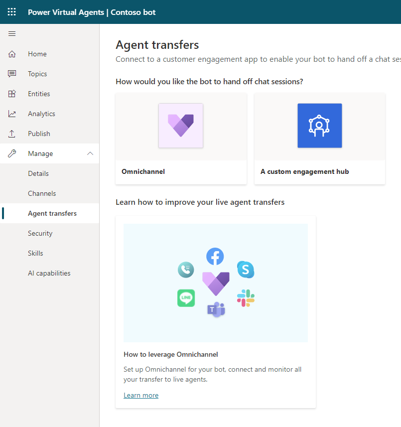

# Configure seamless and contextual hand-off to Omnichannel for Customer Service

[!INCLUDE [cc-beta-prerelease-disclaimer](includes/cc-beta-prerelease-disclaimer.md)]

With Power Virtual Agents, you can seamlessly and contextually hand off escalated Power Virtual Agents conversations to live (human) agents using [Omnichannel for Dynamics 365 Customer Service](/dynamics365/omnichannel/omnichannel-customer-service-guide). 

When you hand off a conversation, you share the full history of the conversation (the context) as well as all user-defined variables. This allows Omnichannel for Customer Service to route incoming escalations to the right live agent queue and enables engaging live agents to review context from the prior conversation and resume the conversation.

For more information about hand off, and how to use hand-off within a bot conversation, see the [Using Transfer to agent node](how-to-handoff.md) topic.

## Prerequisites
* Product license: You need a [product license for Power Virtual Agents](https://go.microsoft.com/fwlink/?LinkId=2092080&clcid=0x409) and a [product license for Omnichannel for Customer service](/dynamics365/customer-engagement/omnichannel/try-chat-for-dynamics365).
* Role: You must be assigned the Omnichannel administrator role to add bots in Omnichannel for Customer Service. More information: [Understand roles and their privileges](/dynamics365/omnichannel/administrator/add-users-assign-roles#understand-roles-and-their-privileges).
* Azure Application ID: You will need an [application registered in Azure](/azure/active-directory/develop/howto-create-service-principal-portal#create-an-azure-active-directory-application) prior to connecting to Omnichannel for Customer Service.
* [!INCLUDE [Medical and emergency usage](includes/pva-usage-limitations.md)]

## Configure hand-off in the Power Virtual Agents app

Sign in to the Power Virtual Agents bot you want to connect to Omnichannel for Customer Service.

1. Select **Settings**, and then **Transfer to agent**.
    
    

1. Select the **Dynamics 365 Omnichannel for Customer Service** tile.

    

1. To acknowledge the privacy policy, select **Next**. 
    >[!CAUTION]
    >Ensure that you adhere to [data sovereignty](data-location.md) laws when you configure this integration as your bot will store and send user information to your Omnichannel for Customer Service instance.

1. Follow the steps to create or reuse an existing Azure application ID. Copy the *Application (client) ID* and paste it in the text box provided.

    >[!IMPORTANT]
    >Omnichannel models bots as "application users" in the system. Therefore, the *Application (client) ID* that you use must be unique to your organization (your Microsoft Dataverse organization or environment).

1. Power Virtual Agents uses a [Teams channel](getting-started-deploy.md) to communicate with Omnichannel for Customer Service. If a Teams channel is not enabled, a Teams channel will be enabled when you select **Next**. 

1. Select the environment where your Omnichannel for Customer Service instance is provisioned.

1. Select the **Go to Omnichannel** link to [continue configuring the bot connection in Omnichannel for Customer Service](/dynamics365/omnichannel/administrator/configure-bot-virtual-agent).

>[!IMPORTANT]
>Your bot must be in a published state for end-to-end capabilities to work as expected. Ensure that you have [published your bot](getting-started-deploy.md) prior to validating the integrated experience.  
>  
>If you want to test the bot on your custom website, you must use the embed code that is specified in the chat widget you set up in Omnichannel (see **Prerequisites** in the [Integrate a Power Virtual Agents bot](/dynamics365/omnichannel/administrator/configure-bot-virtual-agent#prerequisites) article). If you use the embed code from the Power Virtual Agents site, hand-off will not occur correctly.

## Remove Omnichannel for Customer Service connection
Once your bot has been connected to Omnichannel for Customer Service, you cannot remove the connection setting. If you erroneously connected to the wrong instance or environment, you will need to create a new bot and try connecting to Omnichannel for Customer Service again.

## Content display issues
Some content may not show, such as emojis and certain types of notes or variables. If you encounter problems with the display of content, see the [Omnichannel for Customer Service documentation library](/dynamics365/omnichannel/omnichannel-readme).

## Known limitations
See [Known limitations when using Power Virtual Agents with Omnichannel for Customer Service](/dynamics365/omnichannel/administrator/configure-bot-virtual-agent#known-limitations) for more information.

