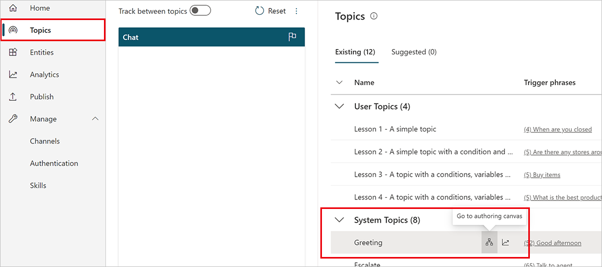
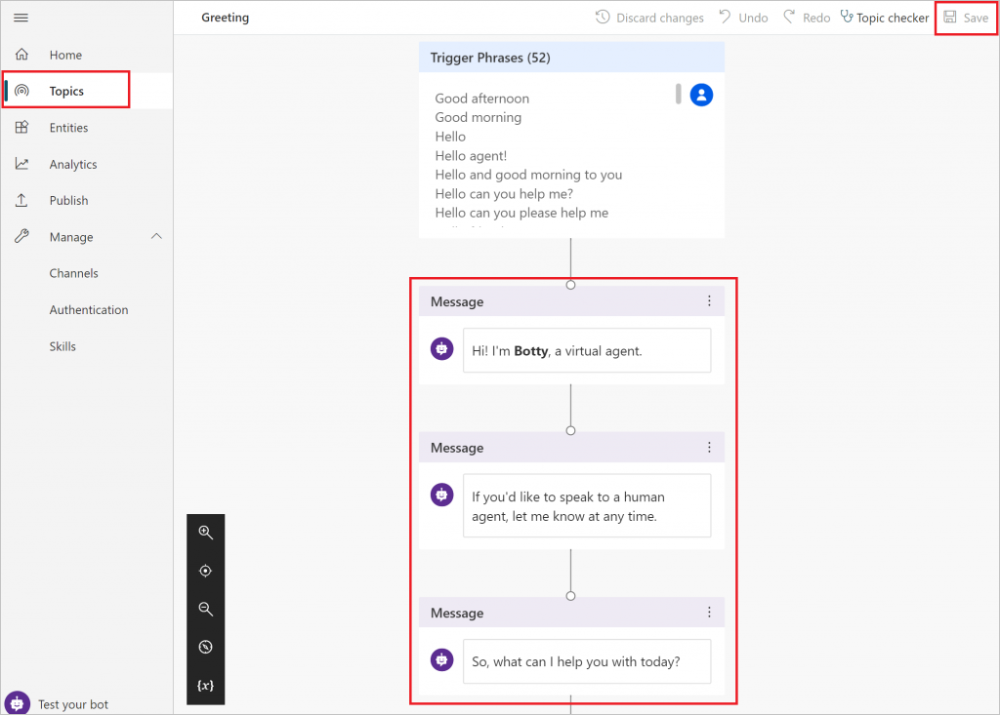

# Configure your bot to start the conversation automatically


By default, chatbots created with Power Virtual Agents and [published to a website](publication-connect-bot-to-web-channels.md) will load without a greeting, and will passively wait for the user to start the conversation.

However, you can use custom CSS and JavaScript code to automatically have the bot start the conversation when the bot loads.

For example, you could have your bot say, "Hi, I’m Botty, a virtual agent" as soon a the bot loads.

First, you'll need to deploy a custom canvas that includes arguments that trigger the greeting. By default, the custom canvas calls the default system greeting topic. You can, however, create a new topic to be used as the greeting, although you will need to modify the custom canvas code.

You can also combine the customized greeting with [customization to the look and feel of the bot](customize-default-canvas.md).

>[!IMPORTANT]
>Having the bot start the conversation will show up in your [analytics](analytics-overview.md) will increase your session count.
>If the user of your bot doesn't engage with the bot (for example, they load the page but don't ask the bot anything), the session will be [marked as an unengaged session](analytics-summary.md#engagement-over-time-chart). 
>This might impact your analytics.

## Prerequisites

- [!INCLUDE [Medical and emergency usage](includes/pva-usage-limitations.md)]

## Retrieve bot ID details

To customize the greeting, you need to know your Bot ID. 

You can get the Bot ID by [going to the Mobile app under Channels](publication-connect-bot-to-custom-application.md#retrieve-your-power-virtual-agents-bot-parameters). 


## Deploy a custom canvas for your bot

You'll need to deploy a custom canvas that includes arguments that cause the [default system greeting topic](authoring-create-edit-topics.md#use-system-and-sample-topics) to be displayed when the bot loads.

1. [Create and publish a bot](fundamentals-get-started.md).

2. Copy and paste the HTML code below and save it as *index.html*.  
    You can also copy and paste the code below into the [w3schools.com HTML try it editor](https://www.w3schools.com/html/tryit.asp?filename=tryhtml_default). You will still need to add your Bot ID.  

    ```HTML
      <!DOCTYPE html>
        <html>
        <head>
            <title>Contoso Sample Web Chat</title> 
            <!-- This styling is for the canvas demonstration purposes. It is recommended 
        that style is moved to separate file for organization in larger projects -->
            <style>
                html, body {
                    height: 100%;
                }
                body {
                    margin: 0;
                }
                h1 {
                    font-size: 16px;
                    font-family: Segoe UI;
                    line-height: 20px;
                    color: whitesmoke;
                    display: table-cell;
                    padding: 13px 0px 0px 20px;
                }
                .heading {
                    background-color: black;
                    height: 50px;
                }
                .main {
                    margin: 18px;
                    border-radius: 4px;
                }

                div[role="form"]{
                    background-color: black;
                }        
                #webchat {
                    position: fixed;
                    height: calc(100% - 50px);
                    width: 100%;
                    top: 50px;
                    overflow: hidden;
                }
              </style>
        </head>
        <body>
            <div>
                <div class="heading">

                    <!-- Change the h1 text to change the bot name -->    
                    <h1>Contoso Bot Name</h1>

                </div>
                <div id="webchat" role="main"></div>
            </div>    
          <script src="https://cdn.botframework.com/botframework-webchat/latest/webchat.js"></script>
          <script>
                const styleOptions = {
                   // Add styleOptions to customize web chat canvas
                   hideUploadButton: true
                };

                // Add your BOT ID below
                var BOT_ID = "<ENTER YOUR BOT ID>"; 

                var theURL = "https://powerva.microsoft.com/api/botmanagement/v1/directline/directlinetoken?botId=" + BOT_ID;

                const store = window.WebChat.createStore(
                   {},
                   ({ dispatch }) => next => action => {
                       if (action.type === "DIRECT_LINE/CONNECT_FULFILLED") {
                          dispatch({
                              meta: {
                                   method: "keyboard",
                               },
                               payload: {
                                   activity: {
                                         channelData: {
                                              postBack: true,
                                         },
                                          //Web Chat will show the 'Greeting' System Topic message which has a trigger-phrase 'hello'
                                          text: "hello",
                                          type: "message",
                                     },
                                },
                                type: "DIRECT_LINE/POST_ACTIVITY",
                           });
                     }
                     return next(action);
                  }
               );
               fetch(theURL)
                    .then(response => response.json())
                    .then(conversationInfo => {
                        window.WebChat.renderWebChat(
                            {
                                directLine: window.WebChat.createDirectLine({
                                    token: conversationInfo.token,
                                }),
                                store: store,
                                styleOptions: styleOptions
                            },
                            document.getElementById('webchat')
                        );
                    })
                    .catch(err => console.error("An error occurred: " + err));
            </script>
          </body>
        </html>
    ```

4. In the *index.html* file you created, enter your Bot ID at the line `var BOT_ID = "<ENTER YOUR BOT ID>"`.

5. Open *index.html* using a modern browser (for example, Edge) to open the bot in the custom canvas.

6. Test the bot to ensure you are receiving responses from your bot and that it's working correctly.  
    If you encounter problems, make sure you've published your bot, and that your Bot ID has been inserted in the correct place. It should be after the equals sign (=) at the line `var BOT_ID`, and surrounded by double quotation marks (").

## Change the bot's default greeting

The code in the *index.html* file causes a topic to be called automatically when the bot is loaded. By default, it calls the system greeting topic. You can also create a new topic and point the code to call that topic instead.


In both instances, you [make changes to the topic you want to call as you would normally](authoring-create-edit-topics.md).

We recommend you modify the system greeting topic so that you don't have to edit the *index.html* code.

### Modify the system greeting topic (recommended)

1. Select **Topics** on the side navigation pane.

2. Under **System Topics**, select the **Go to authoring canvas** icon on the **Greeting** topic row.

    

3. Edit the text inside the **Message** nodes. You can also [add or delete additional nodes](authoring-create-edit-topics.md#insert-nodes).

4. Select **Save** when you're finished editing the message.

    

5. [**Publish** your bot](publication-fundamentals-publish-channels.md).

    

You can now test your bot by going to the web page where you deployed your bot's custom canvas. You'll see the bot start the conversation by automatically showing the greeting topic.


### Create a new user topic

>[!WARNING]
>Using a user topic to start a conversation will increase your [billed sessions](analytics-billed-sessions.md#definition-of-a-billed-session). A billed session is an interaction between a customer and a bot and represents one unit of consumption. The billed session begins when a user topic is triggered. For more information, see the [Licensing guide](https://go.microsoft.com/fwlink/?linkid=2085130).


1. Select **Topics** on the side navigation pane.

1. Select **New topic**, and give it a name. Add the **start conversation** as a trigger phrase.

1. Select **Go to authoring canvas**.

1. Edit the text inside the **Message** node. You can also [add or delete additional nodes](authoring-create-edit-topics.md#insert-nodes).

1. Select **Save** when you're finished editing the message.

1. [**Publish** your bot](publication-fundamentals-publish-channels.md).

1. Configure the custom canvas code in the *index.html* file to call the topic you created by entering the trigger phrase that you used for the topic. In this example, update the value of `text` to `start conversation` as shown in the following snippet:

    ```js
         payload: {
            activity: {
                channelData: {
                    postBack: true,
                },
            //Triggers a new topic with trigger-phrase 'start conversation'  
            text: "start conversation",
            type: "message",
         }, 
    ```

You can now test your bot by going to the web page where you deployed your bot's custom canvas. You'll see the bot start the conversation by automatically showing the new topic.


