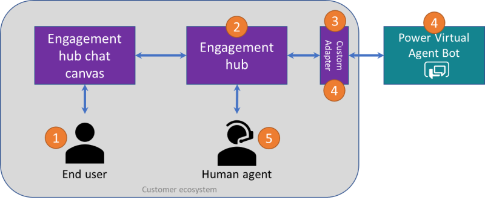

# Configure hand off to any generic engagement hub

Power Virtual Agents lets you hand over bot conversations seamlessly and contextually to a human agent through an engagement hub. 

With some custom development, you can configure your bot to hand off conversations to any engagement hub. This guide describes how you can do this.

## Prerequisites
- You need to have [built a bot using Power Virtual Agents](authoring-first-bot.md)  

- You need an engagement hub that can interacting programmatically using APIs or SDK  

- [!INCLUDE [Medical and emergency usage](includes/pva-usage-limitations.md)]

>[!IMPORTANT]
>Instructions in this section require software development from you or your developers. It is intended for experienced IT professionals, such as IT admins or developers who have a solid understanding of developer tools, utilities, and IDEs who are looking to integrate third-party engagement hubs with Power Virtual Agents. 

## Overview

  

A full hand-off to an engagement hub follows this pattern:

1. An end user interacts with the engagement hub's chat canvas.

1. The engagement hub routes the incoming chat through built-in chat routing capabilities to a bot.

1. A custom adapter relays the incoming chat messages from the engagement hub to a Power Virtual Agents bot.

1. Once the end user [triggers hand-off](advanced-hand-off.md#triggering-hand-off-to-a-live-agent), Power Virtual Agents starts hand-off with full conversational context.

1. The custom adapter intercepts the hand-off message, parses the full conversation context, and seamlessly routes the escalated conversation to a skilled human agent, based on availability.

1. The end user's chat is seamlessly and contextually handed off to a human agent who can resume the conversation.

To hand off the conversation to a human agent, you need to build a custom hand-off adapter.

## Build a custom hand-off adapter
An adapter bridges conversations to and from your agent engagement hub by relaying and transforming messages between end users, bots, and human agents.  

Most popular agent engagement hubs provide SDKs or document their APIs publicly, enabling you to build such adapters. 

While it is outside the scope of this document to cover what a custom adapter could contain, the following sample hand-off message, based on what Power Virtual Agents generates as part of our [standard hand-off to a live agent experience](advanced-hand-off.md), can help get you started. 

These code snippets and samples allow you to extract context from the bot conversation to seamlessly and contextually hand off bot conversations to any generic engagement hub.

### Sample hand-off message payload
Hand-off is currently only supported over DirectLine - [learn more about interacting with the bot over DirectLine](publication-connect-bot-to-azure-bot-service-channels.md#sample-code-example). Upon hand-off, an event activity called `handoff.initiate` is raised and sent to the adapter. 

You can see a [full sample hand-off message activity on our GitHub site](https://github.com/microsoft/PowerVirtualAgentsSamples/blob/master/ConnectToEngagementHub/activities.json).

### Extract context from hand-off message
To use [conversational context](advanced-hand-off.md#contextual-variables-available-upon-hand-off), you must parse the `handoff.initiate` event activity. 
The following snippet of code parses the `handoff.initiate` event activity and extracts the conversational context. See the [full code sample on GitHub](https://github.com/microsoft/PowerVirtualAgentsSamples/tree/master/ConnectToEngagementHub).

```C#
        public void InitiateHandoff(string botresponseJson)
        {
            BotResponse response = JsonConvert.DeserializeObject<BotResponse>(botresponseJson);

            // Look for Handoff Initiate Activity. This indicates that conversation needs to be handed off to agent
            Activity handoffInitiateActivity = response.Activities.ToList().FirstOrDefault(
                item => string.Equals(item.Type, ActivityTypes.Event, System.StringComparison.Ordinal)
                && string.Equals(item.Name, HandoffInitiateActivityName, System.StringComparison.Ordinal));

            if (handoffInitiateActivity != null)
            {
                // Read transcript from attachment
                if (handoffInitiateActivity.Attachments?.Any() == true)
                {
                    Attachment transcriptAttachment = handoffInitiateActivity.Attachments.FirstOrDefault(a => string.Equals(a.Name.ToLowerInvariant(), TranscriptAttachmentName, System.StringComparison.Ordinal));
                    if (transcriptAttachment != null)
                    {
                        Transcript transcript = JsonConvert.DeserializeObject<Transcript>(transcriptAttachment.Content.ToString());
                    }
                }

                // Read handoff context
                HandoffContext context = JsonConvert.DeserializeObject<HandoffContext>(handoffInitiateActivity.Value.ToString());

                // Connect to Agent Hub
                // <YOUR CUSTOM ADAPTER CODE GOES HERE>
            }
        }
```
