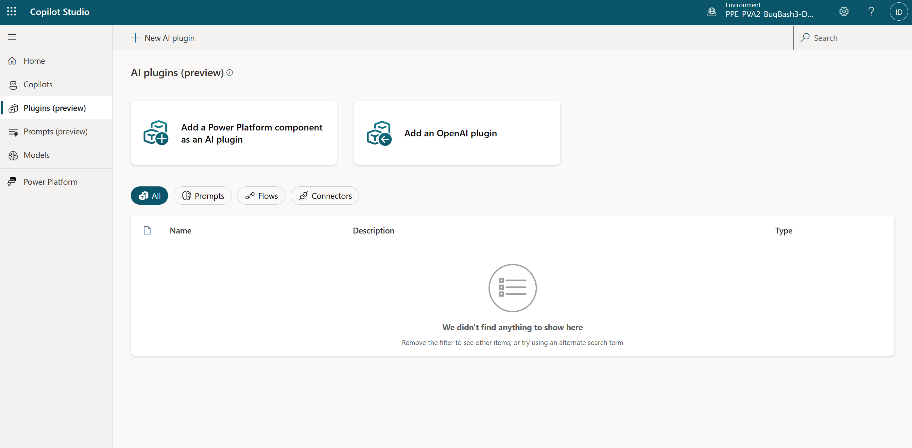
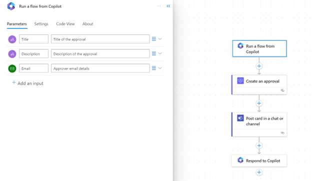
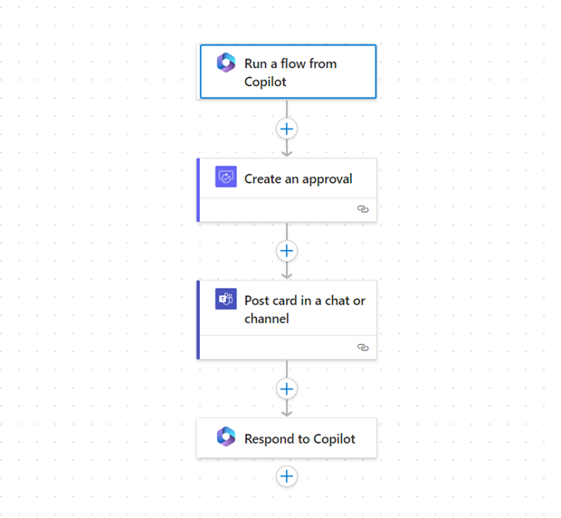
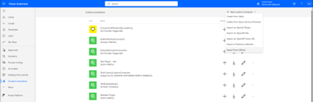
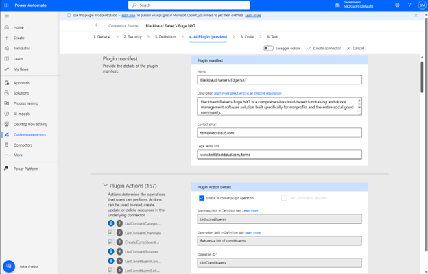
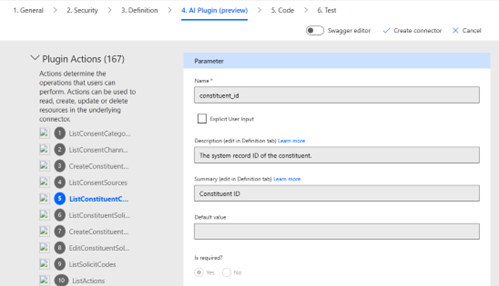
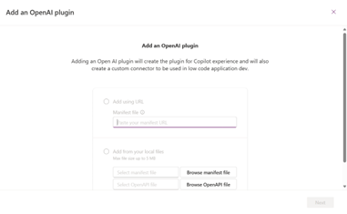
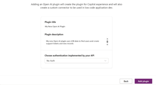
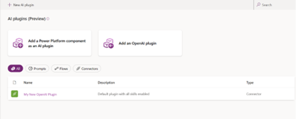

# Create AI plugins for Microsoft Copilot (preview)

[!INCLUDE[pva-rebrand](includes/pva-rebrand.md)]

AI Plugins can be used to extend Microsoft Copilot, or used within a custom copilot as a plugin action.

You can create multiple types of AI plugins in Microsoft Copilot Studio:

- Prompt plugins, which use AI Builder and natural language understanding to target the specific scenarios and workflows within your business.
- Flow plugins, which use Power Automate flows to perform actions, and retrieve and work with data.
- Connector plugins, which use Power Platform connectors to access data from other systems, such as popular enterprise products like Salesforce, Zendesk, MailChimp, and GitHub.
- OpenAI plugins, which use connections to custom OpenAI models that you create.

This article provides instructions for creating, sharing, or publishing plugins.

After you create plugins, [enable them for use in Microsoft Copilot](copilot-plugins-overview.md#use-plugins-in -microsoft-copilot), or [add them to a custom copilot as a plugin action](./advanced-plugin-actions.md).

AI plugins can be created on the **AI plugins (preview)** page in Copilot Studio, under **Plugins (preview)** on the side navigation pane:

The remainder of this article describes how to create each type of plugin.

## Generate content or extract insights with AI Builder dynamic prompts

The experience to create prompt plugins in Copilot Studio is the same as in Power Apps. Any plugins you create in either Copilot Studio or Power Apps go to the plugin registry and populate in both apps.

**To create prompt plugins:**

1. Sign in to Copilot Studio and select **Plugins (preview)** on the side navigation pane.
1. Select **Add a Power Platform component as an AI plugin**.
1. Select **Generate content or extract insights**.
1. Enter a name for your prompt, and then use plain, conversational language to describe what you want to achieve, for example *Summarize this text as a paragraph with fewer than 50 words*. You can also use prebuilt templates to help identify what your prompt can do and how it could be worded.
1. In your prompt, add a dynamic value for each input that the end user should provide in their chat with Microsoft Copilot. You can add dynamic values as phrases or words in your prompt by selecting the phrase and then selecting **Add dynamic value**, or you can add dynamic values without selecting any text and then provide your own label. In this example, the word `text` turns into a dynamic variable.
1. Expand the **Test your prompt** section and enter sample data for each dynamic value. Select **Test prompt** to evaluate how well the prompt works.
1. Select **Save custom prompt**.

After you create your plugin, you need to [enable it for use in Microsoft Copilot](copilot-plugins-overview.md#use-plugins-in-microsoft-copilot).

For more information about building and using prompt plugins, see [AI Builder prompts](/ai-builder/create-a-custom-prompt).

## Custom automation with Power Automate flows

Power Automate flow plugins let you define flows that can be called from AI surfaces in Power Platform. Flow plugins use the new **Run from Copilot** trigger and **Respond to Copilot** action to define custom processes that can be invoked with natural language.

**To create automation plugins:**

1. Sign in to Copilot Studio and select **Plugins (preview)** on the side navigation pane.
1. Select **Add a Power Platform component as an AI plugin**.
1. Select **Custom Automation**.
1. The flow editor automatically opens with the **Run from Copilot** trigger and **Respond to Copilot** action present.
1. You can add inputs to your trigger for information you might want to collect from your users. Provide helpful text descriptions for each input so the AI can correctly identify what to extract from a user's data or inputs.
   
1. Add actions to your flow such as the **Create an approval** and **Post a message to Teams chat** to create an approval process.
1. Optionally add parameters to the **Respond to copilot** action for any output you want to send back to the bot.
   
1. Save your flow with a meaningful flow name and test or run it at least once. The AI uses the title and description of the flow to determine when to invoke the flow plugins. Ensure your flows run correctly, as only tested flows show up as available plugins in Microsoft Copilot.

After you create your plugin, [enable it for use in Microsoft Copilot](copilot-plugins-overview.md#use-plugins-in-microsoft-copilot).

## Update or get answers about external data with connectors

Connector plugins let you define connector actions that can be invoked from AI surfaces in Power Platform. Connector plugins require identification of actions that are enabled for use in Microsoft Copilot and the capture of information that large language models require to effectively identify and utilize the plugin, such as **Summary** and **Description** fields.

>[!NOTE]
>Connector plugins are required to be certified before they can be used in Microsoft Copilot. [Learn more](/connectors/create-a-connector-ai-plugin#submit-the-ai-plugin-enabled-connector-for-certification).

**To create connector plugins:**

1. Sign in to Copilot Studio and select **Plugins (preview)** on the side navigation pane.
1. Select **Add a Power Platform component as an AI plugin**.
1. Select **Update or get answers about external data** to get started creating a plugin using a connector.
1. The **Custom connector** editor page automatically opens. Here you can open your connector from the available list or create a new one.  
   
1. On the **AI plugin** tab, add your plugin information such as a summary and description under **Manifest details**. Select the connector actions to enable them. Add text descriptions so that copilot can identify and use your actions.  
   
1. Select the input parameter in the **Request** section of the action and enter a description. For actions where the input parameters don't have descriptive names and descriptions, it's helpful to add human readable text to aid the AI in using the actions effectively. For example, a field "id" can be better described as the "Account Identifier" or b_date can be described as "Birth Day of Contact in MM/DD/YYYY format." Such descriptions help large language models interact effectively with the plugin.  
     

1. Select **Create/Update Connector** and the connector's Swagger gets updated with appropriate annotations.
1. Follow the instructions to certify the connector so that the plugin can be used in Microsoft Copilot. [Learn more](/connectors/create-a-connector-ai-plugin#submit-the-ai-plugin-enabled-connector-for-certification).

After you create your plugin, [enable it for use in Microsoft Copilot](copilot-plugins-overview.md#use-plugins-in-microsoft-copilot).

## Add an OpenAI plugin

OpenAI plugins allow the AI to access data that's not normally available to them based on their available training data.

This data can include:

- Personal information.
- Specific product, feature, or content details that aren't available publicly.
- Access to line of business application records.
- Data accessed as part of an integration with specific websites, software, or services.

Depending on the plugin, end users of the copilot can also perform actions against the data such as make updates, additions, or delete content.

Users can create OpenAI plugins and use them to generate connectors to integrate data sources with the Power Platform and to integrate AI chat capabilities in Microsoft products like Microsoft Teams.

**To create an OpenAI plugin:**

1. Sign in to Copilot Studio and select **Plugins (preview)** on the side navigation pane.
1. Select **Add an OpenAI plugin**.
1. Provide your manifest for the Open AI plugin. You can add a link to the location of the manifest file, or by manually selecting and uploading the manifest file from a local machine.  
   
1. After providing your manifest, select **Next**.
1. Select the authentication type for your plugin from the available options. You might be asked to provide authentication details, if necessary for the connection.  
   

   The following authentication types are supported:

   - **No Auth** - Anonymous plugins that require no extra credentials.
   - **API Key** - Requires a parameter label, name, and the location for the label. Later, when creating a connection to the connector or plugin, you're prompted to provide your API Key.
   - **OAuth 2.0** - Requires a client ID, client secret, authentication URL, token URL, refresh URL, and scope.

1. Select **Add Plugin**.  
   

Your copilot plugin is generated along with your custom connector for the plugin. Both are available for use within your organization and can be included in solutions that you export. For more information, see [Create a custom connector from an OpenAI definition](/connectors/custom-connectors/define-openapi-definition).

After you create your plugin, [enable it for use in Microsoft Copilot](copilot-plugins-overview.md#use-plugins-in-microsoft-copilot).
