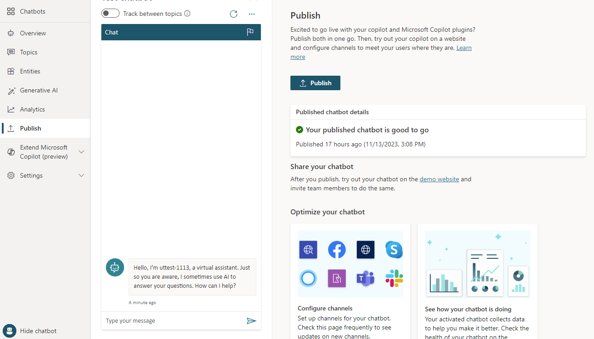
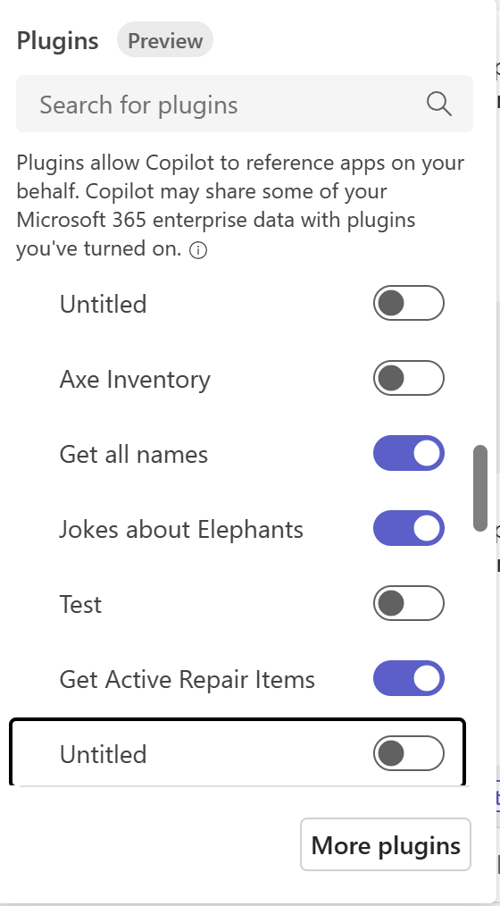

# Create conversational plugins for Microsoft Copilot (preview)

[!INCLUDE[pva-rebrand](includes/pva-rebrand.md)]

Microsoft Copilot provides out of the box experiences to engage with content and resources from across your organization. In some situations, answers and interaction with external systems are required. With Microsoft Copilot Studio, you can author a conversational topic that can be published as a Copilot Plugin. Once your Tenant Admin approves the Plugin, it can be added to your organization's M365 Chat experiences.

For this preview, you can create a conversational plugin that receives the user's query (stored in the **Activity.Text** variable), processes it by completing one or more operations, and then sends one or more responses back to the user in the M365 Chat.

>[!IMPORTANT]
>  
> You can't use conversational plugins that you've created in Microsoft Copilot Studio as a [plugin action](advanced-plugin-actions.md).

## What is a Microsoft Copilot Plugin and how does it work?

Microsoft Copilot's conversational system uses orchestration logic and large language models to help the user achieve their goals. This system interprets the user's request, determining the best course of action, then activates the appropriate system, plugin, component, or series of components. Finally, a generated result is returned to the user.

A conversational plugin built in Microsoft Copilot Studio enables you to extend your app's behavior. You can create new abilities that aren't natively in Microsoft Copilot, like calling a specific API, applying sophisticated business logic, or accessing data sources that require configuration outside of Microsoft Copilot's access.

Unlike a traditional component model that creates a hard-coded integration point with the copilot, a maker in Microsoft Copilot Studio creates a conversational plugin. This maker gives descriptive text to the Microsoft Copilot's orchestrator about the plugin's abilities. The orchestrator can then make its own decision about when the plugin would be most useful and ask the user appropriate questions to fill plugin parameters.

## Prerequisites

- End users must have a license to use Microsoft Copilot for Microsoft 365.
- Your M365 Tenant must also be participating in the [Microsoft Copilot Plugins Preview](https://aka.ms/Copilot_Plugin_Preview)
- Microsoft Copilot Studio application must be a Microsoft Copilot Studio copilot, not a Power Virtual Agents "Classic" bot.
- Before end-to-end works, the Microsoft 365 Tenant Admin needs to enable the **Dynamics and Microsoft Copilot Studio** Integrated Apps category in the Microsoft Admin Center.

> [!IMPORTANT]
> In this preview, there are some limitations:
>
> 1. Your topic will not be able to interact (ask questions of) the user, and can only process the incoming query from the user (in the variable **Activity.Text**) and send a response.
> 1. Responses will be limited to text, no media or adaptive cards will be supported
> 1. In this preview, Copilot Studio will not be able to authenticate the user, so SharePoint and Onedrive sources for generative answers will not be functional.
> 1. This preview will be limited to English language copilots.
> 1. All users of Microsoft Copilot within your organization will be able to interact with the copilot, the copilot will not support authenticting the user itself
> 1. If your Dataverse Environment has a security group assigned, the Plugin may not be visible or work in M365 Chat.

## Creating a basic conversational plugin to publish to Microsoft Copilot

Your topic used within Microsoft Copilot chat uses the System variable **Activity.Text** as an input that represents the user's question in Microsoft Copilot. The chat processes it, such as passing it to **Generative Answers**, and returns the result as one or more messages. These messages could include the response that comes from **Generative Answers** or **Send a Message** nodes. Multiple messages can be included and sent separately to form the output.

The following steps help you create a new conversational plugin within Microsoft Copilot Studio. You author basic capabilities and publish them to the Microsoft Admin Center. You can choose and enable the plugin in the UI.

1. From the left navigation pane in Copilot Studio, choose the **Extend Microsoft Copilot (preview)** option, and then **Conversational plugins**.
1. From this page, choose **Add conversational plugin** affordance in the bar above the authoring canvas, which opens the authoring canvas with a new conversational plugin.
1. The authoring canvas appears with a new **Microsoft Copilot (preview)** trigger node on it.
1. Before authoring further, set the name of the toipc in the top panel above the authoring canvas. This name is visible to the user and admin in the Microsoft Copilot and Microsoft Admin Center respectively.
1. In the Trigger node’s description, provide a clear description of how the conversational plugin can help the user and what it can do. Unlike other descriptions, this one has functional purpose and is used by the Microsoft Copilot to determine whether to invoke your plugin or not. Use clear sentences to describe what your plugin does for the user and what it returns.
1. In the conversational plugin, create any type of logic that doesn't require user interaction (no buttons, questions, cards, or other prompts). The authoring canvas menu for conversational plugins is limited to remove options that could require user interaction.
1. For this example, we use the **Generative Answers** node to execute a search for web content and provide an answer to the user in Microsoft Copilot.
1. To use the Generate Answers node, select the plus on the canvas under the trigger node, then select **Generative answers** under the Advanced tab of the popup menu.
1. For the **Input** field, invoke the variable picker by selecting the arrow in the **Input** box.
1. Choose the system variable **Activity.Text** which represents the user’s last query to Microsoft 365 Copilot. This query was what the user asked in M365 Chat which caused Microsoft Copilot to invoke the plugin.
1. Select the **Data Sources** link in the center of the **Generative Answers** tile.
1. Enter a link to a public website that has content you want for your bot. This web content gets used to answer user questions.
   >[!NOTE]
   >
   > Don't choose content that's not indexed by Bing, for example 301 redirects.
   >
1. Once the link is added (don't forget to hit "+" once entering the URL), the properties panel can be closed
1. If you wish, you send one or more messages to the user as a response. You can use a **Send a Message** node, or another **Generate Answer** node call, or multiple of these actions as your conversational plugin needs.
1. Finally, the conversational plugin can be saved with save icon in the top right corner of the page.

## Publishing your conversational plugin to Microsoft Copilot

Publishing your conversational plugin creates a new plugin in the Dataverse registry for your Tenant. Once available there, your tenant admin needs to approve your plugin to be available to users in the Microsoft Copilot plugins catalog.

In Microsoft Copilot, your conversational plugin is labeled as *Conversational plugin name* in the add plugins UI. As such, specify your conversational plugin name and copilot name for readability.

> [!IMPORTANT]
> During this preview, the first time you publish your conversational plugin, the Microsoft Copilot admin UI will show your conversational plugin after approximately four hours. Changes you make to the internals of your conversational plugin after that will happen immedately.
>
> If you disable, then publish your conversational plugin, and then to reenable and republish, the four hour wait will reoccur.

To publish your conversational plugin:

1. First, create and save your conversational plugin as described in the prior section
1. Go to **Publish** on the side navigation pane of Copilot Studio.
1. Choose **Publish**. The publish should complete quickly. The actual availability in the Microsoft Admin Center can take up to 4 hours.

    

1. Your Admin can find the **Dataverse and Microsoft Copilot Studio** integrated app in the Microsoft Admin Center under **Settings**, then **Integrations to be reviewed and approved**. In this preview, Deploy/Block is at this category level only.
1. Once your Tenant admin approves the Dataverse and Microsoft Copilot Studio integrated app, it should appear in the user's list of plugins in their Microsoft Copilot UI.

    

Once enabled, your user can ask questions to Microsoft Copilot and see the plugin invoked and return the most relevant results.

> [!NOTE]
> To unpublish your conversational plugin from the catalog, in conversational plugin details, unclick the **Status** checkbox, save your conversational plugin, and then re-publish, which will remove it from the Dataverse registry and Microsoft Copilot app catalog.

> [!TIP]
> Interacting with the Microsoft Copilot orchestrator is likely to be a different experience than you might have had integrating with previous systems.
>
> 1. The Microsoft Copilot will always rewrite your answers with it's own voice. It's not possible in this preview to have the content passed through unchanged to the end user.
> 1. The description of your conversational plugin is critical to how reliably it will be invoked. The description teaches the Orchestrator what your plugin is good at and what answers it can provide. Be sure to use clear prose when writing the description, and consider experimenting with changes to get the best outcome.
