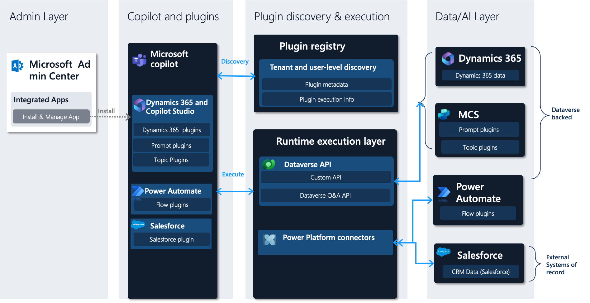
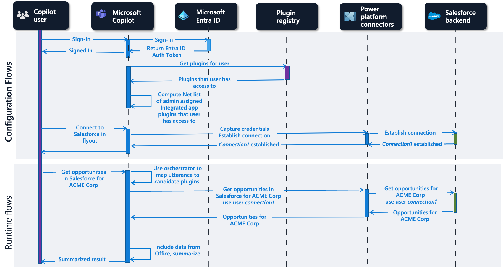
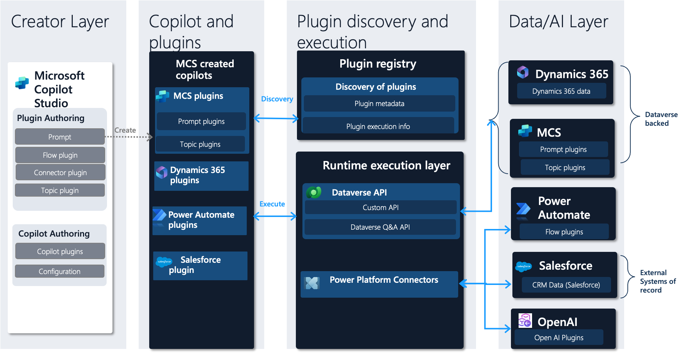
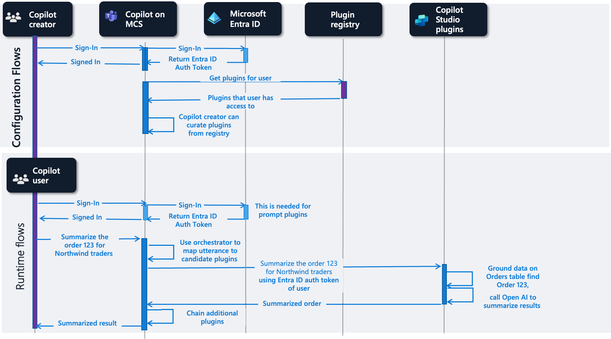

# Microsoft Copilot Studio plugin architecture

[!INCLUDE[pva-rebrand](includes/pva-rebrand.md)]

A **plugin** is a reusable piece of code that can perform a specific task or provide specific functionality for a copilot. For example, a plugin can help a copilot answer a natural language query, execute a workflow, connect to an external system, or provide topic-specific guidance. A **copilot** is a conversational or UX-based assistant that helps users accomplish their tasks and goals in a specific domain or application.

A plugin, in this context, is created in the plugin authoring experience in the Microsoft Copilot Studio. This feature allows users to create and edit plugins using a graphical user interface and publish them to the plugins registry.

The plugins registry helps you create a plugin once and use it in multiple copilots. The registry provides storage and management for metadata and execution information for plugins. Users can apply the power and flexibility of plugins to enhance the capabilities of copilots without writing code for each copilot separately. The various copilots interact with the plugins registry to discover plugins and execution information available for a user. This capability enables AI plugins to be created once and reused many times.

## A plugin is born

Figure: Plugin Authoring using Microsoft Copilot Studio

### Creator Layer

The Creator Layer of Microsoft Copilot Studio is where users can create and edit plugins. This layer supports four types of plugins: Prompt, Flow, Connector, and Topic.

- **Prompt** plugins are plugins that can answer natural language queries from users using natural language processing (NLP) and natural language generation (NLG) techniques. For example, a prompt plugin can answer a question like "What are the sales opportunities for ACME Corp?" by querying data in Microsoft Dataverse and generating a natural language response that can be customized (such as a bulleted list).

- **Flow** plugins are plugins that can execute multi-step workflows using Microsoft Power Automate. For example, a flow plugin can create a new contact in Microsoft Dynamics 365 after manager approval or send an email to a customer with a prescribed template.

- **Connector** plugins are plugins that can connect to external systems or data sources using Microsoft Power Platform connectors. For example, a connector plugin can connect to Salesforce or SAP using Power Platform connectors and retrieve or update data. Connector plugins can be certified connectors that are shared across tenants or environment-specific custom connectors.

- **Topic** plugins are single-turn conversational threads between a user and a copilot that can be created to answer a specific user utterance. For example: a topic about store hours with a trigger phrase *check store hours* can return the store hours. These topics can still handle user utterances such as "see store opening hours" due to the power of LLMs.

### Business applications and Power Platform plugin registry

The plugins registry stores and manages the plugin metadata and execution information. The registry is a single source for discovery of plugins authored from Microsoft Copilot Studio. The registry helps you discover integrated apps available at the tenant level used in the Microsoft Admin center by Microsoft 365 Teams. The registry shows you plugins available to a user, or used by copilots in Microsoft Copilot Studio. A plugin has the same security as its underlying artifact, such as a flow and can provide a customized list of plugins for a specific user role.

### Copilot samples

This sample set of the various copilots integrates with the plugins registry to consume plugins. These copilots include Microsoft copilots for Dynamics 365 apps, Microsoft copilots for Teams, and custom copilots authored using Microsoft Copilot Studio. The list is expected to grow in the future as more first-party and third-party copilots are developed.

## A plugin in Microsoft Copilot

### Admin Layer

The administration layer is where administrators can use the Microsoft Admin Center to choose the integrated apps available for their tenant. Administrators can allow, deploy, or block apps for specific or all users. An integrated app can have multiple plugins. The apps available from Microsoft Copilot Studio-created plugins are retrieved from the plugins registry and include:

- **Dynamics 365 and Microsoft Copilot Studio**: Includes Dynamics 365 plugins from teams such as Microsoft Dynamics 365 Sales and Microsoft Dynamics 365 Field Services. You can create custom prompts and topic plugins.

- **Power Automate**: Includes Power Automate flow plugins.

- **Connector specific**: A sample of Salesforce and SAP plugins are called out here. Every certified connector plugin created by Microsoft or ISVs shows up as their own integrated app for fine-grained management.
   > [!NOTE]
   > App names are subject to modification.

### Plugin Discovery and Execution

The plugins available to a maker include plugins assigned through deployed integrated apps. The plugins available to a maker are discovered through the plugins registry. Makers are free to further customize the plugins based on how they want to use the plugin flyout experience. The plugin execution information gets retrieved from the plugins registry and includes the runtime path.

There are two runtime execution paths supported today:

1. **Plugins that are Dataverse-based**: Microsoft Dynamics 365 plugins that access or modify Dataverse data, Microsoft Copilot Studio topic plugins, and prompt plugins. This path supports Microsoft Entra ID authentication. The calls are made to the underlying system on behalf of the user.

1. **Plugins that use the Power Platform connector ecosystem**: This path helps execute connectors that provide access to internal and external systems of record. It supports explicit configuration of credentials per user such as Salesforce connection credentials that are then maintained per user.

If a maker doesn't find a suitable plugin for their task, they can navigate to the Microsoft Copilot Studio and create a plugin that addresses their needs.

### Data/AI Layer

This layer represents the various data stores and systems where the data and business logic reside. These stores and systems include Sales, Field Service and other Dynamics 365 products, Microsoft Copilot Studio, Power Automate, external systems such as Salesforce, SAP, and others.

## Data and control flows for some plugin types

As a prerequisite for all flows, an administrator uses the Microsoft Admin Center to configure the corresponding integrated apps and assigns them to users, including the Copilot user referenced here. In these flows, we first see the **configuration phase** for a copilot user in Copilot for Teams. After the user signs in, the plugins applicable for that user are retrieved from the plugin registry. The plugins in a user's flyout belong to the integrated apps their administrator configures for them and the ones they have access to in the plugin registry. The user can then configure the plugins they want to use in the copilot experience in the flyout in their Copilot for Teams experience.

### Dynamics 365 plugins

In the runtime flow for the Dynamics 365 plugins, the orchestrator maps a copilot user's utterance of *Get opportunities for ACME corp* to a set of candidate plugins. A plugin from  Dynamics 365 is found to be best candidate and then executed, translating the user's utterance to SQL against the dynamic data the user has access to. The results are then returned to the user. Teams copilot can additionally add data from Microsoft 365 and summarize the results.

### Microsoft Copilot Studio plugins

In the runtime flow for Copilot Studio prompt plugins, the user's utterance is again mapped to a plugin. In this case, the matching plugin is a prompt authored in Microsoft Copilot Studio. The prompt grounds data in Dataverse table _orders_ and calls into Open AI to summarize the results for order 123 and returns the summary to the user.

### Connector plugins

The configuration flow for Salesforce or other connector-based plugins starts with a **Connect** experience in the flyout where the user can enter connection information for Salesforce. At runtime, the user utterance is mapped to a candidate plugin and this plugin is executed using the Power Platform Connector infrastructure. The results are then returned to the user.

## Plugins used in Microsoft Copilot Studio copilots

Microsoft Copilot Studio can be used to create copilots in addition to plugins. Dynamics 365 teams or third parties can build these copilots.

Similar to the creator layer, the plugin discovery, execution, and Data/AI layer look like the figure shown. The difference is in how you manage curation of plugins for the copilot. The copilot creator chooses amongst available plugins from their Dataverse environment.

### Data and Control flows for some plugin types

Here's an example of a prompt plugin used from a copilot built in Microsoft Copilot Studio. The configuration flow includes a copilot creator curating the plugins for the copilot from the plugin registry. At runtime, the authenticated copilot user summarizes order 123 for Northwind traders. This summary maps the utterance to candidate plugins. The matching plugin is a prompt authored in Copilot Studio. The prompt uses data from the *orders* table in Dataverse. The results are summarized using OpenAI and are returned to the user.

## Conclusion

By authoring a plugin in Microsoft Copilot Studio, you can further the reach of your plugin across copilots in Microsoft Dynamics 365, Microsoft Copilot for Teams, and other third-party copilots. Using plugins in this way allows the flexibility to create once and deploy across multiple copilots.
