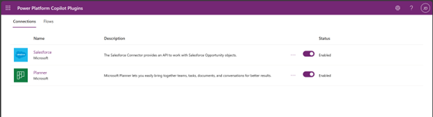
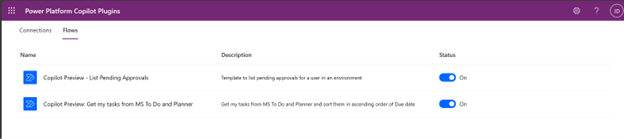

# Create and configure copilot plugins (preview)

[!INCLUDE [preview-banner](~/../shared-content/shared/preview-includes/preview-banner.md)]

Create plugins in Microsoft Copilot Studio that can be used in your copilots across Microsoft products to call connected services, perform actions, and provide answers for your copilot users without needing to manually author complex conversation flows. 

Due to the cross-functional nature of copilot plugin building, the Microsoft 365 tenant and the Power Platform environment are connected when you [enable the M365 Copilot setting in the Power Platform admin center](#). 

This allows you to use plugins in Microsoft Copilot for Microsoft 365 that leverage data and connections across Dynamics 365, Power Platform, and Microsoft 365.

This article gives an overview of the ways you can create and use copilot plugins, and provides links for individual configuration steps.

To get started creating, publishing, and using plugins in Microsoft Copilot, see the [Quickstart guide for creating plugins in Microsoft Copilot Studio](copilot-plugins-quickstart.md).

>[!Important]
>  
> During this preview, you can use plugins in Microsoft Copilot. You can't use plugins in custom copilots that you build with Microsoft Copilot Studio.

## Prerequisites

- You'll need an account for Microsoft Copilot Studio. 

    > [!NOTE]
    >  
    > If you don't have a Microsoft Copilot Studio account, or you haven't created chatbots with Microsoft Copilot Studio before, see the [Quickstart guide for building bots with GPT](nlu-gpt-quickstart.md).

- You'll also need:
  - Admin access to [A Microsoft 365 tenant](/microsoft-365/solutions/tenant-management-overview?view=o365-worldwide) <mark>need roles</mark>
  - Admin access to [A Power Platform environment](/power-platform/admin/environments-overview) <mark>need roles</mark>

  ## Copilot plugins

Plugins are discrete, reusable building blocks that work across Power Platform, Dynamics 365, and Microsoft 365. All of the plugins within your [Microsoft 365 tenant](/microsoft-365/solutions/tenant-management-overview?view=o365-worldwide#a-microsoft-365-tenant-defined) are shared from a central plugin registry in Dataverse. This means that when you create or change a plugin and publish it, the changes are pushed to all of your copilots that use the plugin.

When you create a plugin, you use simple language to describe what the plugin should do, and then provide a data source or additional connection that the copilot should use when it determines the plugin should be used in a conversation. The copilot uses the plugin's description to determine when the plugin would be most useful, and will automatically ask the user for any additional information it needs for the plugin to work.

For example, say you've built an app to manage leads. You add a copilot to improve the efficiency of end users when using the app; in particular, you want to streamline the creation of leads from contacts and help users get insights into the next actions they should take.

However, when your copilot user says to the copilot "Create a new lead from this contact" or "What are the key things I need to do?" the copilot doesn't have the information to correctly answer the question or create the lead.

Instead of manually designing a conversation flow within the copilot to account for these scenarios, you create and connect the following plugins to the copilot:    
- A Power Automate flow plugin which takes the contact data provided by the copilot user to create the lead.
- A prompt plugin to provide a summary from the latest conversations the copilot user has had with the contact.

Now when the copilot user asks to create a lead, the flow plugin will be triggered and the lead will be created from the data already provided by the user. The use can also ask for an abstract or summary, which will trigger the prompt plugin and return a summary of actions.

### Plugin categories and types

There are two categories of plugin that you can create in Copilot Studio: conversational plugins and AI plugins.

#### Conversational plugins

These plugins are similar to standard topics in Copilot Studio that you use to create a functional copilot. 

You create, configure, and publish conversational plugins in a similar manner to topics, after which they'll be added to the plugin registry and availble for use in Microsoft Copilot.

See [Create conversational plugins for Microsoft Copilot (preview)](copilot-conversational-plugins.md) for details on how these plugins work and how to create and use them.

#### AI plugins

These plugins let you connect your copilot to data or perform activities. 

You create and configure AI plugins in Copilot Studio. You can also create and edit some types of AI plugins in Power Apps.

The following table describes each type of AI plugin, with links to articles explaining where and how to create them:

AI plugin type | Description | Creation in Copilot Studio | Creation in Power Platform
- | - | -
AI builder dynamic prompts | Prompts enable your users to use natural, plain language to get answers and perform actions with Microsoft Copilot. They use natural language understanding (NLU) to understand a user's intent and map it to an associated piece of information, data, or activity. | [Generate content or extract insights with AI Builder dynamic prompts](copilot-ai-plugins.md#generate-content-or-extract-insights-with-ai-builder-dynamic-prompts) | [Create a custom prompt (preview) in Power Automate or Power Apps](/ai-builder/create-a-custom-prompt?branch=pr-en-us-766) 
Power Automate flows | Flows can be called from within a Microsoft Copilot chat that can perform actions or retrieve information across the end user's environment. | [Create custom automation with Power Automate flows](copilot-ai-plugins.md#custom-automation-with-power-automate-flows) | Not available
Power Platform custom connectors | Custom connectors let your plugin retrieve and update data from external sources accessed through APIs. Connectors make it possible to access data from popular enterprise systems such as Salesforce, Zendesk, MailChimp and Github, and are routinely used by makers in their Power Apps and flows. |[Update or get answers about external data with connectors](copilot-ai-plugins.md#update-or-get-answers-about-external-data-with-connectors) | [Create a connector AI plugin (preview) in Power Automate or Power Apps](/connectors/create-a-connector-ai-plugin?branch=pr-en-us-1461)
OpenAI plugins | [Open AI plugins](https://platform.openai.com/docs/plugins/introduction) provide access to data sources, allowing specific data to be surfaced through AI experiences that aren't normally available through general models. | [Add an OpenAI plugin](copilot-ai-plugins.md#add-an-openai-plugin)) | Not available. |

During this preview, you can use plugins in Microsoft Copilot. You can't use plugins in custom copilots that you build with Microsoft Copilot Studio.

## Use plugins in Microsoft Copilot

End users in your tenant can use conversational and AI plugins in their chats with Microsoft Copilot if:

1. Your Microsoft 365 tenant admin has deployed the Dynamics 365 and Copilot Studio app in the Microsoft 365 admin center.

1. Your Power Platform environment admin has enabled the M365 Copilot setting in the Power Platform admin center.

1. The end user has enabled the connection from within their chat with Microsoft Copilot.

**To deploy the Dynamics 365 and Copilot Studio app:**

1. Sign in to the Microsoft 365 admin center with your admin account.

2.	Expand **Settings** on the side navigation pane and select **Integrated apps**.

3.	Go to the **Available apps** tab and select the entry **Dynamics 365 and Copilot Studio**. The app's details pane opens.

4. 4. Select **Deploy** to enable the app in chats with Microsoft Copilot.

**To enable the M365 Copilot setting:**

1. Sign in to the Power Platform admin center at https\://admin.powerplatform.microsoft.com with your admin account.

2. Select **Environments** on the side navigation pane and then select the environment where you want your plugins to be used.

3. Expand the **Product** section, and select **Features**.

4. Set the switch for **M365 Copilot** to **On**.

5. Scroll to the botttom of the **Features** page and select **Save**.

**To enable the connection in Microsoft Copilot:**

Microsoft Copilot end users will need to create a connection between their chat instance and the plugin registry. They only need to do this once, after which they can interact with all existing and any future plugins that are available to do them.

The end user will need to go to the Power Platform Copilot plugins configuration portal, where they can enable the plugins they want.

They can get to the portal by asking about plugins in their chat with Microsoft Copilot. They'll receive a short summary about plugins and a link to the portal:

Users can also ask directed questions about data connections or how to perform cross-organizational tasks, for example they could ask:

- *How can I use a plugin?*
- *Tell me about Power platform Copilot plugins*
- *How can I get data from an external system?*
- *How can I get data from Salesforce?*
  
  The configuration portal can also be used to enable Power Automate flows supported for Copilot, under the **Flows** tab:

  

  ## Share AI plugins

By default, plugins are only visible and usable in Copilot Studio by the person who created them. Though, they can be shared so other users of the environment or groups can use it in their Copilot. The authorization is managed at the underlying Power Platform object level. 
For instance, sharing an AI Builder prompt is performed from the AI prompts page by selecting Share for the respective prompt. The same applies for Power Automate flow which can be shared from the Flows page by selecting Share for the respective flow, or for Dataverse custom connectors from the Custom connectors page by selecting Share for the respective custom connector.
All Power Platform plugins can be used in M365 automatically, presuming the M365 admin have deployed the “Dynamics 365 and Copilot Studio” app from M365 Admin Center, and the Power Platform Admin center M365 sync settings is enabled.   
 
## Related topics

| Topic | Description |
|-|-|
[Quickstart guide for creating and using plugins in Microsoft Copilot](copilot-plugins-quickstart.md) | If you're new to Microsoft Copilot Studio and creating plugins, start here to be taken through the end-to-end process from creating through to using plugins.
| [Create conversational plugins for Microsoft Copilot (preview)](copilot-conversational-plugins.md)| Create plugins that can respond to a user's question with additional data.|
| [Create AI plugins for Microsoft Copilot (preview)](copilot-ai-plugins.md) | Create plugins that perform actions and query data across a user's environment with Power Automate flows, AI Builder prompts, Power Platform connectors, and OpenAI connections.
| [Use plugin actions in Microsoft Copilot Studio (preview)](advanced-plugin-actions.md) | Create complex topics for use in copilots you build in Copilot Studio, without doing anything particularly complex.
