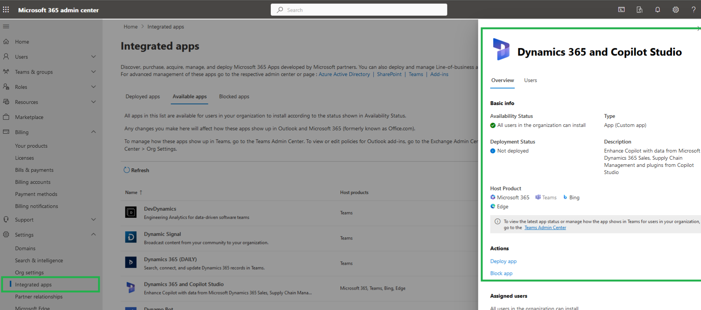
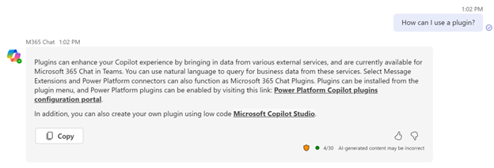

# Create and configure copilot plugins (preview)

[!INCLUDE[pva-rebrand](includes/pva-rebrand.md)]

[!INCLUDE [preview-banner](~/../shared-content/shared/preview-includes/preview-banner.md)]

Create plugins in Microsoft Copilot Studio to use in your copilots across Microsoft products. These plugins can call connected services, perform actions, and provide answers for your copilot users without needing to manually author complex conversation flows.

Copilot plugin building connects the Microsoft 365 tenant and the Power Platform environment when you [enable the Microsoft 365 Copilot setting in the Power Platform admin center](#use-plugins-in-microsoft-copilot).

These connections allow you to use plugins in Microsoft Copilot for Microsoft 365 and use data across Dynamics 365, Power Platform, and Microsoft 365.

This article gives an overview of the ways you can create and use copilot plugins and provides links for individual configuration steps.

>[!Important]
>  
> During this preview, you can use plugins in Microsoft Copilot. You can't use plugins in custom copilots that you build with Microsoft Copilot Studio.

## Prerequisites

To create AI plugins that your end users can use in their chats with Microsoft Copilot, you need:

- A license for Microsoft Copilot Studio (or an existing Power Virtual Agents license).
- Your Microsoft 365 tenant admin to [deploy the Dynamics 365 and Copilot Studio app in the Microsoft 365 admin center](#deploy-the-dynamics-365-and-copilot-studio-app-admin).

End users in your tenant can use conversational and AI plugins in their chats with Microsoft Copilot if you configure these settings, author and publish an AI plugin, and [the user enables the connection from within their chat with Microsoft Copilot](#enable-the-connection-in-microsoft-copilot).

## Copilot plugins

Plugins are discrete, reusable building blocks that work across Power Platform, Dynamics 365, and Microsoft 365. All plugins within your [Microsoft 365 tenant](/microsoft-365/solutions/tenant-management-overview?view=o365-worldwide#a-microsoft-365-tenant-defined) are shared from a central plugin registry in Dataverse. When you create or change a plugin and publish it, the changes are pushed to all your copilots that use the plugin.

When you create a plugin, you use simple language to describe what the plugin should do. Next, you provide a data source or other connection that the copilot uses when reading a description and determining the best plugin for a conversation. The copilot automatically asks the user for more information, if needed, for the plugin to work.

For example, you build an app to manage leads. You add a copilot to improve the efficiency of end users when using the app. You want to streamline the creation of leads from contacts and help users get insights into the next actions they should take.

However, when your copilot user says to the copilot "Create a new lead from this contact" or "What are the key things I need to do?" the copilot doesn't have the information to correctly answer the question or create the lead.

Instead of manually designing a conversation flow within the copilot to account for these scenarios, you create and connect the following plugins to the copilot:

- A Power Automate flow plugin takes the contact data provided by the copilot user to create the lead.
- A prompt plugin summarizes the latest conversations the copilot user had with the contact.

Now when the copilot user asks to create a lead, the flow plugin is triggered and the lead is created from the data already provided by the user. The use can also ask for an abstract or summary, which triggers the prompt plugin and return a summary of actions.

### Plugin categories and types

There are two categories of plugin that you can create in Copilot Studio: conversational plugins and AI plugins.

#### Conversational plugins

These plugins are similar to [standard topics in Copilot Studio](authoring-create-edit-topics.md) that you use to create a functional copilot.

You create, configure, and publish conversational plugins in a similar manner to topics. Afterwards, they're added to the plugin registry and available for use in Microsoft Copilot.

See [Create conversational plugins for Microsoft Copilot (preview)](copilot-conversational-plugins.md) for details on how these plugins work and how to create and use them.

#### AI plugins

These plugins let you connect your copilot to data or perform activities. During this preview, you can use plugins in Microsoft Copilot. You can't use plugins in custom copilots that you build with Microsoft Copilot Studio.

You create and configure AI plugins in Copilot Studio. You can also create and edit some types of AI plugins in Power Apps.

The following table describes each type of AI plugin, with links to articles explaining where and how to create them:

| AI plugin type | Description | Creation in Copilot Studio | Creation in Power Platform |
|--------------- | ----------- | ---------------------------| ---------------------------|
|AI builder prompts | Prompts enable your users to use natural, plain language to get answers and perform actions with Microsoft Copilot. They use natural language understanding (NLU) to understand a user's intent and map it to an associated piece of information, data, or activity. | [Generate content or extract insights with AI Builder prompts](copilot-ai-plugins.md#generate-content-or-extract-insights-with-ai-builder-dynamic-prompts) | [Create a custom prompt (preview) in Power Automate or Power Apps](/ai-builder/create-a-custom-prompt?branch=pr-en-us-766)
Power Automate flows | Flows can be called from within a Microsoft Copilot chat that can perform actions or retrieve information across the end user's environment. | [Create custom automation with Power Automate flows](copilot-ai-plugins.md#custom-automation-with-power-automate-flows) | Not available
Power Platform custom connectors | Custom connectors let your plugin retrieve and update data from external sources accessed through APIs. Connectors make it possible to access data from popular enterprise systems such as Salesforce, Zendesk, MailChimp and GitHub, and are routinely used by makers in their Power Apps and flows. |[Update or get answers about external data with connectors](copilot-ai-plugins.md#update-or-get-answers-about-external-data-with-connectors) | [Create a connector AI plugin (preview) in Power Automate or Power Apps](/connectors/create-a-connector-ai-plugin?branch=pr-en-us-1461)
OpenAI plugins | [Open AI plugins](https://platform.openai.com/docs/plugins/introduction) provide access to data sources, allowing specific data to be surfaced through AI experiences not normally available through general models. | [Add an OpenAI plugin](copilot-ai-plugins.md#add-an-openai-plugin)) | Not available. |

## Use plugins in Microsoft Copilot

End users in your tenant can use conversational and AI plugins in their chats with Microsoft Copilot if:

1. Your Microsoft 365 tenant admin deploys the Dynamics 365 and Copilot Studio app in the Microsoft 365 admin center.

1. The end user enables the connection from within their chat with Microsoft Copilot.

### Deploy the Dynamics 365 and Copilot Studio app (admin)

1. Sign in to the Microsoft 365 admin center with your admin account.

1. Expand **Settings** on the side navigation pane and select **Integrated apps**.

1. Go to the **Available apps** tab and select the entry **Dynamics 365 and Copilot Studio**. The app's details pane opens.

1. Select **Deploy** to enable the app in chats with Microsoft Copilot.

### Enable the connection in Microsoft Copilot

Microsoft Copilot end users need to create a connection between their chat instance and the plugin registry. They only need to create a connection once, then they can interact with all existing and any future plugins that are available to do them.

The end user needs to go to the Power Platform Copilot plugins configuration portal, where they can enable the plugins they want.

They can get to the portal by asking about plugins in their chat with Microsoft Copilot. They receive a short summary about plugins and a link to the portal:

Users can also ask directed questions about data connections or how to perform cross-organizational tasks, for example they could ask:

- *How can I use a plugin?*
- *Tell me about Power platform Copilot plugins*
- *How can I get data from an external system?*
- *How can I get data from Salesforce?*

## Share AI plugins

By default, plugins are only visible and usable in Copilot Studio by the person who authored them.

However, the plugin author can share their plugins in the portal where they created them. For example, you can share an AI Builder prompt from the **AI prompts** page by selecting **Share** for the prompt. The same applies for Power Automate flows (from the **Flows** page in Power Automate) or for custom connectors from the **Custom connectors** page.
 
## Related topics

| Topic | Description |
|-|-|
| [Create conversational plugins for Microsoft Copilot (preview)](copilot-conversational-plugins.md)| Create plugins that can respond to a user's question with extra data.|
| [Create AI plugins for Microsoft Copilot (preview)](copilot-ai-plugins.md) | Create plugins that perform actions and query data across a user's environment with Power Automate flows, AI Builder prompts, Power Platform connectors, and OpenAI connections.
| [Use plugin actions in Microsoft Copilot Studio (preview)](advanced-plugin-actions.md) | Create complex topics for use in copilots you build in Copilot Studio, without doing anything complex.
