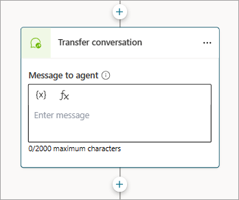
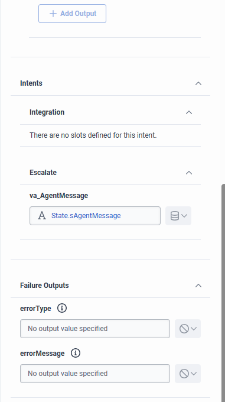

# Hand off to Genesys

[!INCLUDE[pva-rebrand](includes/pva-rebrand.md)]

This guide provides supplemental information to the main Genesys documentation for this integration located on [Github](https://github.com/GenesysCloudBlueprints/bot-connector-for-ms-power-virtual-agent]).

## Initial Integration

- Ensure that the [authentication setting in Copilot Studio is set](configuration-end-user-authentication.md) to **No authentication**.
- While the bot connector documentation is for AWS, equilvalent steps are possible in Azure as well. You'll need to modify the 2 Python scripts accordingly.
- Ensure that the DynamoDB table name created matches the one in the bot_sessions.py file.

## Agent Handoff

- Refer to existing [documentation for transfering the conversation](/dynamics365/customer-service/set-up-multilingual-pva-bot#configure-the-transfer-to-agent-node-by-using-the-escalate-topic).
- If passing a message to the agent in the transfer
  - Set the message in Copilot Studio:
    
    
  - Include as slot for the Escalate intent in the botconnector API call:
    ```
    {
        "name": "Escalate",
        "slots": {
                   "va_AgentMessage": {
                     "name": "va_AgentMessage",
                     "type": "String"
                }
            }
        }
    ```
  - This will show in Genesys as an output.

    

- If passing any other variable from Copilot Studio back to Genesys, follow the same process with `va_{variableName}` as the Slot name.

## iFrame setup

- Refer to existing [documentation](publication-connect-bot-to-web-channels.md#add-your-bot-to-your-website) on how to get a URL to your Copilot Studio bot. 
  - Copy the **iframe src URL**, this will be the value to copy into Genesys Cloud.
- Follow the [Genesys documentation on how to set up the widget](https://help.mypurecloud.com/articles/set-up-an-interaction-widget-integration/).
  - On Step 7, copy your iframe src URL as the **Application URL**.
