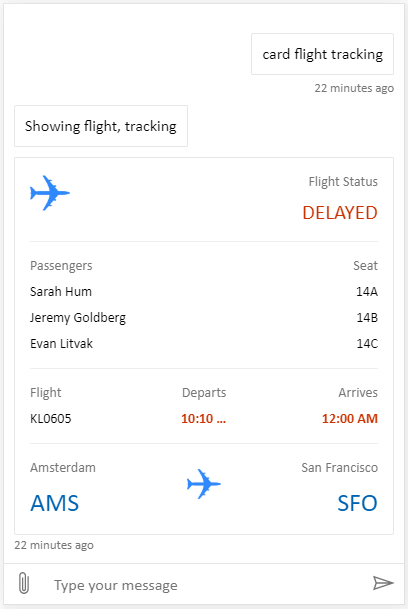
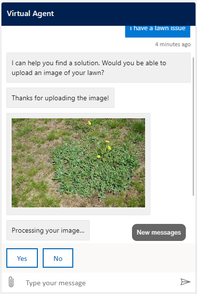

# Customize the look and feel of the bot's default canvas

> [!div class="op_single_selector"]
> - [Power Virtual Agents web app](customize-default-canvas.md)
> - [Power Virtual Agents app in Microsoft Teams](teams/customize-default-canvas-teams.md)

After you create and [publish a bot](publication-fundamentals-publish-channels.md), your customers can [use the bot's Web Chat canvas to interact with it](publication-connect-bot-to-web-channels.md).


The default look and feel of the bot is defined by the bot's canvas. You can customize the canvas in two ways, depending on the complexity of the customizations:


1. You can [customize the default canvas](#customize-the-default-canvas-simple) with JavaScript-based styling in the HTML code for the website where you deploy your bot.  
    Customizing the default canvas is useful if you want to make small customizations without investing in code development.

2. You can use a [custom canvas](#customize-and-host-your-chat-canvas-advanced), based on the [Bot Framework Web Chat canvas](https://github.com/microsoft/BotFramework-WebChat).  
    Connecting to a custom canvas requires extensive developer knowledge and is useful for organizations that want to customize the experience completely.

You can also combine the customized canvas with [configuring your bot to automatically start the conversation](configure-bot-greeting.md).

Lastly, you can [change the name and bot icon](#change-the-bot-name-and-icon) (when the bot is [shared in Microsoft Teams](publication-add-bot-to-microsoft-teams.md)) directly from the portal.


## Prerequisites

- [!INCLUDE [Medical and emergency usage](includes/pva-usage-limitations.md)]

>[!IMPORTANT]
>You may install and use the sample code included in this documentation only for use with the Microsoft Power Virtual Agents product. The sample code is licensed "as is" and is excluded from any service level agreements or support services. You bear the risk of using it.  
>Microsoft gives no express warranties, guarantees, or conditions and excludes all implied warranties, including merchantability, fitness for a particular purpose, and non-infringement.


## Change the bot name and icon

You can change the bot's name and icon. 

>[!NOTE]
>Changing the bot's avatar icon only applies to the bot's avatar when it's [added to Microsoft Teams](publication-add-bot-to-microsoft-teams.md).

**To change the bot's name and icon:**

1. Select **Manage** on the side navigation pane, and then go to the **Details** tab.

2. Change the bot's name and icon. [Review the recommendations on Microsoft Teams icon formats](https://review.docs.microsoft.com/microsoftteams/platform/resources/schema/manifest-schema#icons)

3. Select **Save** to commit your changes.

    :::image type="content" source="media/custom-canvas-name-icon.png" alt-text="The bot details pane lets you change the name and icon":::

## Retrieve bot ID and tenant ID details

To customize your canvas, whether it's the default canvas or a custom one you connect to, you need to retrieve your bot details. 

You can get the Bot ID and Tenant ID by [going to the Mobile app under Channels](publication-connect-bot-to-custom-application.md#retrieve-your-power-virtual-agents-bot-parameters). 

## Customize the default canvas (simple)

You can configure how the chat canvas looks with some simple CSS and JavaScript styling options. 

First, you need to configure where you're deploying your bot canvas.

1.	[Create and publish a bot](fundamentals-get-started.md).

2.	Copy and paste the HTML code below and save it as *index.html*.  
    You can also copy and paste the code below into the [w3schools.com HTML try it editor](https://www.w3schools.com/html/tryit.asp?filename=tryhtml_default). You will still need to add your Bot ID.  

    ```HTML
    <!DOCTYPE html>
    <html>
    <head>
        <title>Contoso Sample Web Chat</title> 
        <!-- This styling is for the Web Chat demonstration purposes. It is recommended that style is moved to separate file for organization in larger projects -->
        <style>
            html, body {
                height: 100%;
            }

            body {
                margin: 0;
            }

            h1 {
                font-size: 16px;
                font-family: Segoe UI;
                line-height: 20px;
                color: whitesmoke;
                display: table-cell;
                padding: 13px 0px 0px 20px;
            }

            #heading {
                background-color: black;
                height: 50px;
            }

            .main {
                margin: 18px;
                border-radius: 4px;
            }

            div[role="form"]{
                background-color: black;
            }

            #webchat {
                position: fixed;
                height: calc(100% - 50px);
                width: 100%;
                top: 50px;
                overflow: hidden;
            }

        </style>

    </head>
    <body>
        <div>
            <div id="heading">
                <!-- Change the h1 text to change the bot name -->    
                <h1>Contoso Bot Name</h1>
            </div>
            <div id="webchat" role="main"></div>
        </div>    

      <script src="https://cdn.botframework.com/botframework-webchat/latest/webchat.js"></script>

      <script>
            const styleOptions = {

               // Add styleOptions to customize Web Chat canvas
               hideUploadButton: true
            };

            // Add your BOT ID below 
            var BOT_ID = "<ENTER YOUR BOT ID>"; 
            var theURL = "https://powerva.microsoft.com/api/botmanagement/v1/directline/directlinetoken?botId=" + BOT_ID;
        
          fetch(theURL)
                .then(response => response.json())
                .then(conversationInfo => {
                    window.WebChat.renderWebChat(
                        {
                            directLine: window.WebChat.createDirectLine({
                                token: conversationInfo.token,
                            }),
                            styleOptions
                        },
                        document.getElementById('webchat')
                    );
                })
                .catch(err => console.error("An error occurred: " + err));

        </script>
      </body>
    </html>
    ```


4.	In the *index.html* file you created, enter your Bot ID at the line `var BOT_ID = "<ENTER YOUR BOT ID>"`.

5.	Open *index.html* using a modern browser (for example, Microsoft Edge) to open the bot in the custom canvas.

6.	Test the bot to ensure you are receiving responses from your bot and that it's working correctly.  
    If you encounter problems, make sure you've published your bot, and that your Bot ID has been inserted in the correct place. It should be after the equals sign (=) at the line `var BOT_ID`, and surrounded by double quotation marks (")._

### Customize the bot icon, background color, and name


Once you get the customized canvas working with your bot, you can make changes to it. 

You can use the JavaScript `styleOptions` options to configure a number of pre-defined styles. 

The [defaultStyleOptions.js file](https://github.com/Microsoft/BotFramework-WebChat/blob/master/packages/component/src/Styles/defaultStyleOptions.js) is available on our GitHub repo and contains the full list of all settings that you can modify. For more information on what you can customize and how it will look, see [Web Chat customization](/azure/bot-service/bot-builder-webchat-customization?view=azure-bot-service-4.0&preserve-view=true).


**To change the bot icon**

1. Update the *index.html* file with the following sample code. 

    ```js

    const styleOptions = {
                botAvatarInitials: 'BT',
                accent: '#00809d',
                botAvatarBackgroundColor: "#FFFFFF",
                botAvatarImage: 'https://docs.microsoft.com/en-us/azure/bot-service/v4sdk/media/logo_bot.svg',
                userAvatarImage: 'https://avatars.githubusercontent.com/u/661465'
            };  

    ```


2.  Replace the bot and user avatar images with your company images.  
    If you don't have an image URL, you can use a Base64-encoded image string instead. 


**To change the background color**

1. Update the *index.html* file with following sample code. 

    ```js
    const styleOptions = {
           
                backgroundColor: 'lightgray'

            };  

    ```

2. Change `backgroundColor` to any color you wish. You can use standard CSS color names, RGB values, or HEX.

**To change the bot name**

1. Update the `<h1>` text in the *index.html* file with the following. 

    ```HTML
    <body>
        <div id="heading">
             <!-- Change the h1 text to change the bot name -->
             <h1> Contoso Bot Name</h1>
        </div>

    ```

2. Change the text to whatever you want to call the bot. You can also insert an image, although you may need to style it to ensure it fits within the heading section.

## Customize and host your chat canvas (advanced)

You can connect your Power Virtual Agents bot with a custom canvas that is hosted as a standalone web app. This option is best if you need to embed a customized iFrame across multiple web pages.

>[!NOTE]
> Hosting a custom canvas requires software development. Our guidance here is intended for experienced IT professionals, such as IT admins or developers who have a good understanding of developer tools, utilities, and IDEs.


### Pick a sample to customize

We recommend starting with one of these samples custom-built to work with Power Virtual Agents: 

* [Full bundle](https://github.com/microsoft/PowerVirtualAgentsSamples/tree/master/BuildYourOwnCanvasSamples/1.starter-full-bundle) is a custom canvas capable of showing all rich content from Power Virtual Agents. For example:

  

* [Location and file uploading](https://github.com/microsoft/PowerVirtualAgentsSamples/tree/master/BuildYourOwnCanvasSamples/2.location-and-file-uploading) is a custom canvas capable of getting a user's location and sending it to a bot using Power Virtual Agents. For example:

  

Or you can pick from [other sample web chat canvases](https://github.com/microsoft/BotFramework-WebChat/#samples-list) provided by Bot Framework.

### Customize canvas using `stylesetOptions`

As with customizing the default canvas, you can use `styleSetOptions` to customize the custom canvas. All customizable properties are listed in [defaultStyleOptions.js](https://github.com/microsoft/BotFramework-WebChat/blob/master/packages/component/src/Styles/defaultStyleOptions.js). For more information on what you can customize and how it will look, see [Web Chat customization](/azure/bot-service/bot-builder-webchat-customization?view=azure-bot-service-4.0&preserve-view=true).

### Deploy your customized canvas

In order to host your custom canvas, deploy all files to a web app.


## See also

-  [Bot Framework web chat](https://github.com/microsoft/BotFramework-WebChat)
-  [Generating a direct line token](https://docs.microsoft.com/azure/bot-service/rest-api/bot-framework-rest-direct-line-3-0-authentication?view=azure-bot-service-4.0#generate-token&preserve-view=true)