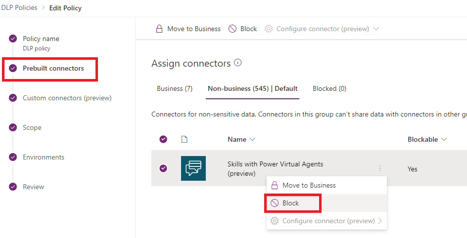

# Data loss prevention example 3 - Require end-user authentication for Power Virtual Agents chatbots 

If a Power Virtual Agents chatbot is not configured to require end-user authentication, then anyone on the internet can chat with the bot.

You can use data loss prevention (DLP) policies to block your bot makers from configuring chatbots that aren't configured for authentication to help prevent data exfiltration.

Bot makers will need to [configure end-user authentication with Teams or Azure AD v2 in Power Virtual Agents](configuration-end-user-authentication.md)if you use this connector in an enforced DLP policy.

See the [Configure data loss prevention for Power Virtual Agents chatbots](admin-data-loss-prevention.md) topic for information about other DLP-related connectors.

### Configure DLP to require authentication in the Power Platform admin center

1.  In the [Power Platform admin center](https://admin.powerplatform.microsoft.com/) select **Data policies**.

    1.  To create a new policy, select **New policy**, enter a name for the policy, and select **Next**.

        

    1.  To add this connector to an existing DLP policy, select the policy you want to update, and then select **Edit policy**.

        

1.  Under **Prebuilt connectors**, find the **Chat without Azure AD authentication in Power Virtual Agents connector**.

1.  Select the connector's menu ellipses (shown as three dots in a vertical line next to the connector's name), and then select **Block**. Select **Next**.

    

1.  Under **Environments**, select **Scope**. Apply the DLP policy on the environment where the bot is created, or for all environments.

    > [!NOTE]
    > If the policy has a tenant scope, DLP policy will apply to all bots.

1.  Under **Review**, Select **Update policy** to apply the DLP policy changes.

    

### Confirm policy enforcement in Power Virtual Agents

You can confirm that this connector is being used in the DLP policy from the Power Virtual Agents web app.

First, open your bot from the environment where the DLP policy is applied.

If the policy is enforced, you'll see an error banner with a **Go to Authentication** button and a message advising you to contact an admin or configure authentication.

The bot maker can select the **Go to Authentication** button to be taken directly to the **Authentication** configuration panel. Here, they'll need to configure **Only for Teams** or **Manual** (**Azure Active Directory** or **Azure Active Directory v2**) for the end-user to chat with the bot.

[!INCLUDE[footer-include](includes/footer-banner.md)]