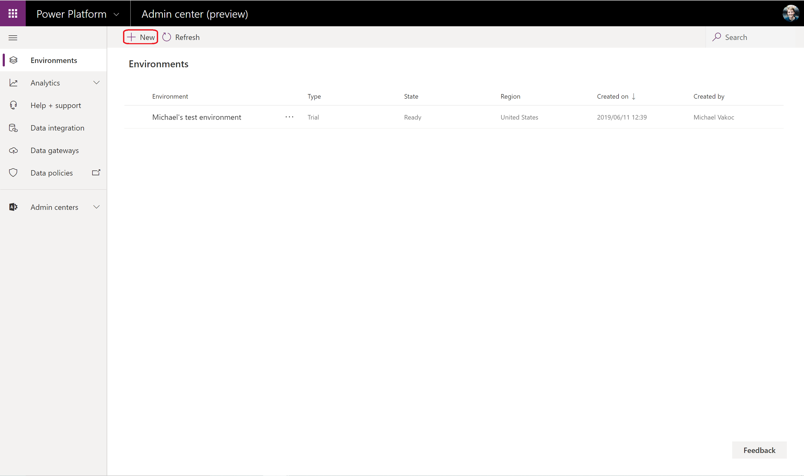
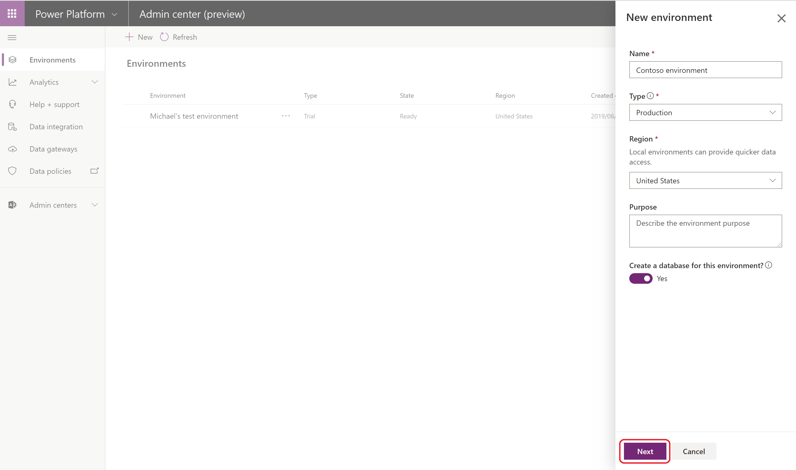
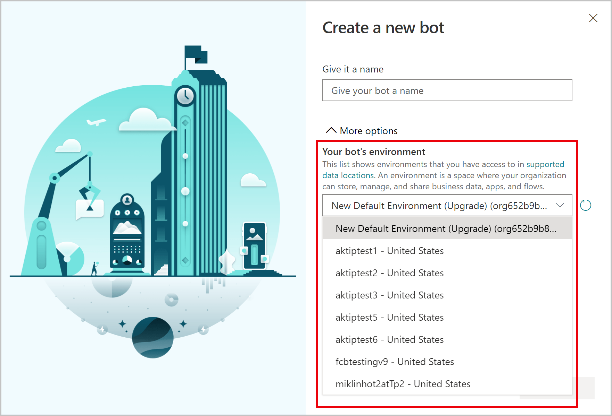
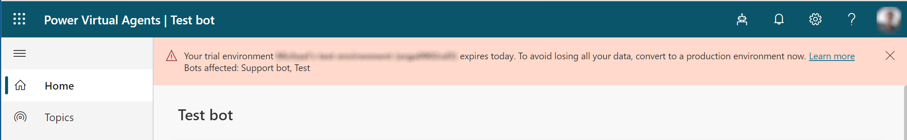

# Working with environments in Power Virtual Agents

With Power Virtual Agents, you can create bots in different environments and easily switch between them.

An environment is a space to store, manage, and share your organization's business data. The bots you create are stored in an environment (apps and flows are also stored in environments). Environments may also have different roles, security requirements and target audiences, and each environment is created in a separate location. More information: [Supported data locations](data-location.md).

## Prerequisites

- [!INCLUDE [Medical and emergency usage](includes/pva-usage-limitations.md)]

## Leverage environments

You can use environments in a number of different ways, depending on your business needs:

  - You might create separate environments that correspond to specific teams or departments in your company, each containing the relevant data and bots for each audience.
  - You might also create separate environments for different global branches of your company.

You can also build all your bots in a single environment if you don't need or want to use different ones.

>[!NOTE]
>We recommend using a non-default production environment for bots that you want to deploy to production.  
>[Learn more about types of environments](/power-platform/admin/environments-overview#types-of-environments).

## Create a new environment for your bots

When you first sign in and create a new bot, a default environment is created for you. 

You can, however, create additional environments by using the [Power Platform Admin Center](/power-platform/admin/create-environment).

**Create a new environment:**

1. Go to [https://admin.powerplatform.com](https://admin.powerplatform.com) and sign in using your work account. Use the same tenant that you use for Power Virtual Agents.

2. Go to the **Environments** tab and select **+ New** to open the **New environment** panel.

   
  
- For **Name**, specify a unique name for the environment.
- For **Environment** select the environment type. 
    > [!NOTE]
    > A production environment is intended for production scenarios and won't be subject to the same restrictions as a [trial environment](#trial-environments).
    > If you are trying out Power Virtual Agents for free, you'll need to make sure you set the environment to **Trial**. The standard limitations for [trial environments](#trial-environments) apply.
- For **Region** select the [support data region](data-location.md) where you want the environment to be created.
- Set **Create a database for this environment?** to **Yes**
- Select **Next**.
   
   
   
   > [!NOTE]
   > The environment needs to be created in a supported region, otherwise you won't be able to use it when creating a bot.
   > More information: [Supported data locations](https://go.microsoft.com/fwlink/?linkid=2106441).

3. Specify the details of the database, such as the language and currency type, and then select **Save**.

4. You'll be returned to the **Environments** tab. Select **Refresh** to see the environment. You'll also see a notice explaining that it may take a few minutes to fully create the environment.

5. After the environment is created, you can return to the [Power Virtual Agents portal](https://go.microsoft.com/fwlink/?linkid=2093067) and use the environment to create a new bot.

## Create a bot in an existing environment
To create a bot in an existing environment, select the environment in the [bot creation window](authoring-first-bot.md).

### Create a bot in an existing environment where you don't have access

To create a bot in an environment where you don't have access, you'll need to be a system administrator or contact the system administrator. You then need to complete the following:

1. Create a bot in the environment (this step will install the necessary Power Virtual Agents solutions).

2. Assign the security role of "bot author" to you in the environment. More information: [Create users and assign security roles](/power-platform/admin/create-users-assign-online-security-roles#assign-a-security-role-to-a-user).

You can then return to the [Power Virtual Agents portal](https://powerva.microsoft.com) and create a bot in the environment.

More information:
- [Power Platform - Environments overview](/power-platform/admin/environments-overview)
- [Power Platform - Configure environment security](/power-platform/admin/database-security)

## Trial environments
When you trial Power Virtual Agents, you can create trial environments that expire after 30 days. When the environment expires, all the bots in the environment will be deleted. The data associated with the bot, including any flows and resources you have been using, will be lost.

If you have created your own environment and selected **Trial** as the environment type, you'll receive email messages shortly before it expires. In the Power Virtual Agents portal, you'll also see a notification if you have bots created in a trial environment that is going to expire in less than two weeks.

> 

> [!NOTE]
> Note that there is a difference between an expiring environment and an expiring license. If your license is expiring, you will be able to extend it without losing any data. More information: [Sign up for a Power Virtual Agents trial](sign-up-individual.md#trial-expiration).

## Converting a trial environment to a production environment

When using a trial environment and you want to retain the bots for longer than 30 days, you must [convert the trial environment to a production environment](/power-platform/admin/trial-environments#convert-a-trial-environment-to-production).

## Known issues with creating a bot

When you are creating your bot, you might encounter the following issues.

### Insufficient permissions for the selected environment

In this case, you see this error: "You do not have permissions to any environments. Please get access from an administrator."

You will need to [create a new environment](environments-first-run-experience.md). Use that environment to create your bot.

### The environment doesn't show up in the drop-down menu of Power Virtual Agents

Your environment might not show up in the drop-down menu due to one of the following:
 - The environment doesn't have a database created. To resolve this issue, go to [admin.powerplatform.com](https://admin.powerplatform.com) to [create a database in your environment](/power-platform/admin/create-database).
 - The environment is created in an unsupported region. More information: [Supported data locations](data-location.md).
