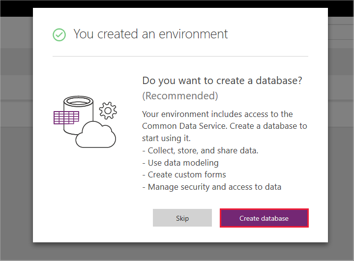
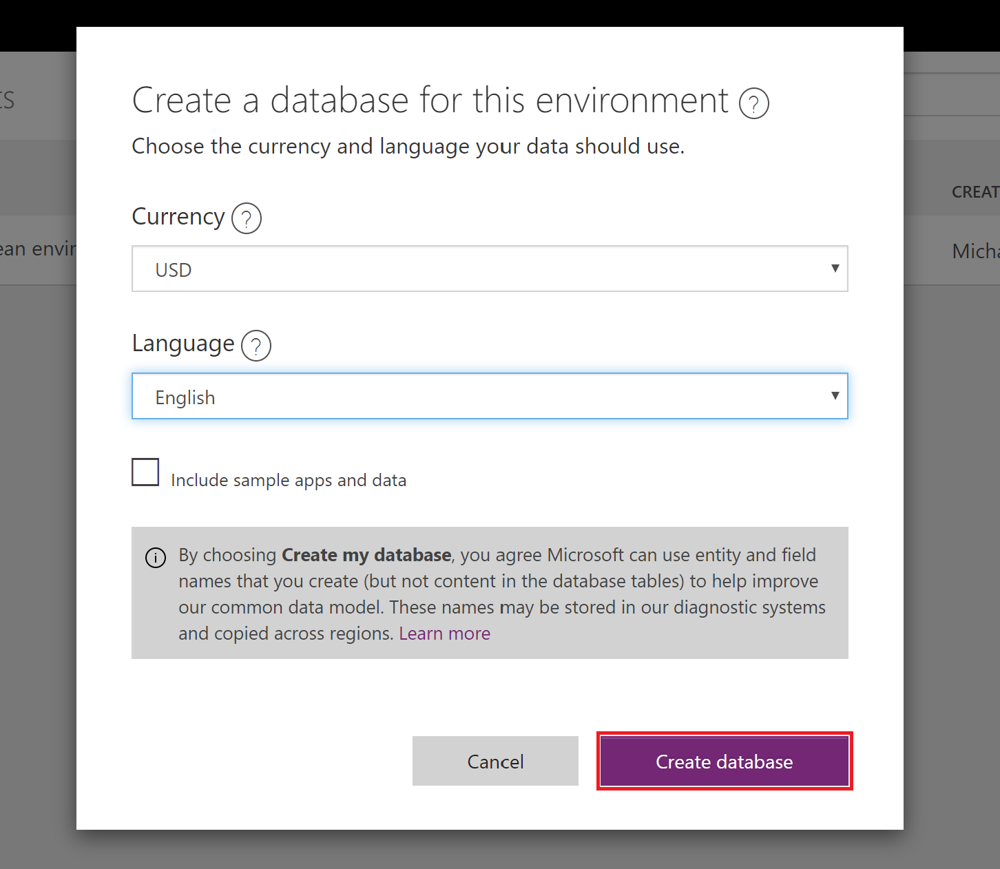

# H1 Environments and Power Virtual Agents

With Power Virtual Agents, you can work in different environments and easily switch among them.

An environment is a space to store, manage and share your organization's business data. The bots you create are stored in an environment (apps and flows are also stored in environments). Environments may also have different roles, security requirements and target audiences. Each environment is created in a separate location. Learn more about region support LINK to MULTIGEO

## How to leverage environments
- You may choose to build all your bots in a single environment
- You might create separate environments that correspond to specific teams or departments in your company, each containing the relevant data and bots for each audience.
- You might also create separate environments for different global branches of your company.

## How to create an environment

When you create a bot, you must select a PowerApps environment for the bot. You can use an existing environment or create one.

### To create a new PowerApps environment

1. Go to [https://admin.powerapps.com](https://admin.powerapps.com) and sign in using your work or school account.

2. Select **New environment** to open the **New environment** dialog box.

    Specify a unique name for the environment, select a region where you want the environment to be created, and the environment type. Then select **Create environment**.

    > [!NOTE]
    > The environment needs to be created in a supported region, otherwise you won't be able to use it when creating a bot.
    > See the list of supported regions here ADD LINK

   

   PowerApps creates the environment and displays a prompt asking if you want to create a database.

3. Select **Create database** to display the **Create a database for this environment** screen.

   

4. Select your currency, language, and clear the checkbox for **Include sample apps and data** and then select **Create database**.

   > [!NOTE]
   > Clearing "Include sample apps and data" will speed up the process of environment creation.

   

5. You will know that the environment is ready when you see an its ID in parenthesis after the environment name. It might take up to 5 minutes before you are ready to use the environment when [creating a new bot](getting-started-create-bot.md).

    
    

## Trial environments

Trial environments expire after 30 days. When the environment expires, all the bots in the environment will be deleted and the data associated with it, the flows, and resources you have been using will be lost.

If you have created your own environment and selected Trial as the environment type, you'll receive emails shortly before it expires.  In the Virtual Agent Designer, you'll see a message if you have bots created in a trial environment that is going to expire in 14 days or less. The message will show the name of the environment that is going to expire, the days remaining to expiration, and the names of the bots affected. This pertains only to trial environments that you have created yourself or been granted access to.

When using a trial environment and you want to retain the bots longer than 30 days, convert the trial environment to a production environment. [Learn how to convert a trial environment to a production environment](https://go.microsoft.com/fwlink/?linkid=2048531).

To convert to a production environment, the following criteria must be met:

1. You are eligible to use a suitable PowerApps plan that enables you to create production environments.
2. You need to have available production quota. There is a fixed number of production environments you can create with your plan.
