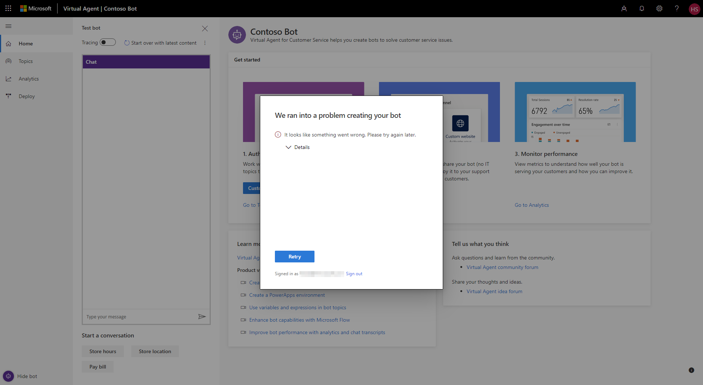
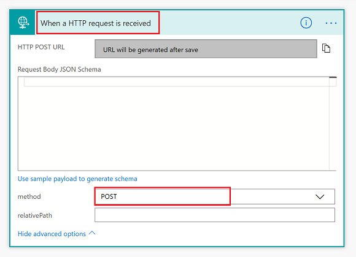

# Frequently asked questions

[!INCLUDE [cc-beta-prerelease-disclaimer](includes/cc-beta-prerelease-disclaimer.md)]

## Known issues

### Customers from outside of the United States signing up for Power Virtual Agents

Preview is currently only supported in the locations listed in the [supported data locations](data-location.md) topic, with data stored in respective data centers. If your company is located outside of the supported data locations, you need to create a custom environment with the region set to a supported data location before you can create your bot. For more information on how to create a custom PowerApps environment, see [Creating a PowerApps environment](getting-started-new-environment.md).

### Issues with Power Automate solutions tab

If you are a new customer and you visit flow.microsoft.com shortly after you create your first bot, you might encounter two issues:
- Missing **Solutions** tab on the left rail of flow.microsoft.com. The **Solutions** tab should appear within 24 hours. You can try refreshing the page to resolve the issue earlier.
- Within the **Solutions** tab, when you choose Common Data Service Default Solution, you might get a permission error. You can still create a flow and connect it to the bot designer. However, the flow might not appear at flow.microsoft.com for up to 24 hours.

### Issues with environment permissions when creating a bot

If you experience any problems with your bot creation due to permission issues with the environment you selected, [try creating a new environment](getting-started-new-environment.md) and use that environment to create your bot.

### Other issues when creating a bot

See [Creating a bot](getting-started-create-bot.md) if you have any issues while creating your bot.

## General 

### What browsers are supported by Power Virtual Agents?

Power Virtual Agents is supported in the latest versions of Microsoft Edge, Chrome, and Firefox. It is not supported in Internet Explorer.
 
### Can Power Virtual Agents be styled and branded for an organization? What can be customized and how?

Currently we don't have any styling or brand customization for the bot (for example, changing the default image). This capability is on the roadmap for a future release.

### Can multiple team members collaborate on a single bot instance?

We don’t have multi-author support currently. For now, it is one bot per author. However, this capability is on the roadmap for a future release. The current workaround is to create a service account and share it across content authors.

### Can I sign in using my personal Microsoft account?

No, you can sign in only by using your work or school Microsoft account.

### Power Virtual Agents does not seem to allow us to store the user utterance that triggered the topic as a variable. Is that by design?

Yes, Power Virtual Agents currently doesn't allow storing the user utterance that triggered the topic as a variable. This capability is on the roadmap for a future release.

### How do I configure my bot to escalate to a human agent? 

Update the Escalate system topic, and update the “Bot says” node to include the link to your support page. Here’s a [step-by-step document](how-to-handoff.md) explaining the steps you should take. 

### I ran into a problem. What should I do to file a bug? How quickly will you get back to me? 

You can file bugs in the in the [community forum](https://go.microsoft.com/fwlink/?linkid=2058639).

### I have a new feature idea or some ideas on how to make a feature work better. How should I submit these ideas to the product team?

That's great—we'd love to hear your thoughts. [Submit your ideas and feedback in our Idea forum](https://go.microsoft.com/fwlink/?linkid=2064961).

### I have an existing bot built on Microsoft Bot Framework and Azure Cognitive Services. How do I leverage Power Virtual Agents?

Power Virtual Agents is built on Microsoft Bot Framework. Organizations with existing bots can follow [step-by-step guidance to setting up Microsoft Bot Framework dispatcher with bot built using Power Virtual Agents](how-to-use-dispatcher.md). We will provide developers with a streamlined bot building experience by seamlessly integrating into [Microsoft Bot Framework’s Skill platform](https://docs.microsoft.com/azure/bot-service/bot-builder-skills-overview?view=azure-bot-service-4.0) in an upcoming release.

### Is Power Virtual Agents available in government environments?
No. At this time, Power Virtual Agents is not available in the Government Community Cloud.

### Does Power Virtual Agents support preview releases of Common Data Service (CDS)?

Power Virtual Agents uses the Common Data Service (CDS) to store your bot's content. Preview releases of CDS may be incompatible with Power Virtual Agents and may result in an error when creating a bot or when saving topics or conversations. If you encounter an error, and retrying does not resolve the issue, you can [file a bug in the community forum](https://go.microsoft.com/fwlink/?linkid=2058639).

## Bot creation and environments

### The creation of my bot takes a long time. Is that expected?

It may take up to 15 minutes to create the first bot within a tenant. While the bot is being created, you can explore the portal. Note that any changes won't get saved until the bot is fully created.

### Why do I get an error that I do not have permissions to any environments?

It is possible that you do not have read/write access to any environments. In this case, you will see the error: “You do not have permissions to any environments. Please get access from an administrator.” 
To resolve this issue, follow the steps in [To create a new PowerApps environment](getting-started-new-environment.md) to create a new environment. Use that environment to create your bot.

### Why do I get "An unexpected server error occurred"?

This error indicates an issue with your current environment. If refreshing your browser doesn't resolve the issue, follow the link to [create a new PowerApps environment](getting-started-new-environment.md). Use that environment to create your bot.

### The PowerApps environment I created does not show up in the drop-down menu of Power Virtual Agents. Why?

Your environment might not show up in the drop-down menu due to the following reasons:
 - The environment doesn't have a database created. To resolve this, go to [admin.powerapps.com](https://admin.powerapps.com), and create a database in your environment.
 - The environment's region is set to something other than a [supported region](data-location.md). To resolve this, follow the steps in [To create a new PowerApps environment](getting-started-new-environment.md), and create an environment in a supported region.
 - The environment didn't finish setting up. To resolve this, retry in a few minutes

### Why am I getting a message or email about an environment that is going to expire?

If you have created your own environment and selected **Trial** as the environment type, you'll receive emails shortly before it expires. Trial environments expire after 30 days. When the environment expires, all the bots in the environment will be deleted and the data associated with it, the flows, and resources you have been using will be lost. In the Power Virtual Agents Designer, you'll see a message if you have bots created in a trial environment that is going to expire in 14 days or less. The message will show the name of the environment that is going to expire, the days remaining to expiration, and the names of the bots affected. This pertains only to trial environments that you have created yourself or been granted access to.

When using a trial environment and you want to retain the bots longer than 30 days, convert the trial environment to a production environment. [Learn how to convert a trial environment to a production environment](https://go.microsoft.com/fwlink/?linkid=2048531).

To convert to a production environment, the following criteria must be met:
1. You are eligible to use a suitable PowerApps plan that enables you to create production environments.
2. You need to have available production quota. There is a fixed number of production environments you can create with your plan.

## Authoring

### How do I access the conversation editor?

You can access the conversation designer (the visual dialogue tree editor) by selecting **Edit** on a topic. You can either hover over a topic name and select the pencil icon or select the **Edit** button from the **Topic details** page.
 
### How do I use variables to save end-user responses for later use?

In the conversation designer, select **User says**, and then select **Add variable**. This opens **Properties**, where you can select **Create variable**. Name your variable, and select from the different variable types. Now you will be able to refer to previous user utterances using this variable.
    
### Which variable types do you support? Will you add more types later?

We currently support four variable types: Text, Age, Number, and Currency. The different types help our natural language understanding model interpret user responses in different ways. For example, if you create a variable called “MyAge”, the bot would be able to understand that “18 years old” is **MyAge = 18**. Similarly, if you created a variable called “BankBalance” and set it to a Currency type, it could understand responses such as **USD 300** or **$300.00** as both equal to 300.
We have plans to expand the types of variables supported in the coming months, and will also add support for custom-defined variable types.

### Can I change or rename variables after I’ve created them?

Yes, you can change your variable types or rename your variables after you’ve created them. Select the variable and edit the properties. Select **Done** to complete the changes.
If you change the variable type, expressions that rely on that variable might become invalid because the operator might no longer be relevant.  For example, if you change a number variable to a text variable but use the expression “FormerNumberVariable is greater than 10”, that expression no longer works when the variable type has been changed.

### Do I need to delete orphaned nodes?

You might end up creating orphaned nodes if you delete certain nodes and find that subsequent nodes get relocated to the top-right portion of the authoring canvas. You don't need to delete these orphaned nodes—your dialogue tree will ignore these nodes because they are inaccessible from the main part of your dialogue tree.
You can reconnect these nodes by selecting the lines between the nodes and dragging them over to your orphaned nodes, reconnecting them to the main dialogue tree.

### I can’t access greater than/less than comparisons in my Expression node—I can only see “is equal to”. Why is this, and how do I do other operations? 

The types of operations available to you in your Expression node vary depending on the type of variable used within that expression. For text variables, the only operation available is “is equal to”. For Age, Number, or Currency, you have all the operators available to you. You might find that if you change the variable type, certain expressions that you have authored will no longer be valid, particularly if you are changing between Text and Age/Number/Currency types—so when this happens, you need to modify your Expression nodes for your dialogue to work properly.

### How do I create fallback routes?
You can create fallback routes to cover scenarios where you want the bot to respond to something outside of the listed branches of your tree. An example would be if the dialogue asks the user to name a city, and you have answers prepared for when the user's answer is Seattle or Bellevue, but the user specifies another city name. 

You might want to author another branch of the tree that covers any response outside of “Seattle” or “Bellevue”. You can do this by hovering over the lines between the “User Responses” node and the “User Says” nodes. Select the plus icon, and then select **Fallback**.  This adds a branch to the tree that enables you to author content for any response that is not in your two main branches.

### Can I create routing branches without showing suggestion buttons?

Yes, it is possible to hide suggestion buttons. You can do this by selecting the trash can icon next to the suggestion button in the “User Responses” node. This retains the routes below, but those routes would only be accessible if the user typed in the response directly to the bot.

In the following example, suppose you want to display the “Seattle” and “Bellevue” suggestions, but you create a hidden “Redmond” route.  The bot can still route correctly to the Redmond branch if the user types Redmond into the bot window, but Redmond would not be shown as a button.

## Topic creation and management  

### What is a topic? 

A topic defines a conversation path with the bot for a specific customer intent. You can author topics by customizing provided templates or creating new topics from scratch.  

### What is the difference between a system topic and a provided template user topic? 

A system topic is linked to predefined features like a customer survey, escalation to a live agent, or the bot greeting. Some areas of the system topics can be modified. User topics can be modified or deleted. They are for your customization to fulfill the needs of your Power Virtual Agents bot. 

### How do I create my own custom topic?  

You can find details about creating your own topics in this article: [Creating custom topics for your bot](getting-started-create-topics.md).

### How many versions of a topic can I have? 

Currently, you can have up to two versions of a topic. A published version and an unpublished version, which you can work on. 

### How do I delete topics? 

You can delete user topics by hovering over the topic name and then selecting the trash can icon. Note that only user topics can be deleted. System topics are required for the bot to function and can be edited, but not deleted.

### When I test the bot, it doesn't seem to reflect my edits. What's happening? 

You need to make sure to save the topic you're editing, and then select the **Start over with latest content** button in the test bot. This ensures that the latest content gets updated in the chat canvas. 

### What is the green outline that appears while I'm testing my topic? 

The green outline appears around each node that is successfully tested while you are using the test bot. Nodes that fail are outlined in red. 

### What is Topic Checker? 

Topic Checker lets you see a comprehensive list of all errors and warnings in your topic. Errors and warnings can be saved with a topic and cleared upon subsequent visits. Errors should be cleared up before deploying your bot to production. Warnings are skipped by the bot. 

### Is it possible to link multiple topics?
You can link a different topic within a topic by using the **Go To** option, which appears when you add a new node in the dialogue flow of a topic.

### Is it possible to launch the bot to address a specific topic from a link on the page? The scenario we have in mind is a list of links/actions on the page, and a couple of them will launch a topic on the bot.

Currently we don't support context passing in the bot, so you will not be able to launch the bot or trigger a specific topic based on a link or action on the webpage. 
Some unofficial workarounds you might want to consider: deploy the bot on a custom page, and launch that page as an iframe or pop-up from the parent webpage, when the link or action is launched.
For triggering specific topics, you could have multiple bots, and have the Topic content added as part of the Greeting, which always appears when starting a conversation. The downside is that it will be cumbersome to maintain multiple bots for different sets of links/actions.

### What’s a variable and how do I use it? 

Variables store customer responses to bot questions. Variables can be used in expressions evaluating a customer response or passed to a flow. Variables can also be used to confirm a customer response. 

## Power Automate integration 

### How do I create a Power Automate action in Power Virtual Agents?

Have a look at the article about [Add actions to your bot using Power Automate](how-to-flow.md) and the [video on how to create a Power Automate action that can be executed from Power Virtual Agents](https://go.microsoft.com/fwlink/?linkid=2079323).

<iframe width="560" height="315" src="https://www.youtube.com/embed/joXCzvi38Fo" frameborder="0" allow="accelerometer; autoplay; encrypted-media; gyroscope; picture-in-picture" allowfullscreen></iframe>

### What license do I need to use Power Automate in Power Virtual Agents?

Every bot author is automatically licensed to use Power Automate. No extra steps are needed. Bot authors are assigned a P2 Plan Power Automate license as part of their Power Virtual Agents license. For details, please refer to [Power Automate Plans documentation](https://flow.microsoft.com/pricing/).

### I created some new flows for actions using Power Automate, but they are not visible in Power Virtual Agents. Why?

- The environment you are using to create your flows must be the same as the environment you are using for the bot.   
- Make sure to [create your flows in Solutions](https://docs.microsoft.com/flow/overview-solution-flows). The bot can't see the flows created in the **My Flows** tab. 
- Bots can only invoke flows that have HTTP Request interfaces, so you need to select the right trigger for your flow. Select **When Http Request is received** from the trigger list in Power Automate, and make sure you are using the **POST** method under advanced options in the trigger (or leave the method field empty, which is how it is by default):

### I created a flow with an HTTP Request trigger, and it's visible in my bot, but when I test my topic, it fails. Why?

Make sure the flow is turned on (enabled) on the Power Automate portal. Flows that are turned off (disabled) on the Power Automate portal are visible when editing a bot and can be incorporated into actions. However, they will fail at run time until they are turned on in the Power Automate portal.

### What are the response formats that Power Virtual Agents accepts, especially in the message response provided by the Power Automate action?

The Power Virtual Agents designer accepts only JSON object format in the message response. The JSON object can contain strings and numbers only. In the coming months, we will release a custom Power Automate connector that will make it easier to create flows using key/value pairs rather than requiring the use of JSON format. We do not support arrays as flow output for bots yet, but this feature is on the roadmap. 

### Can we call a third-party API from a flow?

Yes, an existing API or another application can be called from a flow, and the results can be passed back to Power Virtual Agents as flow output. Power Automate provides hundreds of connectors to enable you to connect to apps, data, and devices in the cloud. 

Examples of popular connectors include Microsoft Common Data Service (CDS), Dynamics 365, Salesforce, Zendesk, ServiceNow, Office 365, Microsoft Teams, Slack, Facebook, Twitter, Dropbox, Mailchimp, Google services, and many more. Please refer to [Power Automate Connector documentation](https://docs.microsoft.com/connectors/) to see the full list of available Power Automate connectors.

If there is no suitable connector that you can use out of the box in Power Automate, you can use an HTTP call inside a flow to connect to a custom third-party API, like in the following example:

### Can we call a third-party API directly from the Power Virtual Agents action, without going through a flow?

This capability is not currently available directly from the Power Virtual Agents experience, but you can call any third-party API by wrapping the call in a flow. If this feature is critical to your business, please [submit your ideas and feedback in our Idea forum](https://go.microsoft.com/fwlink/?linkid=2064961).

### How to work with your data in Power Automate?
Power Automate provides [hundreds of data connectors](https://docs.microsoft.com/connectors/) and offers many ways to manipulate your data. Refer to the following Power Automate documentation for more information on how to:
- [Use Common Data Service (CDS)](https://docs.microsoft.com/flow/connection-cds)
- [Create a flow that uses the Common Data Service](https://docs.microsoft.com/flow/common-data-model-intro)
- [Create multi-step flows](https://docs.microsoft.com/flow/multi-step-logic-flow)
- [Add conditions in a flow](https://docs.microsoft.com/flow/add-condition)
- [Use expressions with conditions](https://docs.microsoft.com/flow/use-expressions-in-conditions)
- [Use functions in expressions](https://docs.microsoft.com/azure/logic-apps/workflow-definition-language-functions-reference)
- [Perform data operations](https://docs.microsoft.com/flow/data-operations)
- [Loop through your data](https://docs.microsoft.com/flow/apply-to-each)
- [Filter and copy data](https://docs.microsoft.com/flow/odata-filters)
- [Troubleshoot your flow](https://docs.microsoft.com/flow/fix-flow-failures)

### If we have authentication for the user, can we pass user authentication info to a flow?

Currently, passing end-user authentication to a flow is not supported in Power Virtual Agents, but we have this feature on the roadmap, and it will be enabled over the coming months. We will start with token-based authentication. If you have specific authentication requirements that you would like us to be aware of, please [submit your ideas and feedback in our Idea forum](https://go.microsoft.com/fwlink/?linkid=2064961).

### Can I share the flows I created with other users?
You can add other users in you organization as owners of the flows you have created. Select the flow to open its Details page, and select the **Add another owner** option in the Owners section:

### How do I move or copy my flows between different environments?

You can export and import solutions containing your flows to move them between environments. Note that there is currently no way to export or import a single flow. For more information on how to import and export solutions, refer to the Power Automate documentation:
- [Export a Solution](https://docs.microsoft.com/flow/export-flow-solution)
- [Import a Solution](https://docs.microsoft.com/flow/import-flow-solution)

### Where can I find out more about Power Automate?
You can find out more about the capabilities of Power Automate on the [Frequently asked quetsions](https://docs.microsoft.com/flow/frequently-asked-questions) page or by reading [Power Automate documentation](https://docs.microsoft.com/flow/getting-started).
You can also learn new skills and discover the power of Power Automate with step-by-step [Power Automate training modules](https://docs.microsoft.com/learn/browse/?products=flow).

## Deployment 

### How do I share my bot with others?

You can find the details in this article: [To share your bot on the demo website](getting-started-deploy.md#to-share-your-bot-on-the-demo-website)

### How do I install the bot in a modern SharePoint site? Is there any additional work that will be required if the given modern SharePoint restricts embedding code from external sites?

If the modern SharePoint site allows embedding an iframe, it should be able to embed the bot. We have an iframe code snippet that you can get for your respective bot by going to the **Deploy** page. That snippet can be pasted into any HTML webpage, and from there you should see your bot appear. You can get this code to embed in your SharePoint site from **Deploy** > **Custom Website** in Power Virtual Agents.

### Why are the changes I made to my topic not reflected on the demo website page, or custom website? 

Today you can have up to two versions of a topic, a published version (which you’ve previously deployed) and an unpublished version. When you [edit a topic](getting-started-create-topics.md), that change will not be available until you [redeploy the bot](getting-started-deploy.md). Once redeployed, the bot will use latest state of the topic and end users will see the updated conversation.

## Analytics 

### What is the difference between a conversation and a session? How do sessions work? 

A conversation is the entire interaction between the bot and a user, starting from the user’s first message to when the chat window is closed or inactive for about an hour. Within a conversation, the user might have more than one query. 
A session is intended to capture just one query or problem within a conversation. So, a conversation can have multiple sessions. A session starts with the user’s initial query and ends when the user indicates the problem is solved ("confirmed success" topic) or the session is escalated ("escalation" topic).

### What’s the definition of an engaged session? 

An engaged session is one where the bot has been able to find a topic that could potentially help answer the customer’s question.  

### What’s the definition of an unengaged session?

An unengaged session is one where the bot can't find a topic that can potentially help solve the customer’s question or issue. Unengaged sessions are an indication that you have missing content and need to create additional topics to address those questions. You can find unengaged sessions by [downloading Session data](analytics-sessions.md) and filtering the Session Outcome column to show unengaged sessions.   

### Can I view the detailed content of sessions between my bot and customers?  

Yes, you can find the detailed content of sessions, by [downloading Session data](analytics-sessions.md).

### How can I improve the performance of my bot over time?   

Start by reviewing the performance of your bot in the Analytics tab. Examine which topics have the most abandoned and escalated sessions. They will appear at the top of the Escalation Rate and Abandon Rate charts. You can also find the detailed content of sessions, by [downloading Session data](analytics-sessions.md). You can then filter by Session Outcome. We recommend you focus on analyzing the content of Escalated, Abandoned and Unengaged sessions first to identify the causes of poor performance.  

### What are the common causes of poor bot performance?    

There are several common causes of poor performance including a high number of unengaged sessions, poorly written content, incomplete topics, or overlapping triggers.  
- High number of unengaged sessions: Indication that you have missing content and you don’t have topics created to address the type of questions asked by your customers.
- Poorly written or incomplete topics: A topic may not be well written or is lacking content to address a particular nuance of the customers question. For example, customers may want information on how to get a refund but you only provide information on how to do an exchange. This may result in high number of escalated or abandoned sessions.
- Overlapping triggers: If you are using the same trigger words on multiple topics, it may result in the bot needing to ask “did you mean” questions after the customer types their first question/utterance to try to determine which topic it should show the customer first. This may result in the bot triggering the wrong topic and the bot not providing the content the customer needs. 
