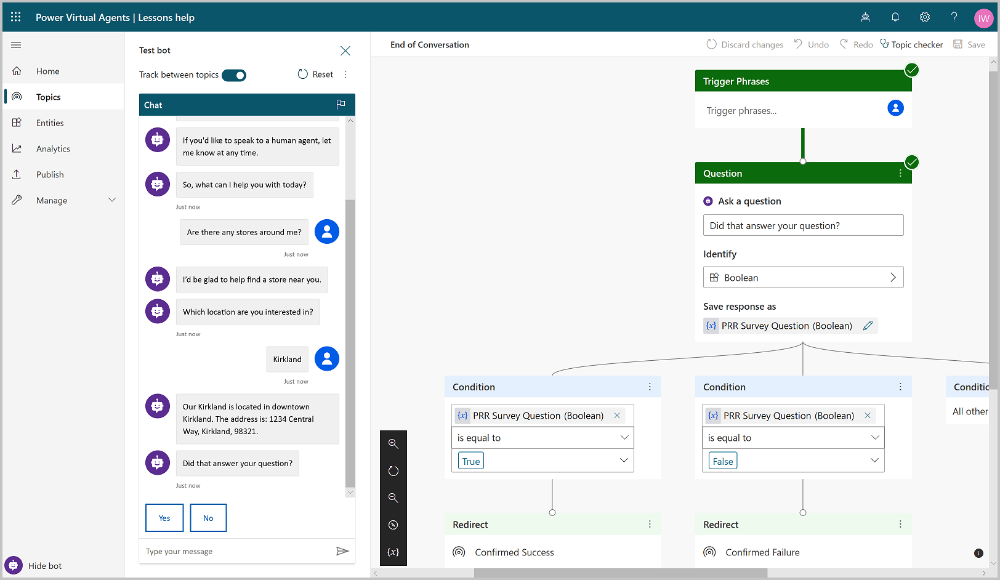
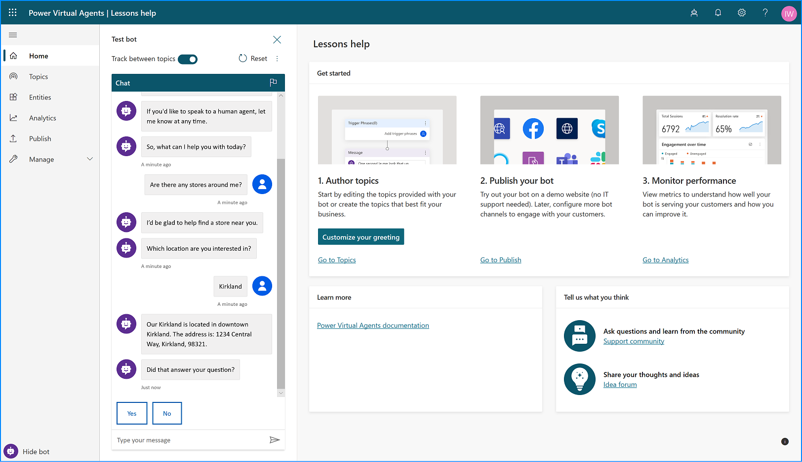
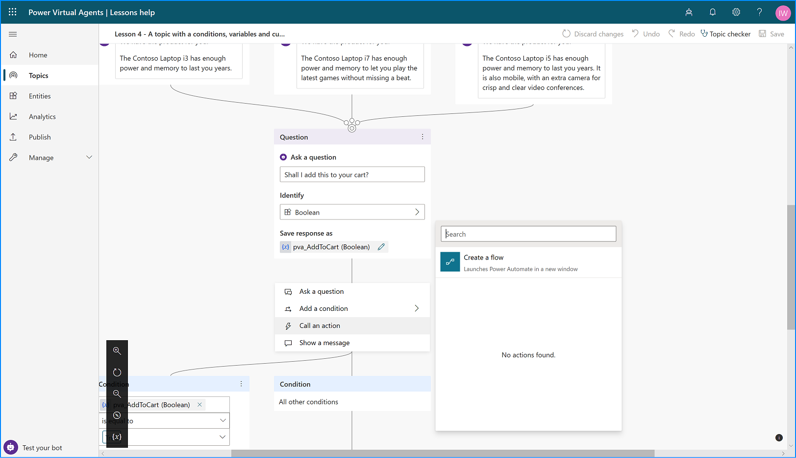
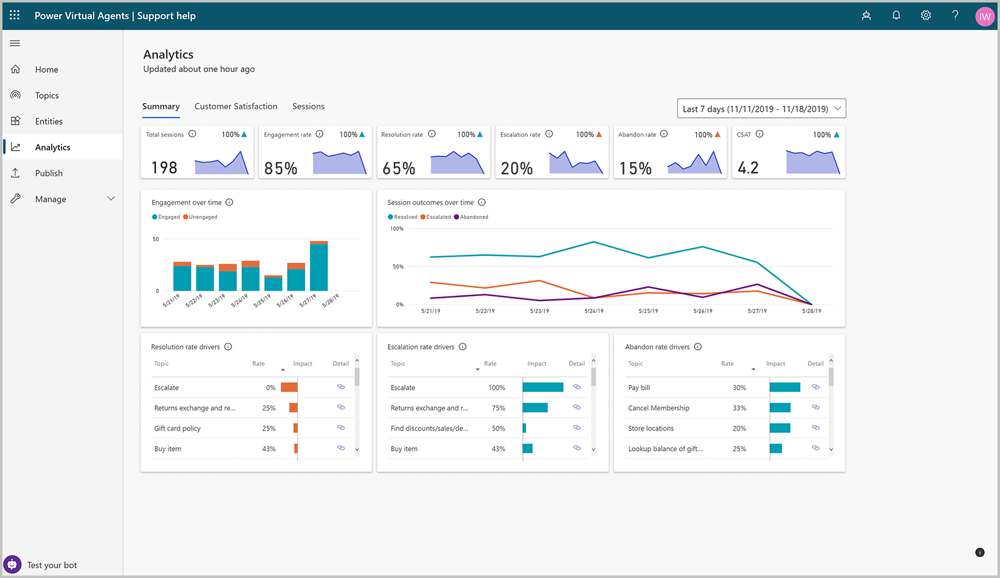

# Power Virtual Agents web app

Select the version of Power Virtual Agents you're using here:

> [!div class="op_single_selector"]
> - [Power Virtual Agents web app](fundamentals-what-is-power-virtual-agents-portal.md)
> - [Power Virtual Agents app in Microsoft Teams](teams/fundamentals-what-is-power-virtual-agents-teams.md)

>[!IMPORTANT]
>See the [Important information](#important-information) section for specific usage details.

Power Virtual Agents lets you create powerful chatbots that can be created with a guided, no-code graphical interface - and without the need for data scientists or developers. 

The benefits of using a no-code graphical interface help to:

- Eliminate the gap between subject matter experts and development teams building the bots
- Reduce the time from when bot builders and owners recognize an issue to when it can be updated
- Remove the need to understand complex conversational AI systems and methodologies
- Simplify the need for complex code
- Minimize the IT effort needed to deploy and maintain a custom conversational solution

Using Power Virtual Agents, you can: 
- **Empower your teams** by allowing them to easily build bots themselves without needing intermediaries, or coding or AI expertise.
- **Reduce costs** by easily automating common inquiries and freeing human agent time to deal with more complex issues.
- **Improve customer satisfaction** by allowing customers to self-help and resolve issues quickly 24/7 using rich personalized bot conversations. 

You can read more about Power Virtual Agents, or get started creating bots now at the following link:

> [!div class="nextstepaction"]
> [Get started now](https://aka.ms/trypva)

## Highlights of Power Virtual Agents

1. **Get started in seconds**. Power Virtual Agents is a software-as-a-service (SaaS) offering. It allows you to easily sign up, create your bot, and embed it into your website with just a few clicks. There's no infrastructure to maintain or complex systems to deploy. 

2. **Empower your subject matter experts**. Using Power Virtual Agents, you are in the driver's seat. Your SMEs can create bots quickly and easily using a **novel, intuitive, code-free graphical interface**, eliminating the need for AI expertise or teams of developers.

    

3. **Enable rich, natural conversations.** Microsoft's powerful conversational AI capabilities enable your end users to have rich multi-turn conversations that quickly guide them to the right solution. And, unlike most products on the market, there's no need to retrain AI models. Simply provide a few short examples of the topic you want the bot to handle, build the conversation using our graphical editor and your bot is ready to handle customer requests about it. You can even try out your changes in real-time in the test pane!

   
 
4. **Enable bots to take action.** Bots that can chat with your users are great, but bots that can act on their behalf are even better. With Power Virtual Agents, you can easily integrate with services and back-end systems out-of-the-box or through hundreds of easy-to-add custom connectors using Power Automate. This makes it simple to create a bot that not only responds to the user, but also takes action on their behalf.
 
    

5. **Monitor and improve bot performance.** Power Virtual Agents lets you keep an eye on how your bots are performing using powerful metrics and AI-driven dashboards. Easily see which topics are doing well and where the bot can improve, and quickly make adjustments to improve performance.  

    

6. **Better together.** Power Virtual Agents works hand-in-hand with [Dynamics 365 Customer Service Insights](https://dynamics.microsoft.com/ai/customer-service-insights) to provide a holistic view of your customer service operations. You can use Customer Service Insights and Power Virtual Agents together to determine which topics are trending or consuming support resources, and then easily automate them.

>[!NOTE]
> Power Virtual Agents does not currently support US Government Cloud plans.

## Important information
<!-- CELA required disclosure, do not modify -->
Microsoft Power Virtual Agents (1) is not intended or made available as a medical device for the diagnosis of disease or other conditions, or in the cure, mitigation, treatment or prevention of disease, or otherwise to be used as a component of any clinical offering or product, and no license or right is granted to use Microsoft Power Virtual Agents for such purposes, (2) is not designed or intended to be a substitute for professional medical advice, diagnosis, treatment, or judgment and should not be used as a substitute for, or to replace, professional medical advice, diagnosis, treatment, or judgment, and (3) should not be used for emergencies and does not support emergency calls. Any chatbot you create using Microsoft Power Virtual Agents is your own product or service, separate and apart from Microsoft Power Virtual Agents. You are solely responsible for the design, development, and implementation of your chatbot (including incorporation of it into any product or service intended for medical or clinical use) and for explicitly providing end users with appropriate warnings and disclaimers pertaining to use of your chatbot. You are solely responsible for any personal injury or death that may occur as a result of your chatbot or your use of Microsoft Power Virtual Agents in connection with your chatbot, including (without limitation) any such injuries to end users.

## Helpful links

[Create your first bot](authoring-first-bot.md)

[Create and edit topics](authoring-create-edit-topics.md)

[Enhance your bot](advanced-fundamentals.md)

[Publish your bot](publication-fundamentals-publish-channels.md)

[Using analytics to improve your bot](analytics-overview.md)

