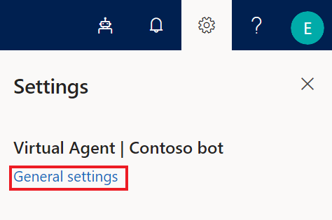

# Responding to requests to delete data from Power Virtual Agents

[!INCLUDE [cc-beta-prerelease-disclaimer](includes/cc-beta-prerelease-disclaimer.md)]

Power Virtual Agents offers the following experiences to delete personal data for a specific user:

* [Bot chat logs](#delete-power-virtual-agents-bot-chat-logs)
* [Power Virtual Agents bot content](#delete-power-virtual-agents-bot-including-all-content)
* [Power Virtual Agents telemetry](#delete-power-virtual-agents-telemetry)
* [Metrics](#delete-power-virtual-agents-metrics)
* [System telemetry](#delete-power-virtual-agents-system-telemetry)

## Prerequisites

- [!INCLUDE [Medical and emergency usage](includes/pva-usage-limitations.md)]

## Delete Power Virtual Agents bot chat logs

All bot chat logs are deleted when the bot is deleted. See [steps to delete bot](#delete-power-virtual-agents-bot-including-all-content) for more information.

## Delete Power Virtual Agents bot including all content

Follow these steps to delete a bot:

1. Open Power Virtual Agents in your browser.
2. On the **Settings** menu, select **General settings** to display the **General** tab of the **Settings** screen.

   

3. In the **Delete bot** section, select **Delete bot**.

All bot content is immediately deleted.

## Delete Power Virtual Agents telemetry

All Power Virtual Agents telemetry data is automatically deleted within 29 days. No action from the user is needed.

## Delete Power Virtual Agents metrics

To delete metrics data, you must delete your bot. See [steps to delete your bot](#delete-power-virtual-agents-bot-including-all-content) for more information.

## Delete Power Virtual Agents system telemetry

All bot system telemetry is automatically deleted within 29 days. No action from the user is needed.

> [!NOTE]
> Removing personal data includes removing all personal data and system-generated logs except audit log information.
