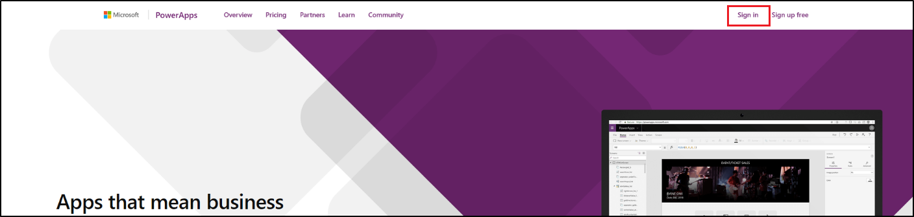
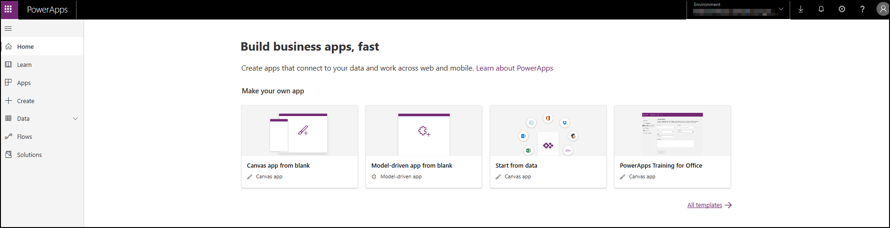
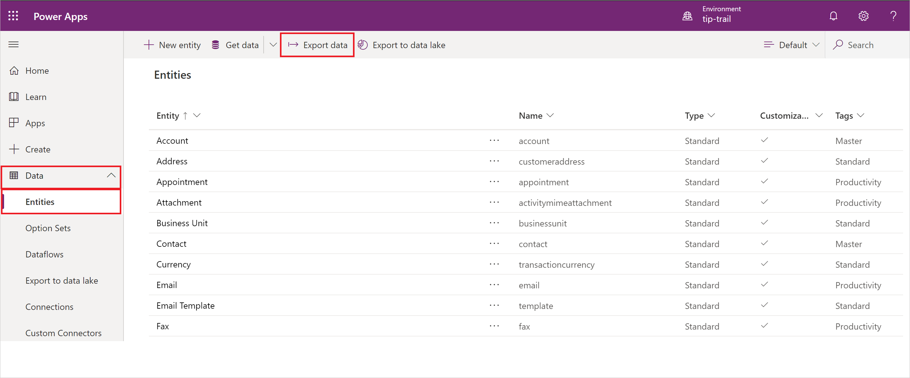
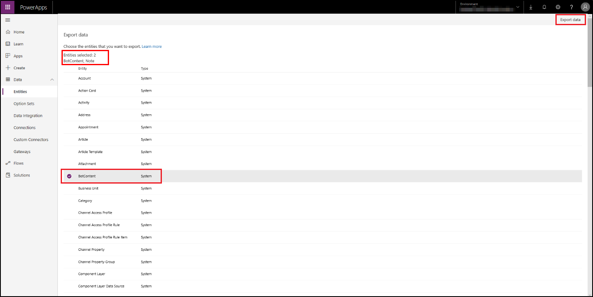

# Export data to respond to requests for copies of personal data in Power Virtual Agents

[!INCLUDE [cc-beta-prerelease-disclaimer](includes/cc-beta-prerelease-disclaimer.md)]

Power Virtual Agents offers the following capabilities to find or export personal data for a specific user:

1. Export customer data – Bot content (tenant admin)
2. Export customer data – Bot sessions (bot author)
3. Export system-generated logs (tenant admin) 

## Prerequisites

- [!INCLUDE [Medical and emergency usage](includes/pva-usage-limitations.md)]

## Export the bot content

**Export customer data – Bot content (tenant admin):**
1. Go to [https://www.powerapps.com](https://www.powerapps.com) and sign in with your credentials.

   

2. After signing in, you are redirected to the Power Platform admin center.

   

3. In the side navigation pane, expand the **Data** node. Select **Entities** and select **Export data**.

   

4. On the Export data screen, select **BotContent** and **Note** from the entity list. Select **Export data** at the top. Your data will take a couple of minutes to be compiled for export.

   

5. Select **Download exported data** to download the content.

   

**Export customer data – Bot sessions (bot author):**
 
You can download session data from the [sessions analytics page](analytics-sessions.md) in Power Virtual Agents.

**Export system-generated logs (tenant admin)**

1. Go to [https://www.microsoft.com/en-us/trust-center/privacy/gdpr-dsr](https://www.microsoft.com/en-us/trust-center/privacy/gdpr-dsr).

2. Select the **Learn more about the Data Log Export** link under the **Microsoft Data Log Export** section. This will open a new tab or window and go to the [User Privacy blade in the Azure Portal](https://portal.azure.com/#blade/Microsoft_Azure_Policy/UserPrivacyMenuBlade/Overview). Here you can request an export of data.

