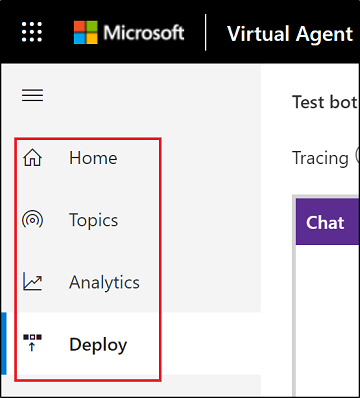
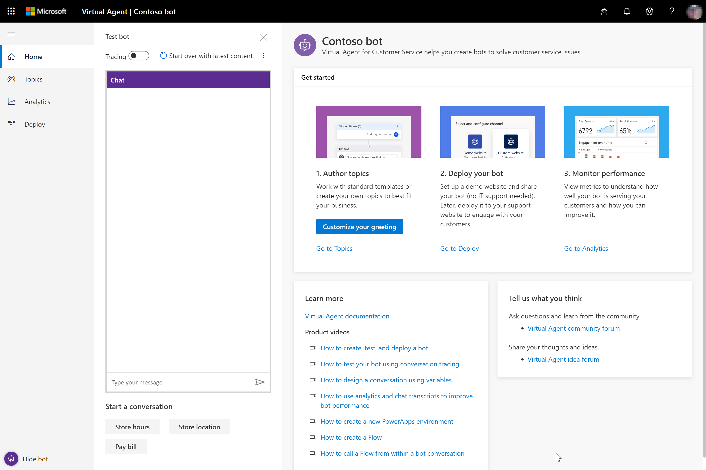
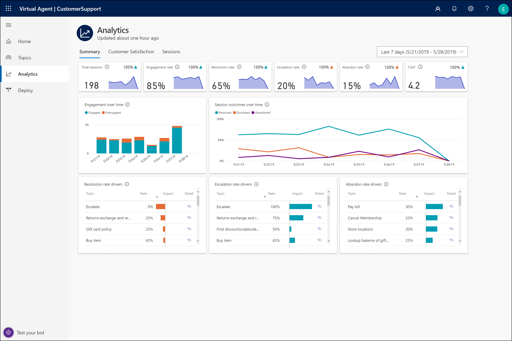
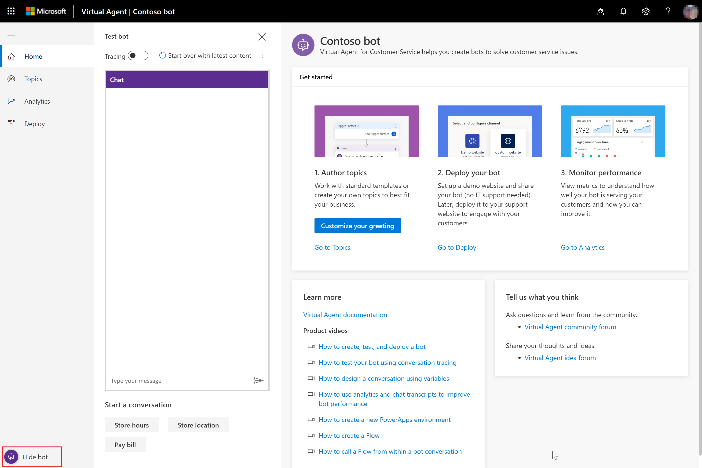
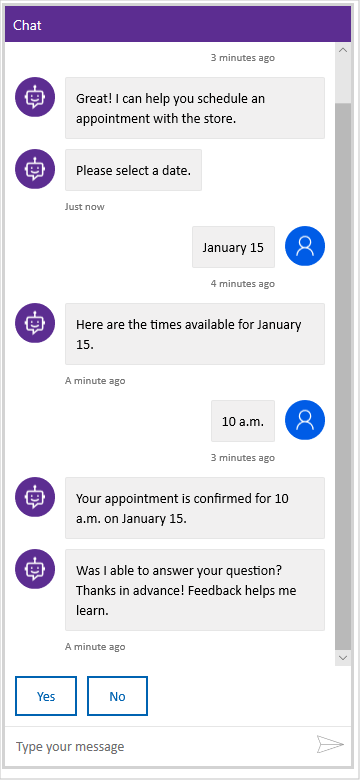

# Overview of Power Virtual Agents pages

[!INCLUDE [cc-beta-prerelease-disclaimer](includes/cc-beta-prerelease-disclaimer.md)]

Power Virtual Agents provides a variety of tools to create powerful custom bots. You can add topics to your bots to design conversations to resolve customer support issues, and then deploy the bots to a web channel. You can also view analytics to help you improve the bot and the overall customer experience.

Power Virtual Agents is composed of several pages designed for different tasks. You can access the pages through the navigation pane.

## Home page

The home page provides links to the Topics, Analytics, and Deploy pages.  A **Customize your greeting** button lets you revise the built-in bot greeting topic. The home page also includes a **Learn more** section with links to documentation and a **Tell us what you think** section with links to the Power Virtual Agents community forum and the Power Virtual Agents idea forum.

## Topics page

The Topics page is the central location for creating and managing Power Virtual Agents topics. Power Virtual Agents includes several built-in system topics.

You can revise the built-in topics and also create your own custom topics to design a conversation path that leads each customer to a resolution of the customer's support issue. You can then test the bot in the **Test bot** pane and refine it as necessary.

For more information about using the Topics page to create topics, see [Creating custom topics for your bot](getting-started-create-topics.md).

## Analytics page

The Analytics page provides a variety of charts showing key performance indicators for your bot.

For more information about using the Analytics page, see [Using analytics to improve your bot](getting-started-analytics.md).

## Deploy page

The Deploy page is where you deploy your completed bot to a demo website or your own custom website. The demo website provides a sandbox environment for your team to test the bot and give you feedback.

As part of the deployment to the demo website, you can specify a custom welcome message and any suggested conversation starters to help team members get started testing your bot.

If you choose to deploy your bot to your own custom website, you can copy and share the code, which needs to be added to your custom website.

For more information about using the Deploy page to deploy your bot, see [Deploying your bot](getting-started-deploy.md).

## Test the bot

Power Virtual Agents includes a **Test bot** pane, where you can test how the conversation with the bot works in practice. You can hide the **Test bot** pane by selecting **Hide bot** in the lower-left corner of Power Virtual Agents.

When the test bot is hidden, **Hide bot** changes to **Test your bot**. Select **Test your bot** to restore the **Test bot** pane.

You can test a bot topic by entering a trigger phrase for the topic at the **Type your message** prompt at the bottom of the **Test bot** pane.

The trigger phrase starts the topic's conversation, and the test bot displays the bot responses and user-response choices you specified when you created the topic on the Topics page.

