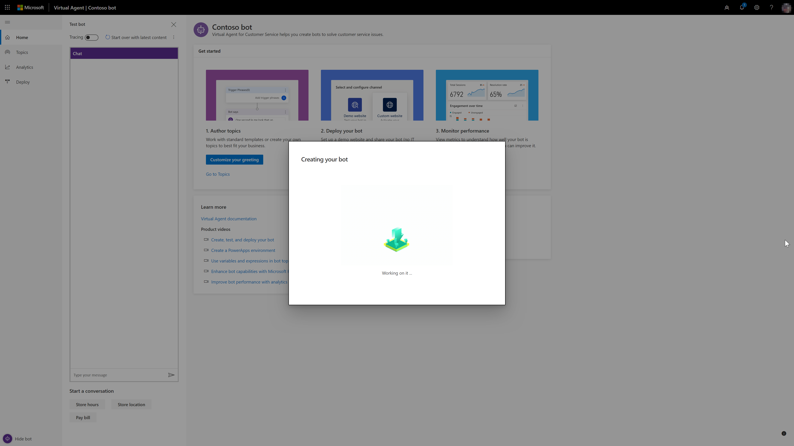

# Create a bot

[!INCLUDE [cc-beta-prerelease-disclaimer](includes/cc-beta-prerelease-disclaimer.md)]

You can use Power Virtual Agents to create a powerful custom bot. Power Virtual Agents makes it easy to create bots that address common support issues. You can design a conversation path that leads each customer to a resolution.
    
<iframe width="560" height="315" src="https://www.youtube.com/embed/eM-hs7maZko" frameborder="0" allow="accelerometer; autoplay; encrypted-media; gyroscope; picture-in-picture" allowfullscreen></iframe>

To help get you started and tailor the bot to your specific needs, Power Virtual Agents lets you create a bot using built-in content building blocks containing topics, trigger phrases, and pre-authored conversation paths. These built-in topics can also be useful as a model for building your own conversations for similar customer-support issues. For more information, see [Work with built-in topics](how-to-templates.md).

## To create your first bot

If you encounter an issue while creating your bot, see [Known issues with creating a bot](#known-issues-with-creating-a-bot).

1. Go to [aka.ms/virtual-agent](https://aka.ms/virtual-agent) and select **Try Preview**. Sign in using your work account.

   
    
   You are then presented with several license agreements and terms-of-service screens. When you agree to these terms, you are assigned licenses that allow you to access the Preview.
    
2. In the **Create a new bot** dialog box, you’ll name your bot. This can be something generic to your company or specific to the scenario you are tailoring your bot to.

   

   Your bot is created in the default Power Apps environment that was created for you in the prior step. For most users, this is sufficient. However, if you want to specify a custom Power Apps environment for your bot, you can do so by expanding the **More options** menu and selecting a different environment.

   >[!NOTE]
     >Preview is currently supported only in the locations listed in the [supported data locations](data-location.md) topic, with data stored in respective data centers. If your company is located outside of the supported data locations, you need to create a custom environment, with **Region** set to a supported data location, before you can create your bot. For more information on how to create a custom Power Apps environment, see [Creating a Power Apps environment](getting-started-new-environment.md).

  
3. Once you select **Create**, the process for creating the first bot within a new environment can take up to 15 minutes. 

    

   > [!NOTE]
   >
   > Explore some features of Power Virtual Agents while you are waiting:
   > - [Chat with a test bot](how-to-test-bot.md#work-with-the-test-bot-pane)
   > - [Trace your conversation in the authoring canvas](how-to-test-bot.md#to-trace-through-the-topics-conversation-path)
   > - [View and edit topics](getting-started-bot-designer.md#topics-page) (but not save them)
   > - [Watch product videos](videos.md)
   
 4.	When the bot creation process completes, the banner changes. You now have full functionality in the bot and can modify topics, test your changes, or deploy your bot.

## Creating additional bots

If you have already created a bot, you can create a new bot by selecting the icon on the title bar to open the **Bots** pane and then selecting **New bot**.

   

## Known issues with creating a bot

When you are creating your bot, you might encounter the following issues.

### No read/write access to any environment

In this case, you see this error: “You do not have permissions to any environments. Please get access from an administrator.”

To resolve this issue, follow the steps in [To create a new Power Apps environment](getting-started-new-environment.md). Use that environment to create your bot.

### Insufficient permissions for the selected environment

If an user selects an environment that they have insufficient access to, they get the following error: “An unexpected server error occurred. Please retry creating your bot.”

To resolve this issue, follow the steps in [To create a new Power Apps environment](getting-started-new-environment.md). Use that environment to create your bot.

### The Power Apps environment I created does not show up in the drop-down menu of Power Virtual Agents

Your environment might not show up in the drop-down menu due to one of the following:
 - The environment doesn't have a database created. To resolve this, go to [admin.powerapps.com](https://admin.powerapps.com) to create a database in your environment.
 - The environment's region is set to something other than a region in the [supported data locations](data-location.md). To resolve this, follow the steps in [To create a new Power Apps environment](getting-started-new-environment.md).
 - The environment didn't finish setting up. To resolve this, retry in a few minutes.
