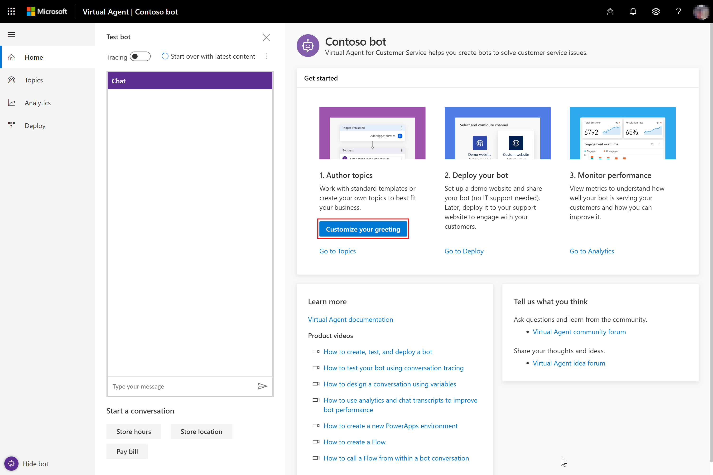
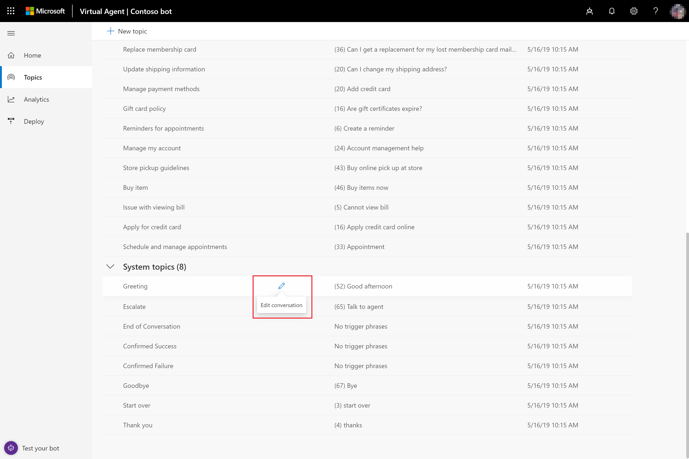
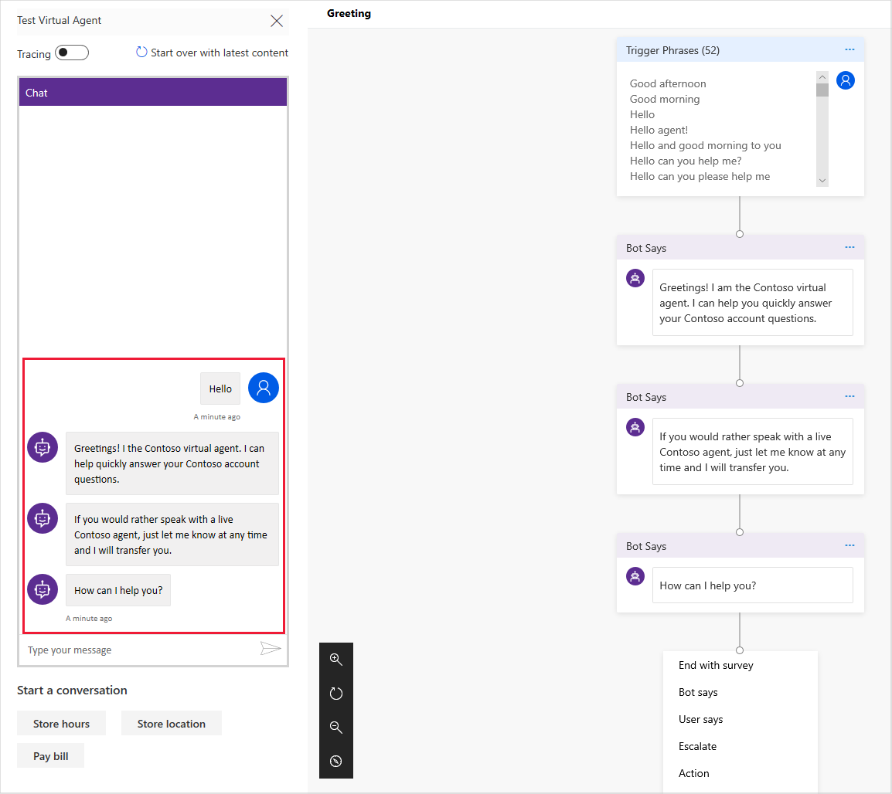

# Create a custom greeting for your bot

A customer can start a conversation with a bot by entering any trigger phrase that starts a conversation defined by a topic. Sometimes the customer starts a conversation with a simple greeting, such as *Hello* or *Good morning*. To help you handle this common situation, Power Virtual Agents automatically includes a built-in Greeting system topic when you create a bot, which you can customize.

Customizing your greeting gives you an opportunity to tell the customer that they are interacting with a bot rather than a human agent and to tailor the bot to reflect your organization's personality.

For information on creating a custom topic, see [Creating custom topics for your bot](getting-started-create-topics.md).

## To customize your bot's greeting

1. On the home page, select **Customize your greeting** to open the Greeting topic in the conversation editor.

   

   You can also open the Greeting topic in the conversation editor by selecting **Topics** in the left pane to open the Topics page, scrolling to the **System topics** section, and selecting **Edit conversation** on the Greeting topic.

   

   The Greeting topic by default is named *Greeting* and includes a built-in description and trigger phrases, which can't be edited. However, you can customize the greeting by editing the topic's conversation path.

2. In the conversation editor, edit the topic's **Bot Says** nodes to customize the greeting.

   

    Select **Save** to save the topic.

## To test the greeting

1. In the **Test bot** pane, select **Start over with latest content** to make sure you are using the most current bot content.

2. At the **Type your message** prompt at the bottom of the **Test bot** pane, enter a trigger phrase for the Greeting topic. The bot responds with the customized greeting you created.

   
