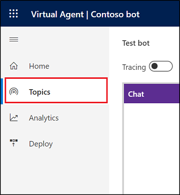
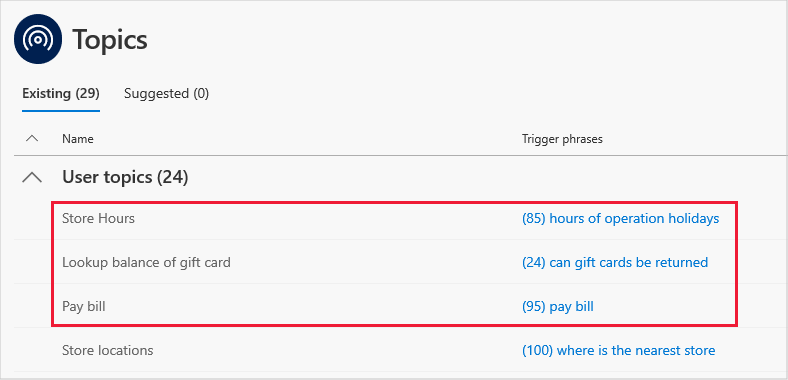
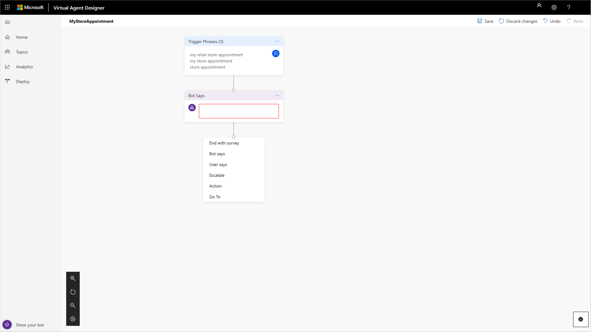
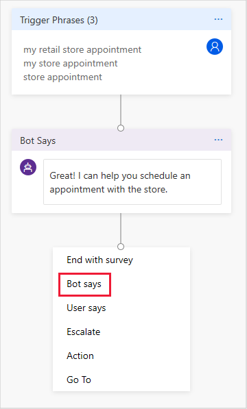
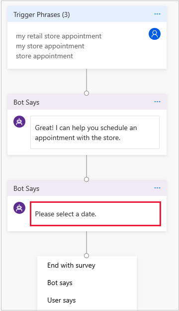
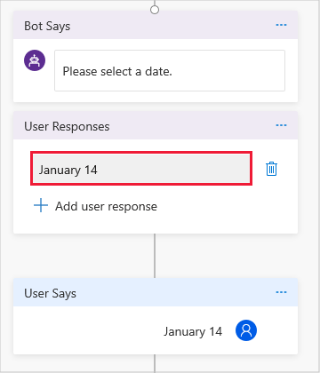
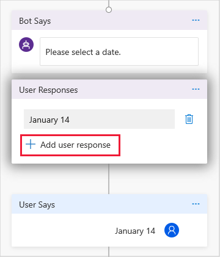
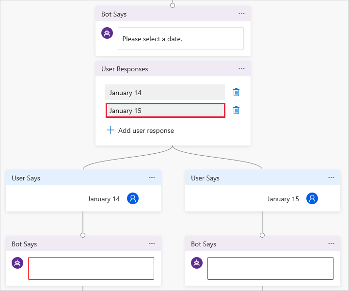
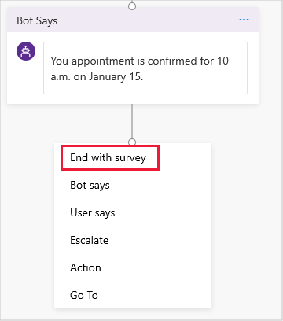

# Create custom topics for your bot

[!INCLUDE [cc-beta-prerelease-disclaimer](includes/cc-beta-prerelease-disclaimer.md)]

In Power Virtual Agents, a topic defines a conversation path with the bot for a specific customer intent. You specify a trigger phrase that prompts the bot to start the conversation. Then create a conversation path in Power Virtual Agents's conversation editor to lead customers to a resolution of their support issue.

You can see how the conversation path works in practice by testing it in the **Test bot** pane and continue to fine-tune the topic until you are ready to deploy it.

## To create your custom topic

1. Select **Topics** in the left pane to open the Topics page.

   

    The Topics page displays a list of your bot's current topics. Power Virtual Agents includes some built-in topics to get you started.

   

    Power Virtual Agents also includes several system topics that help you address common situations—a customer greeting, escalation to a live agent, the end of the conversation, a confirmed success, or a confirmed failure.

2. On the Topics page, select **New topic**.

   

3. Specify a name, description, and one or more trigger phrases for the topic.

    A trigger phrase is a phrase that a customer enters in the chat window to start a conversation with the bot. Once the conversation is started, the conversation follows the path you define. You can specify more than one trigger phrase for a topic. You can include punctuation in a trigger phrase, but it is best to use short phrases rather than long sentences.

    Select **Save topic** to add the topic to the topics list.

   

## To design the topic's conversation path

1. Select **Edit** to open the conversation editor.

   

    Power Virtual Agents opens the topic in the conversation editor and displays the topic's trigger phrases. The conversation editor is where you define the conversation path between a customer and the bot.

   

    As you define the topic's conversation path, you might want to expand the conversation editor design canvas. For more information on working with the design canvas, see [Working with the conversation editor design canvas](expanding-design-canvas.md).

2. Enter the bot's response to the trigger phrase in the **Bot Says** box.

   

3. To specify an additional response by the bot, select **Bot says**.

   

    Then enter the additional response in the **Bot Says** box.

   

4. To specify a response by the customer, select **User says**.

    You can provide several options for the user’s response. The options display as clickable buttons.

   

    Enter a response in the **User Responses** box.

   

    To give the customer a choice between different responses, select **Add user response**.

   

    Then specify the additional response in the **User Responses** box.

   

    The conversation editor creates separate paths in the conversation, depending on the customer's response. The conversation path leads the customer to the appropriate resolution for each user response.

5. Add additional bot and user responses to complete the conversation path.

   

6. To add a customer satisfaction survey at the end of a response that resolves the customer issue, select **End with survey**.

   

   Then select **Save** to save the conversation path.

As you design your topic's conversation path, you can use the **Test bot** pane to see how the bot leads the customer through a conversation.

## To test the topic in the Test bot pane

1. To make sure you are using the most current bot content, select **Start over with latest content** at the top of the **Test bot** pane.

   

2. At the **Type your message** prompt at the bottom of the **Test bot** pane, enter a trigger phrase for the topic.

   

   The trigger phrase starts the topic's conversation. The **Test bot** pane displays the bot and user responses that you specified in the conversation editor.

   

3. Continue the conversation path until you complete the conversation.

   

   If the conversation editor is open, you can select a response in the **Test bot** pane to navigate to the response in the conversation editor.

You can return to the conversation editor at any time to revise the topic's conversation path and continue to fine-tune the bot until you are ready to deploy it. For more information, see [Deploying your bot](getting-started-deploy.md).

For more information on using the **Test bot** pane, see [Work with the Test bot pane](how-to-test-bot.md).
