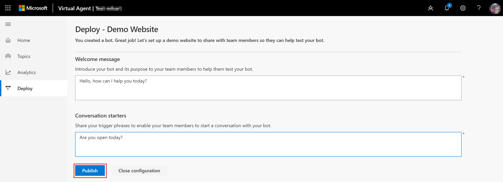
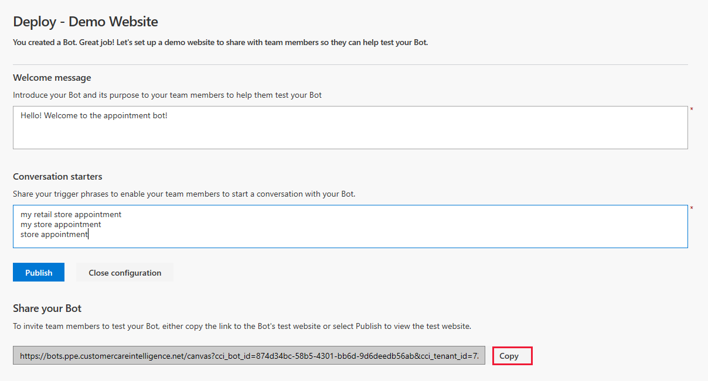
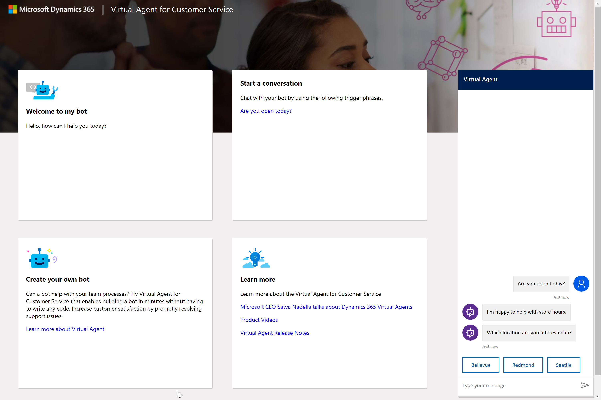
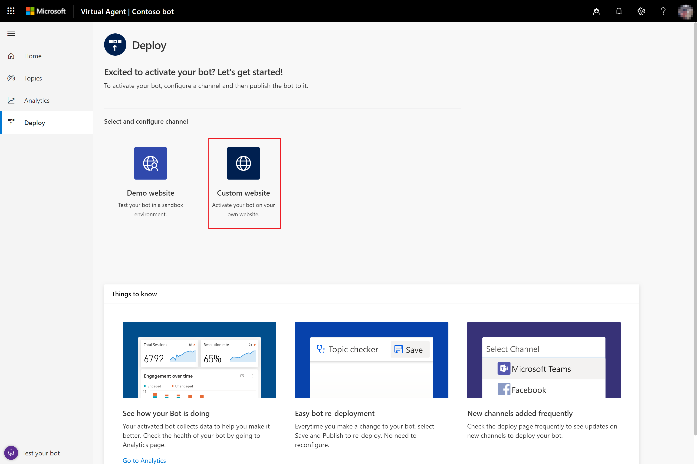

# Deploy your bot

[!INCLUDE [cc-beta-prerelease-disclaimer](includes/cc-beta-prerelease-disclaimer.md)]

Once you have finished designing you Power Virtual Agents, you can deploy it to a demo environment on the web or to your live website.

> [!NOTE]
> Newly deployed bot content won't be available immediately to end users until they restart the conversation, by refreshing the browser window, for example.

## To deploy your bot to a demo environment

1. Select **Deploy** in the left pane to open the Deploy page.

   

2. Select **Demo website** on the Deploy page. The demo website provides a sandbox environment for your team that lets them test the bot and give you feedback.

   

    On the Deploy - Demo Website page, enter a welcome message for your bot and some examples of topic triggers to use as conversation starters for team members testing your bot, and then select **Publish**.

   

## To share your bot on the demo website

1. When you deploy your bot, Power Virtual Agents adds a **Share your bot** section to the Deploy page that includes the URL for the bot's demo website. Select **Copy** to copy the URL.

   

    Users can open the demo website and test the bot by pasting the URL into their browser.

2. Test the bot on the demo website. Enter a trigger phrase at the **Type your message** prompt, and then follow the conversation path.

   

## To deploy your bot to your own custom website

1. If the Deploy page is not already open, select **Deploy** in the left pane to open it.

2. Select **Custom website** on the Deploy page.

   

   On the Deploy - Custom Website page, copy the code for the custom website and share it with your website administrator to add to the site. If you have admin permissions to the site, you can do it yourself.

   Then select **Publish** to publish the bot. Publishing the code ensures that your website displays the most current bot content.

   
