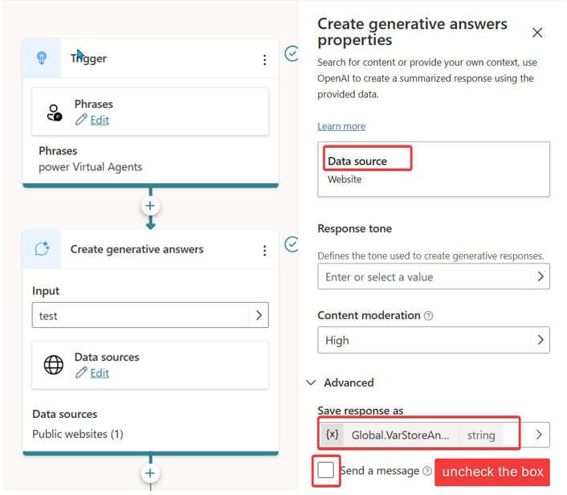
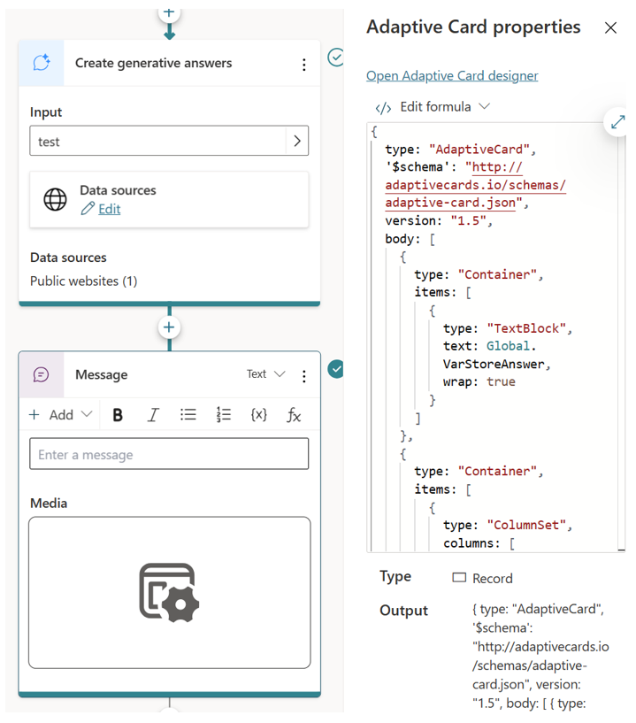
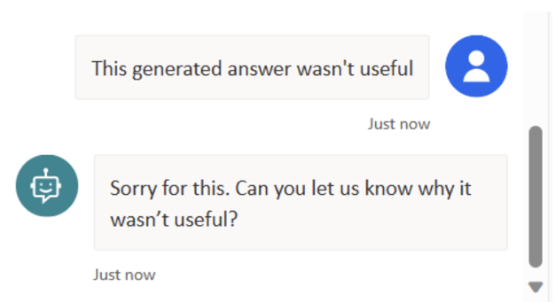

# Add feedback for every response 

As a bot owner, obtaining feedback from users is a vital step in improving the effectiveness and reliability of your conversational agent. It allows you to gain valuable insights into how well your bot is performing, identify areas for enhancement, and ultimately deliver a more satisfying user experience. 
In this article, we will show you how to use Adaptive Cards to collect user feedback after every interaction with your chatbot without being annoying to the user. Whether you're building a customer support bot, an informational assistant, or any other type of conversational agent, implementing this feedback mechanism will allow you to assess and enhance the quality of responses while ensuring user satisfaction. For this tutorial, I’m using a “Generative Answer” but this approach can be used for any response type as well.
Final output of this tutorial will look like below:


## Add a generative answer node
1.	Open the authoring canvas for your topic and select the plus icon to open the new node menu.

2.	Under Advanced, select Generative answers.

3.	A new node, called Create generative answers will be added to your topic, and will open the Properties pane automatically. 

4.	Under Data Source  Public website add any public website, like  

5.	Under Advanced create a [Variable](https://learn.microsoft.com/power-virtual-agents/authoring-variables), store the generative answers generated in response to user queries and give this variable a meaningful name, such as "VarStoreAnswer."

6.	Uncheck the send a message box

 

## Add a question / send message/ Ask with adaptive card
1.	Use any of asking or sending message node to add the adaptive card

 

2.	Paste the following JSON to the Adaptive Edit Formula 

``` json
{
  type: "AdaptiveCard",
  '$schema': "http://adaptivecards.io/schemas/adaptive-card.json",
  version: "1.5",
  body: [
    {
      type: "Container",
      items: [
        {
          type: "TextBlock",
          text: Global.VarStoreAnswer,
          wrap: true
        }
      ]
    },
    {
      type: "Container",
      items: [
        {
          type: "ColumnSet",
          columns: [
            {
              type: "Column",
              width: "90",
              items: [
                {
                  type: "TextBlock",
                  text: "Generated answer, please rate it",
                  wrap: true,
                  size: "Small",
                  color: "Accent"
                }
              ]
            },
            {
              type: "Column",
              width: "5",
              items: [
                {
                  type: "Image",
                  url: "data:image/svg+xml;utf8,%3Csvg%20width%3D%2224%22%20height%3D%2224%22%20viewBox%3D%220%200%2024%2024%22%20fill%3D%22none%22%20xmlns%3D%22http%3A%2F%2Fwww.w3.org%2F2000%2Fsvg%22%3E%0A%20%20%3Cpath%20d%3D%22M16.4996%2017.9852C16.4996%2020.4271%2015.3595%2022.1838%2013.4932%2022.1838C12.5183%2022.1838%2012.1518%2021.6411%2011.8021%2020.3881L11.596%2019.6162C11.495%2019.2574%2011.3192%2018.6467%2011.069%2017.7852C11.0623%2017.7621%2011.0524%2017.7403%2011.0396%2017.7203L8.17281%2013.2346C7.49476%2012.1736%206.49429%2011.3581%205.31841%2010.9079L4.84513%2010.7267C3.5984%2010.2494%202.87457%208.94562%203.1287%207.63505L3.53319%205.54897C3.77462%204.30388%204.71828%203.31298%205.9501%203.01106L13.5778%201.14153C16.109%200.521138%2018.6674%202.05607%2019.3113%204.5814L20.7262%2010.1306C21.1697%2011.8698%2020.1192%2013.6393%2018.3799%2014.0828C18.1175%2014.1497%2017.8478%2014.1835%2017.5769%2014.1835H15.7536C16.2497%2015.8164%2016.4996%2017.0762%2016.4996%2017.9852ZM4.60127%207.92059C4.48576%208.5163%204.81477%209.10893%205.38147%209.3259L5.85475%209.5071C7.33036%2010.0721%208.58585%2011.0954%209.43674%2012.4268L12.3035%2016.9125C12.3935%2017.0534%2012.4629%2017.2064%2012.5095%2017.367L13.0614%2019.2873L13.2731%2020.0786C13.4125%2020.5666%2013.4827%2020.6838%2013.4932%2020.6838C14.3609%2020.6838%2014.9996%2019.6998%2014.9996%2017.9852C14.9996%2017.1007%2014.6738%2015.6497%2014.0158%2013.6701C13.8544%2013.1846%2014.2158%2012.6835%2014.7275%2012.6835H17.5769C17.7228%2012.6835%2017.868%2012.6653%2018.0093%2012.6293C18.9459%2012.3905%2019.5115%2011.4377%2019.2727%2010.5012L17.8578%204.952C17.4172%203.22415%2015.6668%202.17393%2013.9349%202.59841L6.30718%204.46794C5.64389%204.63051%205.13577%205.16407%205.00577%205.83451L4.60127%207.92059Z%22%20fill%3D%22%23212121%22%20%2F%3E%0A%3C%2Fsvg%3E",
                  width: "15px",
                  height: "15px",
                  selectAction: {
                    type: "Action.Submit",
                    data: "This generated answer wasn't useful"
                  }
                }
              ]
            },
            {
              type: "Column",
              width: "5",
              items: [
                {
                  type: "Image",
                  url: "data:image/svg+xml;utf8,%3Csvg%20width%3D%2224%22%20height%3D%2224%22%20viewBox%3D%220%200%2024%2024%22%20fill%3D%22none%22%20xmlns%3D%22http%3A%2F%2Fwww.w3.org%2F2000%2Fsvg%22%3E%0A%20%20%3Cpath%20d%3D%22M16.4996%205.20259C16.4996%202.76065%2015.3595%201.00391%2013.4932%201.00391C12.467%201.00391%2012.1149%201.60527%2011.747%203.00348C11.6719%203.29233%2011.635%203.43297%2011.596%203.57157C11.495%203.93031%2011.3192%204.54106%2011.069%205.40258C11.0623%205.42566%2011.0524%205.44741%2011.0396%205.46749L8.17281%209.95315C7.49476%2011.0141%206.49429%2011.8296%205.31841%2012.2798L4.84513%2012.461C3.5984%2012.9384%202.87457%2014.2421%203.1287%2015.5527L3.53319%2017.6388C3.77462%2018.8839%204.71828%2019.8748%205.9501%2020.1767L13.5778%2022.0462C16.109%2022.6666%2018.6674%2021.1317%2019.3113%2018.6064L20.7262%2013.0572C21.1697%2011.3179%2020.1192%209.54845%2018.3799%209.10498C18.1175%209.03807%2017.8478%209.00422%2017.5769%209.00422H15.7536C16.2497%207.37133%2016.4996%206.11155%2016.4996%205.20259ZM4.60127%2015.2672C4.48576%2014.6715%204.81477%2014.0788%205.38147%2013.8619L5.85475%2013.6806C7.33036%2013.1157%208.58585%2012.0923%209.43674%2010.7609L12.3035%206.27526C12.3935%206.13437%2012.4629%205.98131%2012.5095%205.82074C12.7608%204.95574%2012.9375%204.34175%2013.0399%203.97786C13.083%203.82461%2013.1239%203.66916%2013.1976%203.38519C13.3875%202.66348%2013.4809%202.50391%2013.4932%202.50391C14.3609%202.50391%2014.9996%203.48797%2014.9996%205.20259C14.9996%206.08708%2014.6738%207.53803%2014.0158%209.51766C13.8544%2010.0032%2014.2158%2010.5042%2014.7275%2010.5042H17.5769C17.7228%2010.5042%2017.868%2010.5224%2018.0093%2010.5585C18.9459%2010.7973%2019.5115%2011.7501%2019.2727%2012.6866L17.8578%2018.2357C17.4172%2019.9636%2015.6668%2021.0138%2013.9349%2020.5893L6.30718%2018.7198C5.64389%2018.5572%205.13577%2018.0237%205.00577%2017.3532L4.60127%2015.2672Z%22%20fill%3D%22%23212121%22%20%2F%3E%0A%3C%2Fsvg%3E",
                  width: "15px",
                  height: "15px",
                  selectAction: {
                    type: "Action.Submit",
                    data: "This generated answer was useful"
                  }
                }
              ]
            }
          ]
        }
      ]
    }
  ]
}
```

3.	At the end of the response, you can give an option to the user to rate every response. 


To capture the thumbs up and down, I trigger the specific topic to get additional feedback. Based on up and down clicks topic catches the phrases. 



Here is the YAML file to redirect to this topic to capture those responses. 

``` yaml
kind: AdaptiveDialog
beginDialog:
  kind: OnRecognizedIntent
  id: main
  condition: =!IsBlank(Global.VarStoreAnswer)
  intent:
    displayName: Untitled

  actions:
    - kind: SendActivity
      id: sendActivity_XauhTN
      activity:
        attachments:
          - kind: AdaptiveCardTemplate
            cardContent: |-
              ={
                type: "AdaptiveCard",
                '$schema': "http://adaptivecards.io/schemas/adaptive-card.json",
                version: "1.5",
                body: [
                  {
                    type: "Container",
                    items: [
                      {
                        type: "TextBlock",
                        text: Global.VarStoreAnswer,
                        wrap: true
                      }
                    ]
                  },
                  {
                    type: "Container",
                    items: [
                      {
                        type: "ColumnSet",
                        columns: [
                          {
                            type: "Column",
                            width: "90",
                            items: [
                              {
                                type: "TextBlock",
                                text: "Generated answer, please rate it",
                                wrap: true,
                                size: "Small",
                                color: "Accent"
                              }
                            ]
                          },
                          {
                            type: "Column",
                            width: "5",
                            items: [
                              {
                                type: "Image",
                                url: "data:image/svg+xml;utf8,%3Csvg%20width%3D%2224%22%20height%3D%2224%22%20viewBox%3D%220%200%2024%2024%22%20fill%3D%22none%22%20xmlns%3D%22http%3A%2F%2Fwww.w3.org%2F2000%2Fsvg%22%3E%0A%20%20%3Cpath%20d%3D%22M16.4996%2017.9852C16.4996%2020.4271%2015.3595%2022.1838%2013.4932%2022.1838C12.5183%2022.1838%2012.1518%2021.6411%2011.8021%2020.3881L11.596%2019.6162C11.495%2019.2574%2011.3192%2018.6467%2011.069%2017.7852C11.0623%2017.7621%2011.0524%2017.7403%2011.0396%2017.7203L8.17281%2013.2346C7.49476%2012.1736%206.49429%2011.3581%205.31841%2010.9079L4.84513%2010.7267C3.5984%2010.2494%202.87457%208.94562%203.1287%207.63505L3.53319%205.54897C3.77462%204.30388%204.71828%203.31298%205.9501%203.01106L13.5778%201.14153C16.109%200.521138%2018.6674%202.05607%2019.3113%204.5814L20.7262%2010.1306C21.1697%2011.8698%2020.1192%2013.6393%2018.3799%2014.0828C18.1175%2014.1497%2017.8478%2014.1835%2017.5769%2014.1835H15.7536C16.2497%2015.8164%2016.4996%2017.0762%2016.4996%2017.9852ZM4.60127%207.92059C4.48576%208.5163%204.81477%209.10893%205.38147%209.3259L5.85475%209.5071C7.33036%2010.0721%208.58585%2011.0954%209.43674%2012.4268L12.3035%2016.9125C12.3935%2017.0534%2012.4629%2017.2064%2012.5095%2017.367L13.0614%2019.2873L13.2731%2020.0786C13.4125%2020.5666%2013.4827%2020.6838%2013.4932%2020.6838C14.3609%2020.6838%2014.9996%2019.6998%2014.9996%2017.9852C14.9996%2017.1007%2014.6738%2015.6497%2014.0158%2013.6701C13.8544%2013.1846%2014.2158%2012.6835%2014.7275%2012.6835H17.5769C17.7228%2012.6835%2017.868%2012.6653%2018.0093%2012.6293C18.9459%2012.3905%2019.5115%2011.4377%2019.2727%2010.5012L17.8578%204.952C17.4172%203.22415%2015.6668%202.17393%2013.9349%202.59841L6.30718%204.46794C5.64389%204.63051%205.13577%205.16407%205.00577%205.83451L4.60127%207.92059Z%22%20fill%3D%22%23212121%22%20%2F%3E%0A%3C%2Fsvg%3E",
                                width: "15px",
                                height: "15px",
                                selectAction: {
                                  type: "Action.Submit",
                                  data: "This generated answer wasn't useful"
                                }
                              }
                            ]
                          },
                          {
                            type: "Column",
                            width: "5",
                            items: [
                              {
                                type: "Image",
                                url: "data:image/svg+xml;utf8,%3Csvg%20width%3D%2224%22%20height%3D%2224%22%20viewBox%3D%220%200%2024%2024%22%20fill%3D%22none%22%20xmlns%3D%22http%3A%2F%2Fwww.w3.org%2F2000%2Fsvg%22%3E%0A%20%20%3Cpath%20d%3D%22M16.4996%205.20259C16.4996%202.76065%2015.3595%201.00391%2013.4932%201.00391C12.467%201.00391%2012.1149%201.60527%2011.747%203.00348C11.6719%203.29233%2011.635%203.43297%2011.596%203.57157C11.495%203.93031%2011.3192%204.54106%2011.069%205.40258C11.0623%205.42566%2011.0524%205.44741%2011.0396%205.46749L8.17281%209.95315C7.49476%2011.0141%206.49429%2011.8296%205.31841%2012.2798L4.84513%2012.461C3.5984%2012.9384%202.87457%2014.2421%203.1287%2015.5527L3.53319%2017.6388C3.77462%2018.8839%204.71828%2019.8748%205.9501%2020.1767L13.5778%2022.0462C16.109%2022.6666%2018.6674%2021.1317%2019.3113%2018.6064L20.7262%2013.0572C21.1697%2011.3179%2020.1192%209.54845%2018.3799%209.10498C18.1175%209.03807%2017.8478%209.00422%2017.5769%209.00422H15.7536C16.2497%207.37133%2016.4996%206.11155%2016.4996%205.20259ZM4.60127%2015.2672C4.48576%2014.6715%204.81477%2014.0788%205.38147%2013.8619L5.85475%2013.6806C7.33036%2013.1157%208.58585%2012.0923%209.43674%2010.7609L12.3035%206.27526C12.3935%206.13437%2012.4629%205.98131%2012.5095%205.82074C12.7608%204.95574%2012.9375%204.34175%2013.0399%203.97786C13.083%203.82461%2013.1239%203.66916%2013.1976%203.38519C13.3875%202.66348%2013.4809%202.50391%2013.4932%202.50391C14.3609%202.50391%2014.9996%203.48797%2014.9996%205.20259C14.9996%206.08708%2014.6738%207.53803%2014.0158%209.51766C13.8544%2010.0032%2014.2158%2010.5042%2014.7275%2010.5042H17.5769C17.7228%2010.5042%2017.868%2010.5224%2018.0093%2010.5585C18.9459%2010.7973%2019.5115%2011.7501%2019.2727%2012.6866L17.8578%2018.2357C17.4172%2019.9636%2015.6668%2021.0138%2013.9349%2020.5893L6.30718%2018.7198C5.64389%2018.5572%205.13577%2018.0237%205.00577%2017.3532L4.60127%2015.2672Z%22%20fill%3D%22%23212121%22%20%2F%3E%0A%3C%2Fsvg%3E",
                                width: "15px",
                                height: "15px",
                                selectAction: {
                                  type: "Action.Submit",
                                  data: "This generated answer was useful"
                                }
                              }
                            ]
                          }
                        ]
                      }
                    ]
                  }
                ]
              }

```


 

