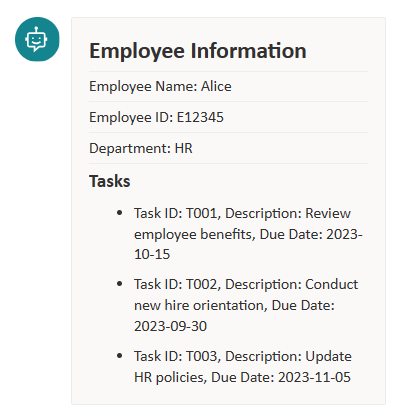
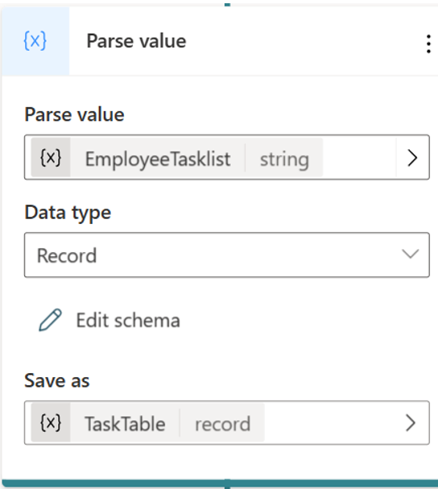

# Display Data from Arrays in Adaptive Cards

Adaptive Cards are a versatile tool that can be used to create interactive and engaging conversations in Power Virtual Agents. 
In this document, we will learn how to display array items in Adaptive Cards in Power Virtual Agents. We will use a hard-coded example for simplicity, but in a real-life scenario, you would likely get the data from a more dynamic source like SharePoint list etc. by leveraging Power Automate.

Let’s say that you have a list of tasks in an array, and you want to show the list of tasks in the bot like below: 



## Initialize a variable with the task list 

1.	Select Add node (+) to add a node, and then select Set a variable value.
1.	Select the box under Set variable, and then select Create a new variable and name your variable something meaningful,like  EmployeeTaskList

   

1.  To Value paste the following JSON Data:

```json
{
    "employeeName": "Alice",
    "employeeID": "E12345",
    "employeeDepartment": "HR",
    "employeeTasks": [
        {
            "taskID": "T001",
            "taskDescription": "Review employee benefits",
            "dueDate": "2023-10-15"
        },
        {
            "taskID": "T002",
            "taskDescription": "Conduct new hire orientation",
            "dueDate": "2023-09-30"
        },
        {
            "taskID": "T003",
            "taskDescription": "Update HR policies",
            "dueDate": "2023-11-05"
        }
    ]
}
```
## Parse the JSON Data into a Table

Use Parse value node to convert the JSON string into Table. Copy and paste the same JSON into the “From sample data” section of the data type settings. This will automatically generate the schema and datatype. 
Save the parsed table as a variable, which you can reference later. For example, save it as a variable named TaskTable.


## Display the Data in an Adaptive Card

To display the data in an Adaptive Card, add a Question Node and from dropdown add the Adaptive Card to your topic
Paste the following JSON code 

```json

{
  type: "AdaptiveCard",
  version: "1.5",
  body: [
    {
      type: "TextBlock",
      text: "Employee Information",
      weight: "bolder",
      size: "large"
    },
    {
      type: "TextBlock",
      text: "Employee Name: " & Topic.TaskTable.employeeName,
      separator: true
    },
    {
      type: "TextBlock",
      text: "Employee ID: " & Topic.TaskTable.employeeID,
      separator: true
    },
    {
      type: "TextBlock",
      text: "Department: " & Topic.TaskTable.employeeDepartment,
      separator: true
    },
    {
      type: "TextBlock",
      text: "Tasks",
      weight: "bolder",
      size: "medium",
      separator: true
    },
    {
      type: "Container",
      items: 
        ForAll(Topic.TaskTable.employeeTasks,
          {
            type: "TextBlock",
            text: "- Task ID: " & taskID & ",  Description: " & taskDescription & ", Due Date: " & dueDate ,
            wrap: true
          }
      )
    }
  ]
}
```

1.	Now we can refer the JSON record properties using expressions like "Topic.TaskTable.employeeName." 

1.	To display array items in an Adaptive Card, use the Container element with the items property. The items property takes an array of elements as its value. Each element in the array will be displayed in the Adaptive Card, using  ['ForAll'](https://learn.microsoft.com/power-platform/power-fx/reference/function-forall) function. Reference the "Topic.TaskTable.employeeTasks" array, it will  allow to access each of its properties.

Paste the YAML code in the code editor view. You can access this option at the top right corner of a new topic. 

```
kind: AdaptiveDialog
beginDialog:
  kind: OnRecognizedIntent
  id: main
  intent:
    displayName: Untitled
    triggerQueries:
      - array

  actions:
    - kind: SetVariable
      id: setVariable_uFs69M
      variable: Topic.EmployeeTasklist
      value: "{     \"employeeName\": \"Alice\",     \"employeeID\": \"E12345\",     \"employeeDepartment\": \"HR\",     \"employeeTasks\": [         {             \"taskID\": \"T001\",             \"taskDescription\": \"Review employee benefits\",             \"dueDate\": \"2023-10-15\"         },         {             \"taskID\": \"T002\",             \"taskDescription\": \"Conduct new hire orientation\",             \"dueDate\": \"2023-09-30\"         },         {             \"taskID\": \"T003\",             \"taskDescription\": \"Update HR policies\",             \"dueDate\": \"2023-11-05\"         }     ] }"

    - kind: ParseValue
      id: 58zKdp
      variable: Topic.TaskTable
      valueType:
        kind: Record
        properties:
          employeeDepartment: String
          employeeID: String
          employeeName: String
          employeeTasks:
            type:
              kind: Table
              properties:
                dueDate: String
                taskDescription: String
                taskID: String

      value: =Topic.EmployeeTasklist

    - kind: SendActivity
      id: sendActivity_oNXY1r
      activity:
        attachments:
          - kind: AdaptiveCardTemplate
            cardContent: |-
              ={
                type: "AdaptiveCard",
                version: "1.5",
                body: [
                  {
                    type: "TextBlock",
                    text: "Employee Information",
                    weight: "bolder",
                    size: "large"
                  },
                  {
                    type: "TextBlock",
                    text: "Employee Name: " & Topic.TaskTable.employeeName,
                    separator: true
                  },
                  {
                    type: "TextBlock",
                    text: "Employee ID: " & Topic.TaskTable.employeeID,
                    separator: true
                  },
                  {
                    type: "TextBlock",
                    text: "Department: " & Topic.TaskTable.employeeDepartment,
                    separator: true
                  },
                  {
                    type: "TextBlock",
                    text: "Tasks",
                    weight: "bolder",
                    size: "medium",
                    separator: true
                  },
                  {
                    type: "Container",
                    items: 
                      ForAll(Topic.TaskTable.employeeTasks,
                        {
                          type: "TextBlock",
                          text: "- Task ID: " & taskID & ",  Description: " & taskDescription & ", Due Date: " & dueDate ,
                          wrap: true
                        }
                    )
                  }
                ]
              }

```

> [!div class="nextstepaction"]
> [Add feedback for every response](Adaptive-Card-Add-feedback-for-every-response.md)