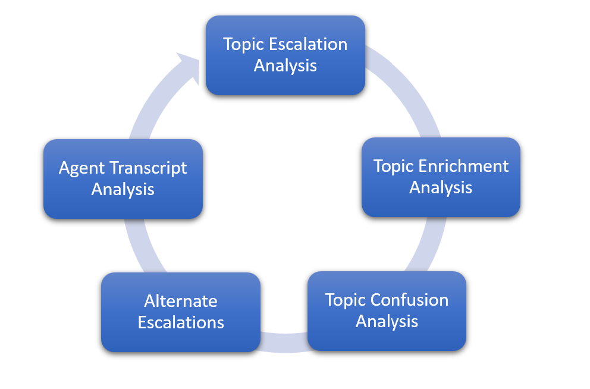

# Deflection overview

[!INCLUDE[pva-rebrand](../includes/pva-rebrand.md)]

Return on investment (ROI) and improved customer satisfaction (CSAT) are top priorities for the organizations that implement Microsoft Copilot Studio chatbots.

Optimizing the bot deflection rate is one of the top focus areas for organizations to achieve their business goals around ROI and CSAT, and to improve the bot's overall performance. There are major indicators in Microsoft Copilot Studio that help improve bot performance, such as resolution rate, escalation rate, and CSAT.

While the metrics continue to evolve, there are several things you can do as a bot builder to improve the deflection rate of your bot. In these articles, we cover the importance of deflection in conversational AI and general techniques/considerations that are universal for optimizing deflection for chatbots.  

> [!TIP]
> In the context of conversational AI, *deflection* is an indicator representing the percentage of requests that are completed in a self-service fashion that would otherwise be handled by live agents. In other words, it refers to the number of items a team avoids having to deal with as a result of automation.

## Why deflection optimization?

> [!div class="checklist"]
>
> - **Better customer experience**: more customers or employees can get their issues resolved by the bot instead of waiting for a human agent in chat or phone. This leads to a better customer experience and higher CSAT scores. While this helps reduce wait time, live agents can also focus on more complex, higher-value tasks.
> - **Cost savings**: one of the key ways the ROI of the bot is determined is by using deflection rates. Human agent call support typically costs around $5 to $10 in the contact center industry. However, a bot session that resolves a customer request costs around 50 cents. This means that higher deflection rates lead to higher cost savings.

## Understanding the key components of Microsoft Copilot Studio analytics to improve deflection

A basic understanding of available analytics is required to be able to determine what deflection means for your organization. The following table describes the key metrics from Microsoft Copilot Studio:

|Description                     |Details                           |
|--------------------------------|----------------------------------|
| **Total Sessions**  | The total number of _analytics sessions_ within the specified time period.   A conversation with a chatbot can generate one or multiple analytics sessions, each with their own engagement status and outcome. An analytics session begins when a user has new questions after an initial conversation completed (for example, reached the End Of Conversation topic). |
|  **Engagement Rate** | The percentage of total sessions that are engaged sessions.   An engaged session is an analytics session in which a custom topic is triggered, or the session ends in escalation. Engaged sessions can have one of three outcomes—they're either resolved, escalated, or abandoned. |
|  **Resolution Rate**  | The percentage of engaged sessions that are resolved.   A resolved session is an engaged session in which the user receives an End Of Conversation question that asks "_Did that answer your question?_" and the user either doesn't respond or responds "_Yes_". |
|  **Escalation Rate**  | The percentage of engaged sessions that are escalated.   An escalated session is an engaged session that is escalated to a human agent. |
|  **Abandon Rate** | The percentage of engaged sessions that are abandoned.   An abandoned session is an engaged session that isn't resolved or escalated after one hour from the beginning of the session. |
|  **CSAT**  | The graphical view of the average of CSAT scores for sessions in which customers respond to an End of Conversation request to take the survey.  |

These metrics need to be continuously improved to optimize the bot ROI. However, each organization may have their own definition of what *deflection rate* means to them. For example, an organization may consider the *Abandon* rate along with the *Escalation* rate as part of their deflection calculation, while another organization may look purely at the *Escalation* rate.

Despite having different definitions for a deflection rate, these metrics still provide the foundation to calculate deflection. Based on our experience with various customers, we have seen that in the context of deflection, *Resolution* rate and *Escalation* rate play a major role. Increasing the *Resolution* rate and reducing the *Escalation* rate typically has a direct result on overall bot deflection metrics.

## Key techniques

> [!div class="nextstepaction"]
> [Topic escalation analysis](deflection-topic-escalation-analysis.md)
