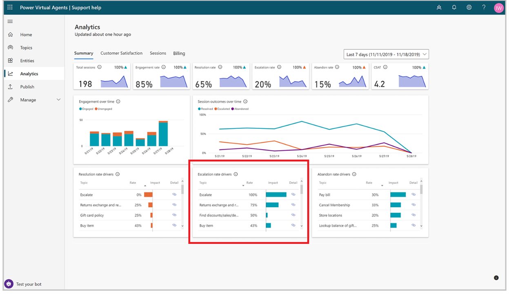
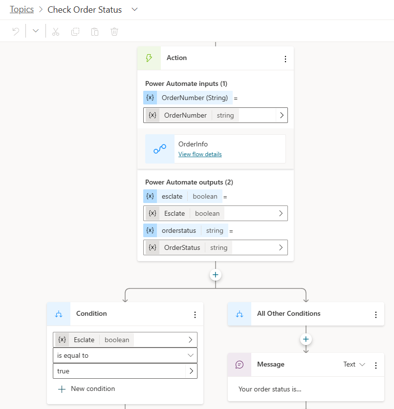

# Deflection optimization techniques

Return on investment (ROI) and improved customer satisfaction (CSAT) are top priorities for the organizations that implement Power Virtual Agents (PVA) bots. Optimizing the bot deflection rate is one of the top focus areas for organizations to achieve their business goals around ROI, CSAT etc. and improve the overall bot performance.  There are major indicators provided out-of-box in PVA to improve bot performance, such as resolution rate, escalation rate, and CSAT. While the metrics continue to evolve, there are several things you can do as a bot builder to improve the deflection rate of your PVA bot. This article covers the importance of deflection in conversational AI and some general techniques/considerations that are universal for optimizing deflection for bots.  
In the context of conversational AI, deflection is an indicator representing the percentage of requests that are completed in a self-service fashion that live agents would otherwise handled. In other words, it refers to the number of items a team avoids having to deal with as a result of automation

## Why deflection optimization?

More customers can get their issues resolved by the bot instead of waiting for a human agent in chat or phone, which results in a better customer experience and higher CSAT scores. While this help reduce wait time, live agents can also focus on more complex, higher-value tasks.
Cost savings: one of the key ways to determine the ROI of the bot is by using the deflection rates. The human agent call support typically costs around $ 5-10 in the contact center industry. However, a bot session that resolves a customer request costs around 50 cents. Higher deflection rates lead to higher cost savings.

## Understanding the key components of PVA analytics to improve deflection

A basic understanding of available PVA analytics is required to be able to determine what deflection means for your organization. The following table describes the key metrics from Power Virtual Agents:

|Description                     |Details                           |
|--------------------------------|----------------------------------|
|  Total Sessions                | The total number of sessions within the specified time period.                                 |
|  Engagement Rate               | The percentage of total sessions that are engaged sessions. An engaged session is a session in which a user-created topic, as opposed to a system topic like “Greeting”, is triggered, or the session ends in escalation. Engaged sessions can have one of three outcomes—they're either resolved, escalated, or abandoned.                                 |
|  Resolution Rate               | The percentage of engaged sessions that are resolved. A resolved session is an engaged session in which the user receives an end-of-conversation survey that asks the question "Did that answer your question?" and the user either doesn't respond or responds Yes.                                 |
|  Escalation Rate               | The percentage of engaged sessions that are escalated. An escalated session is an engaged session that is escalated to a human agent.                                  |
|  Abandon Rate                  | The percentage of engaged sessions that are abandoned. An abandoned session is an engaged session that is not resolved or escalated after one hour from the beginning of the session.                                 |
|  CSAT                          | The graphical view of the average of customer satisfaction (CSAT) scores for sessions in which customers respond to an end-of-session request to take the survey.                                 |

These metrics need to be continuously improved to optimize  the bot ROI. However, each organization may have their own definition of what deflection rate means to them. For example, an organization may consider “Abandon rate” along with “escalation rate” as part of deflection calculation while another organization may look purely at escalation rate. Despite having different definitions for deflection rate, the PVA metrics still provide the foundation to calculate deflection.
Based on our experience with various customers, we have seen that in the context of deflection, resolution rate and escalation rate play a major role. Increasing the resolution rate and reducing the escalation rate typically has a direct impact on the overall bot deflection metrics.

## Key Techniques

## Technique 1: topic escalation analysis
  
Escalation is the conversation flow during which the bot couldn’t handle the conversation and escalated to a human agent. When a topic does not escalate to a human agent, it's considered as deflection. The ideal goal is to increase the deflection rate of a bot by reducing the number of escalations.
PVA has multiple ways to handle escalation, the direct way of initiating an escalation to human agent is through the “Escalate” system topic. This system topic enables PVA to understand that the bot is no longer able to address the customer request and would need to escalate to a human agent. Through the “Escalate” topic, one can enable the bot to transfer the conversation to an agent service desk tool like Dynamics 365 Omnichannel for Customer Service for the live agent transfer or an asynchronous support experience like creating a ticket, scheduling a call back etc. A common way of triggering this escalation is through the “Transfer to agent” node in the PVA authoring canvas.

Power Virtual Agents has two types of escalations:

1. Direct escalation: in this case, the user comes to the bot and directly wants to talk to a human agent. These kinds of escalations can't be avoided as the intent of the end-user is to trigger the “Escalate” topic directly.
• Examples end-user queries:
 “can I talk to someone”
 “talk to a live agent”
 “speak with agent”
 “talk to a representative”
2. Indirect escalation: in this case, the user gets escalated to an agent during the conversation. The escalations can be grouped to expected vs unexpected escalations. Expected escalations happen when the topic is designed to escalate at some point during the conversation, or the user chooses to escalate since the bot didn't answer their query. Unexpected escalation can happen when the bot errors out due to other issues.

### STEP 1: Monitor and review topics performance

Identifying and optimizing escalation rate drivers can be done through the built-in analytics provided in PVA or through custom analytics.

Built-in analytics:

PVA captures all the bot sessions that led to an escalation or transfer to an agent, from beginning to end, at the topic level. The bot topics are the escalation drivers. The PVA analytics dashboard has a section for “Escalation Rate Drivers” that gives the details on which are the bot topics that were escalated to human agents most of the time and why. This information is available in the numerical point of view and derived from the chat transcripts by the PVA analytics.

For example, in the below screenshot under the “Escalation Rate Drivers” section we see the “Returns, Exchanges…” topic has a “Rate” value of 75%. Seventy-five percent of all the sessions that triggered the “Returns, Exchanges…” topic were escalated to a human agent. Since the bot couldn’t solve the issue for the user, 75% of the times when user asked about returns, the bot had to escalate to a human agent. Now the bot author can improve the “Returns, Exchanges..” topic to reduce the number of escalations happening through this topic.

The chart also shows the “impact” as a red or blue bar. The escalation rate impact score is the overall escalation rate including the topic minus the overall escalation rate excluding the topic. In short “impact” helps you understand what this topic is contributing to the overall escalation rate. If the impact is high, then that is the topic you have to focus on. If you improve that topic, the potential impact it has on escalation also improves.

A red bar indicates that the topic's escalation rate is greater than the average escalation rate, resulting in a negative impact on overall escalation rate. A blue bar indicates that the escalation rate is smaller, resulting in a positive impact on overall escalation rate performance. Lowering the escalation rate for the topics in red has the greatest impact on improving the overall escalation rate.

Note: The impact score isn't represented as a number but as a bar chart in PVA.

  
Custom analytics:
  
You can also build on your own custom analytics on top of the conversation transcripts data. Microsoft provides a template report (https://aka.ms/PVAAnalytics) that you can reuse or extend to identify the top escalation driver topics and add custom details specific to your business and context, such as whether you need number of escalated sessions per topic. More information will be added through the deflection analytics dashboards that will be available in future updates.
<!-- Insert Image -->

### STEP 2: Select the top Escalation topics

The general guidance is to target the top 5-10 topics under “Escalation rate drivers” to start with for deflection rate optimization. On a ball park estimate, if you improve the rate of escalation by 10% for each of the top five topics, you can improve the overall deflection by 1% for the chatbot.

### STEP 3: Review conversations for selected topics

Analyzing the conversation transcripts for the top escalation topics can provide more insights into reasons for escalation. Conversation transcripts capture the turn by turn, as “user says” and “bot says”. It also captures the topic name that was triggered and the session outcome (for example, Resolved, Escalated etc.).

Now, you can filter these sessions based on outcome for “Top escalated topics” and review a few sample conversations to see what caused the escalation. This helps you identify the pattern that is causing the escalation. This exercise can be repeated in periodic cadence to keep improving the deflection rate and reducing the escalation rates.

Following is the step-by-step guidance you can use for dissecting the chat transcripts and coming up with the right recommendations for improving the topic performance,

1. Take one of the top five topics for which you want to make improvements to reduce escalation
2. Filter the transcripts and sort by the session outcome for “Escalation”
3. Select the most recent sample set of conversation transcripts (for example, 10 sessions). The size of the sample set depends on how much accuracy you're looking for. For a quick analysis, you can start with 10 sessions.
4. Read through each of the sessions and identify the various repeated dialog paths that are emerging for that topic related conversation.
5. List out the dialog paths identified for each session and group them as per the dialog path.
6. For each dialog path group, come up with a recommendation for improvement.
7. Implement the recommendations in the PVA bot topics and observe the change in the escalation rate and deflection.

Applying the above approach for the “Check Order Status” Topic example would look like this:

 Topic description: “Check Order Status” is supposed to provide order and shipping information for the user

Observation from transcripts:  after reviewing multiple conversation transcripts for this topic that ended with escalation, you can find there are multiple dialog paths emerging that is leading the user to escalate to an agent even if the bot provided the order information as designed.
There could be a dialog path #1 where the bot provides the order info when the user asks about missing shipment. There could also be another dialog path #2 where user is looking for the status of multiple orders while the bot is currently providing a status for only one order at a time. The recommendation for dialog path #1 could be adding a new topic exclusively addressing the “Missing Order” scenario. The recommendation for dialog path #2 could be to update the self-service action to provide status for multiple orders instead of just one.

Conversation transcript review summary:
   • Sample set size: analyze (#10) sample conversations for escalated sessions from the downloaded transcripts. All triggered the correct topic. All got escalated at the end.
   • Expected dialog path: Go to “OrderInfo” action and provide the order status to end user.

 New dialog paths identified by reviewing transcripts:

   • Dialog path 1: OrderInfoSkill replies with “order info adaptive card” but the user’s query is related to missing package, so the user decides to escalate (7 out of 10 sessions)
   • Dialog path 2: OrderInfo action replies with: “your order contains multiple shipments” but doesn't show shipping information for all the orders, so the user decides to escalate (2 out of 10 sessions)
   • Dialog path 3: Other: (order number mismatch), user was unaware that they were entering an incorrect order number, so the user decides to escalate  (1 out of 10 sessions)

 Recommendations for the dialog path groups:

   • Path 1: Add a new topic for handling missing order
   • Path 2: Enhance the OrderInfo action to support providing multiple order shipping information
   • Path 3: Enhance the OrderInfo action to validate the order ID format and provide error message for incorrect order IDs

### STEP 4: Make targeted improvements in selected topics

Based on the outcome of the review of conversation transcripts, you can now make targeted improvements in those selected topics. You can reduce topic level escalation rates by adding self-serve capabilities so the user doesn't have to rely on human agents for an action, such as checking shipping status. You can also improve the triggering performance to make sure the right topics are presented to the user instead of having to escalate to a human agent, including adding missing trigger phrases and updating existing trigger phrases.

## Technique 2: topic enrichment analysis  

PVA has a built-in fallback system topic that is set to fire when the AI isn't able to find a matching intent/topic for a given user query. If most fallback topic conversations are escalated to a human agent – that is, not deflected – there's an opportunity to improve the deflection by addressing the usage patterns of the user that triggers fallback consistently. Topic enrichment is an offline data analysis exercise, focusing on repurposing such user queries that triggered a fallback topic into triggering relevant topics in PVA. The analyzed user queries from the fallback topic typically fall into these buckets:

1. User queries that are expected to trigger existing topics, but are missed by the Natural Language Understanding (NLU) of the bot.
2. User queries that can be converted to newly suggested topics.
3. Unmapped user queries that aren't relevant to any existing or new topics.
4. Other categories including, user queries that triggered a DYM followed by fallback, unclear user queries that hit fallback, user queries from incomplete conversations that led to fallback.
Of the four categories, 1 and 2 are immediately actionable. Based on the findings from 1 and 2, you can enrich the topics by adding more trigger phrases for existing topics or creating new topics.
 

Topic enrichment through out-of-the-box PVA Analytics.
PVA provides some advanced AI capabilities out of box to identify the list of newly suggested topics, by enabling the “Advanced AI capabilities” in PVA for “Topic Suggestions based on Transcripts” when the author doesn't want to set up a fall back. This info can also be used to create new Topics to improve deflection rate.

Other approach topic enrichment exercise
• Install the custom analytics for PVA (https://aka.ms/PVAAnalytics) that includes a "deflection analysis” page.
• Analyze a representative set of conversation transcripts for this exercise.
• Under the deflection analysis report, you'll find charts of session clusters with word cloud based on user queries and their occurrences. The report contains the following info:
    o Word clouds of user queries similar to existing topics
    o Word clouds of user queries for new topics  

<!-- Add image from Dash board -->

• Label and organize the top list of user queries you want to address for topic enrichment in an Excel sheet based on the word clouds.
• Rephrase the “user queries” to create topic trigger phrases.
• For the trigger phrases from "similar to existing topics" bucket, add them to the appropriate existing topics in the bot to improve triggering of the topic and increase the deflection.
• For the trigger phrases from "Newly suggested topics" bucket, create new topics and add the trigger phrases to those topics. This approach addresses the top user queries missed by the bot are now handled by the bot through these new topics, hence improving the deflection.

## Technique 3: topic confusion analysis

Using semantically similar trigger phrases for two different topics can lead to confusion as the bot may not know which topic to open and will need to ask follow-up questions to the bot user. This often results in the "escalation" to an agent and spikes the “deflection rate” of the bot.
A topic confusion analysis exercise helps you improve topic triggering accuracy by finding overlaps between topics. Resolving topic overlaps can help reduce the need for the bot to ask clarifying questions before triggering a topic.
Identifying semantically similar trigger phrases can also help you determine if you have topics that themselves are similar. You can then consolidate to simplify the bot authoring process, or edit to make the topics more distinct. Improving the high triggering accuracy improves the deflection rate.

You can identify the list of topics causing confusion during triggering, by enabling the “AI capabilities” in PVA for “topic overlap detection”. This standard capability helps you to identify the trigger phrases causing confusion and remove duplicates, and consolidate similar topics.

  
## Technique 4: alternate escalation paths

There are a few strategies you can use to deflect the user from reaching the human agent when the bot user decides to escalate, without deprecating the user experience:

1. Check for operating hours and queue size during escalation:  in this approach, you can have a self-service action inside PVA (for example, a Power Automate cloud flow) that checks for the operating hours of the human agent and agent queue size from the engagement hub (for example, Dynamics 365 Omnichannel for Customer Service). It then transfers the chat only if the agent is available in the current hour or if the queue isn't full. If the escalation happens outside the operating hours of agent or the agent queue is full, then the bot can redirect the user to email support or schedule a call back or some other action. This approach avoids unnecessary escalation and in turn improves the deflection rate.

2. Provide an option to create a support ticket during escalation: When the user escalates to an agent, the bot can redirect through a self-service action to create a support ticket by providing the required details.
  
## Technique 5: agent transcript analysis

Analyzing the agent transcripts can provide insights on what new topics or self-service actions can be added to the bot to reduce escalation and improve deflection. The agent transcript review process is similar to the bot transcript review we discussed earlier in this playbook:

1. Identify the top escalation driver topics
2. Download the Agent conversation transcripts from Dynamics 365 Omni-channel
3. Select the most recent sample set of human agent conversation transcripts for that topic (for example, 10 sessions). The size of the sample set depends on how much accuracy you're looking for. For a quick analysis, you can start with 10 sessions.
4. Read through each of the human agent conversations and identify the resolution path provided by the human agents and patterns that are emerging for that conversation.
5. List out the resolution paths identified for each session and group them as per the resolution paths.
6. For each resolution path group, come up with a recommendation for implementing it in the bot as a topic or self-service action etc.
7. Implement the recommendations in the PVA bot topics and observe the change in the escalation rate and deflection.

## Appendix

Sharing the PVA documentation links referred to:
• Hand off to a live agent (contains video) - Power Virtual Agents | Microsoft Docs
• Report analytics, performance, and usage (contains video) - Power Virtual Agents | Microsoft Docs
• Download chatbot sessions - Power Virtual Agents | Microsoft Docs
• Use a system fallback topic - Power Virtual Agents | Microsoft Docs
• Advanced AI features (contains video) - Power Virtual Agents | Microsoft Docs

<!-- TODO -->
