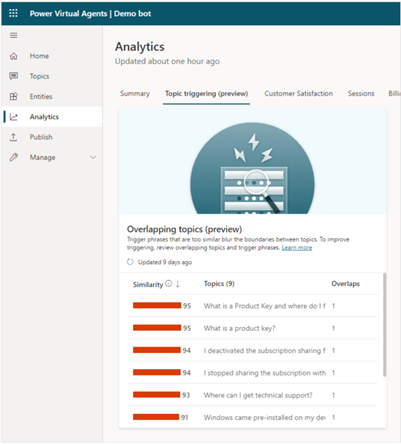

# Topic confusion analysis 
Using semantically similar trigger phrases for two different topics can lead to confusion as the bot may not know which topic to open and will need to ask follow-up questions to the bot user. This often results in the "escalation" to an agent and spikes the “deflection rate” of the bot. 
A topic confusion analysis exercise will help you improve topic triggering accuracy by finding overlaps between topics. Resolving topic overlaps can help reduce the need for the bot to ask clarifying questions before triggering a topic.
Identifying semantically similar trigger phrases can also help you determine if you have topics that themselves are similar and could be consolidated to simplify the bot authoring process or edited to make the topics more distinct with high triggering accuracy which in turn improves the deflection rate.
You can identify the list of topics causing confusion during triggering, by enabling the “AI capabilities” in PVA for “topic overlap detection”. This standard capability will help you to identify the trigger phrases causing confusion and remove duplicates, and consolidate similar topics.

