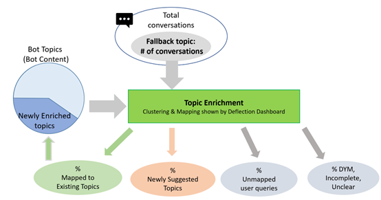
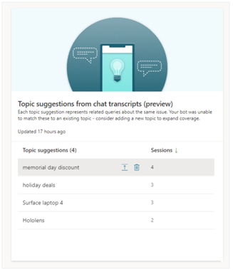

# Topic enrichment analysis  

[!INCLUDE[pva-rebrand](../includes/pva-rebrand.md)]

## Analyzing the Fallback topic conversations

Microsoft Copilot Studio has a built-in [Fallback](/power-virtual-agents/preview/authoring-system-topics#fallback) system topic that is set to trigger when the NLU model isn't able to find a matching topic for a given user query.

If most Fallback topic conversations are escalated to a human agent – that is, not deflected – there's an opportunity to improve the deflection by addressing the usage patterns of the user that triggers fallback consistently.

> [!TIP]
> Topic enrichment is an offline data analysis exercise, focusing on repurposing such user queries that triggered the Fallback topic into triggering relevant topics in Microsoft Copilot Studio.

The analyzed user queries from the Fallback topic typically fall into these buckets:

1. User queries that are expected to trigger existing topics, but are somehow missed by the NLU of the bot.
2. User queries that can be converted to newly suggested topics.
3. Unmapped user queries that aren't relevant to any existing or new topics.
4. Other categories, including user queries that triggered a [Multiple Topics Matched](/power-virtual-agents/preview/authoring-system-topics#multiple-topics-matched) (also known as "did you mean") topic followed by Fallback, unclear user queries that hit Fallback, and user queries from incomplete conversations that led to Fallback.

Of the four categories, the first and the second are immediately actionable. Based on the findings from these categories, you can enrich the topics by adding more trigger phrases for existing topics or creating new topics.

 

## Topic enrichment through out-of-the-box analytics

Microsoft Copilot Studio provides advanced AI capabilities out-of-the-box, to identify a list of suggested new topics, by enabling the [advanced AI features](/power-virtual-agents/advanced-ai-features) for [topic suggestion from chat transcripts](/power-virtual-agents/advanced-ai-features#topic-suggestion-from-chat-transcripts-preview), when the author doesn't want to enable the Fallback topic.

This information can also be used to create new topics to improve deflection rate.

> [!div class="nextstepaction"]
> [Topic confusion analysis](deflection-topic-confusion-analysis.md)
