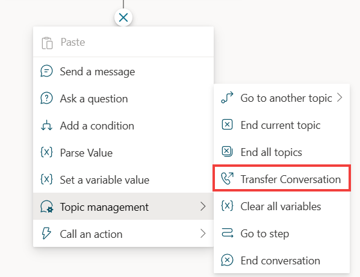

# Topic escalation analysis

[!INCLUDE[pva-rebrand](../includes/pva-rebrand.md)]

  
Escalation is the conversation flow during which the bot couldn’t handle the conversation and escalated to a human agent. When a chatbot is able to answer the user query without having to escalate to a human agent, it's considered a deflection. The ideal goal is to increase the deflection rate of a bot by reducing the number of escalations.

Microsoft Copilot Studio has multiple ways to handle escalation:

- The direct way of initiating an escalation to human agent is through the Escalate system topic. This system topic is triggered when the bot is no longer able to address the customer request and needs to escalate to a human agent. Through the Escalate topic, one can enable the bot to transfer the conversation to an agent service desk tool like Dynamics 365 Omnichannel for Customer Service for the live agent transfer or an asynchronous support experience like creating a ticket, scheduling a call back, and so on.
- Another way of triggering this escalation is through the Transfer Conversation node in the authoring canvas.

  

## Escalation types

Microsoft Copilot Studio has two types of escalations:

1. **Direct escalation**: in this case, the user comes to the bot and directly wants to talk to a human agent. These kinds of escalations can't be avoided as the intent of the end-user is to trigger the Escalate topic directly.
Examples end-user queries:
>
> - "_can I talk to someone_"
> - "_talk to a live agent_"
> - "_speak with agent_"
> - "_talk to a representative_"

2. **Indirect escalation**: in this case, the user gets escalated to an agent during the conversation.

These can be grouped in _expected_ vs _unexpected_ escalations.

_Expected_ escalations happen when the topic is designed to escalate at some point during the conversation, or the user chooses to escalate since the bot didn't answer their query while _unexpected_ escalation can happen when the bot errors out due to other issues.

## Topic escalation analysis

### STEP 1: Monitor and review topics performance

Identifying and optimizing escalation rate drivers can be done through the [built-in analytics](/power-virtual-agents/preview/analytics-overview) or through [custom analytics](./custom-analytics-strategy.md).

#### Built-in analytics

All the bot sessions that led to an escalation or transfer to an agent are captured from beginning to end at the topic level.
The escalation drivers in this are the bot topics.

The analytics dashboard has a section for "_Escalation Rate Drivers_", which gives the details on which bot topics were escalated to human agents most of the time and why. This information is available in the numerical point of view and derived from the chat transcripts.

For example, in the following screenshot, under the **Escalation Rate Drivers** section, the **Returns, Exchanges…** topic has a **Rate** value of 75%. This means that 75% of all the sessions that triggered the **Returns, Exchanges…** topic were escalated to a human agent.
Since the bot couldn’t solve the issue for the user, 75% of the times when user asked about returns, the bot had to escalate to a human agent. Now the bot author can improve the **Returns, Exchanges...** topic to reduce the number of escalations happening through this topic.

The chart also shows the **impact** as a red or blue bar. The escalation rate impact score is the overall escalation rate including the topic minus the overall escalation rate excluding the topic. In short, **impact** helps you understand what this topic is contributing to the overall escalation rate. If the impact is high, then that is the topic you have to focus on because if you improve that topic, the potential impact it has on escalation will also improve.

A red bar indicates that the topic's escalation rate is greater than the average escalation rate, resulting in a negative impact on overall escalation rate. A blue bar indicates that the escalation rate is smaller, resulting in a positive impact on overall escalation rate performance. Lowering the escalation rate for the topics in red has the greatest impact on improving the overall escalation rate (the impact score isn't represented as a number but as a bar chart).

  
#### Custom analytics
  
You can also build on your own custom analytics on top of the conversation transcripts data. Microsoft provides a [sample template report](https://aka.ms/PVAAnalytics) that can be reused or extended to identify the top escalation driver topics and add custom details specific to your business and context. For example, if you need the number of escalated sessions per topic.  

### STEP 2: Select the top Escalation topics

The general guidance is to target the top 5-10 topics under **Escalation rate drivers** to start with, for deflection rate optimization. On a ball park estimate, if you improve the rate of escalation by 10% for each of the top five topics, you can improve the overall deflection by 1% for the chatbot.

### STEP 3: Review conversations for selected topics

Analyzing the conversation transcripts for the top escalation topics can provide more insights into reasons for escalation. Conversation transcripts capture the turn by turn, as "_user says_" and "_bot says_". It also captures the topic name that was triggered and the session outcome (for example, Resolved, Escalated etc.).

Now, you can filter these sessions based on outcome for **Top escalated topics** and review a few sample conversations to see what caused the escalation. This helps you identify the pattern that is causing the escalation. This exercise can be repeated in periodic cadence to keep improving the deflection rate and reducing the escalation rates.

Below is the step-by-step guidance you can use for dissecting the chat transcripts and coming up with the right recommendations for improving the topic performance:

1. Take one of the top five topics for which you want to make improvements to reduce escalation.
2. Filter the transcripts and sort by the session outcome for **Escalation**.
3. Select the most recent sample set of conversation transcripts (for example, 10 sessions). The size of the sample set depends on how much accuracy you're looking for. For a quick analysis you can start with 10 sessions.
4. Read through each of the sessions and identify the various repeated dialog paths that are emerging for that topic related conversation.
5. List out the dialog paths identified for each session and group them as per the dialog path.
6. For each dialog path group, come up with a recommendation for improvement.
7. Implement the recommendations in the bot topics and observe the change in the escalation rate and deflection.

Applying the above approach for the **Check Order Status** topic example described in the next section would look like this:

#### Topic description

**Check Order Status** is supposed to provide order and shipping information for the user.

#### Observation from transcripts

After reviewing multiple conversation transcripts for this topic that ended with escalation, you can find there are multiple dialog paths emerging that is leading the user to escalate to an agent even if the bot provided the order information as designed.

There could be a dialog path #1 where the bot provides the order info when the user asks about missing shipment. There could also be another dialog path #2 where user is looking for the status of multiple orders while the bot is currently providing a status for only one order at a time. The recommendation for dialog path #1 could be adding a new topic exclusively addressing the **Missing Order** scenario, while the recommendation for dialog path #2 could be to update the self-service action to provide status for multiple orders instead of just one.

#### Conversation transcript review summary

- Sample set size: analyze sample conversations for escalated sessions from the downloaded transcripts. All triggered the correct topic. All got escalated at the end.
- Expected dialog path: Go to **OrderInfo** action and provide the order status to the end-user.

#### New dialog paths identified by reviewing transcripts

- Dialog path 1: **OrderInfo** replies with **order info adaptive card** but the user query is related to missing package, so the user decides to escalate (7 out of 10 sessions).
- Dialog path 2: **OrderInfo** action replies with: "_your order contains multiple shipments_", but doesn't show shipping information for all the orders, so the user decides to escalate (2 out of 10 sessions).
- Dialog path 3: Other (order number mismatch), user was unaware that they were entering an incorrect order number, so the user decides to escalate  (1 out of 10 sessions).

#### Recommendations for the dialog path groups

- Path 1: Add a new topic for handling missing order.
- Path 2: Enhance the **OrderInfo** action to support providing multiple order shipping information.
- Path 3: Enhance the **OrderInfo** action to validate the order ID format and provide error message for incorrect order IDs.

### STEP 4: Make targeted improvements in selected topics

Based on the outcome of the review of conversation transcripts, you can now make targeted improvements in those selected topics.

Some of the techniques you can apply for reducing topic level escalation rates include adding self-serve capabilities so the user doesn't have to rely on human agents for an action (for example, checking shipping status), improve the triggering performance to make sure the right topics are presented to the user instead of having to escalate to a human agent (this includes adding missing trigger phrases and updating existing trigger phrases).

> [!div class="nextstepaction"]
> [Topic enrichment analysis](deflection-topic-enrichment-analysis.md)
