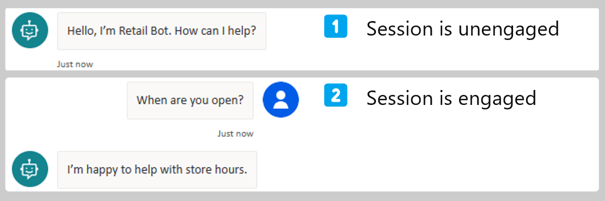

# Measuring chatbot engagement

Tracking conversation engagement rates and outcomes are crucial to measure the chatbot performance metrics and spot areas for improvements.

## Understanding conversations and analytics sessions

 **A single conversation** between an end-user and a Power Virtual Agents chatbot can generate **one or multiple analytics sessions**, typically happening when a user has new questions after an initial topic conversation path completed.

> [!NOTE]
> Analytics sessions and [billed sessions](/power-virtual-agents/preview/analytics-billed-sessions) are distinct concepts.

## Engaged and unengaged analytics sessions

Analytics sessions are either **unengaged** (default) or **engaged**.

This notion is used in the Power Virtual Agents [analytics dashboard](power-virtual-agents/preview/analytics-summary).

> [!TIP]
> Analytics session engagement is also tracked in [conversation transcript records in Dataverse](../analytics-sessions-transcripts.md), if you have a [custom analytics strategy](./custom-analytics-strategy.md).
  In a conversation transcript record `content`, the engagement status of a session (either `unengaged` or `engaged`) is available as part of the `SessionInfo` activity, in the `value` `type`.

> [!div class="checklist"]
>
> - A session starts when a user interacts with the chatbot or when the chatbot sends a proactive message to the user.
> - The analytics session begins in an **unengaged** state.
> - An analytics session becomes **engaged** when either entering a **custom topic** or the **Escalate** topic.
> - The last custom topic triggered—or the first system topic triggered, if no custom topics were triggered—is associated with the analytics session.

 

> [!NOTE]
> Having a chatbot that [proactively starts a conversation](/power-virtual-agents/configure-bot-greeting) or that is placed on a website can greatly increase the session total and the number of unengaged sessions.

> [!div class="nextstepaction"]
> [Measuring chatbot outcomes](measuring-outcomes.md)
