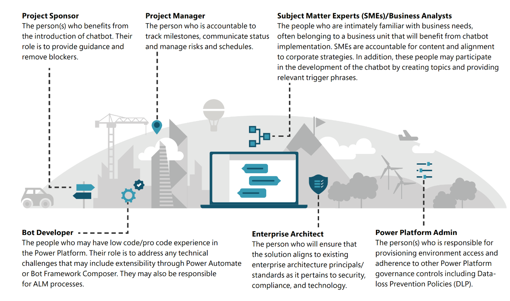

# Building your team

Once you have your usecases, now its time to start formulating your team and making sure they are trained. 
Delivering a large bot is like any complex technology project – there are several stakeholders involved with different 
parts to play within your organization and outside. This section outlines the roles and responsibilities to help align 
everyone in the project. 
Internal Team 
Most customers treat a Chatbot implementation like any other project. It usually consists of the following roles:

## External Team 

**3rd party Delivery partner (where applicable)** 

This is typically a System Integrator that leads various activities: 
    
1. Project management including setting up workstreams and reviews with customer
    
2. Chatbot development – frequently includes developers/analysts with experience of Power Virtual Agents,chatbots and related technologies
    
3. Training
    
4. Administration/governance setup
    
5. Hackathons and other nurture events to drive adoption and knowledge sharing

## Microsoft 

**Microsoft delivers the Power Virtual Agents service:**  
1. **Account team - Account Executive/Account Technical Strategist/Technical Specialist/ Customer Success Manager**
    
    a. Alignment on success/ goals with customer

    b. Ultimate advocate for the customer within Microsoft

    c. Leads business discussions and escalations

    d. Attend all the rhythm of business calls until goals are met
    
2. **Product group**
    a. Develops product features based on customer needs

    b. Customer Advisory Team (CAT) – engages with select customers providing guidance on how to adopt and deploy technology including architecture reviews and monthly executive syncs
    
3. **Microsoft Support** 
    
    a. Works with customers to solve issues with Microsoft software. Aims to solve issues directly but can also bring in engineering resources for challenging issues

## Training your team 

For organizations that are new to building PVA chatbots, it is likely there are some training needs required for the 
customer to be familiar with the technology. The following resources can be leveraged to assist customers with 
building PVA chatbots, [aka.ms/LearnPVA.](https://powervirtualagents.microsoft.com/blog/new-years-resolution-build-powerful-conversational-bots/)

Training can be delivered through various channels. These channels include Technical Sales Professionals (TSPs), 
Microsoft Technology Center (MTC) Architects and Microsoft certified partners. In exceptional circumstances, 
engineering resources like Power CAT may be able to facilitate these sessions. 

| **PVA in a Day** |
|---|
| **[PVA in a Day](https://powervirtualagents.microsoft.com/blog/power-virtual-agents-in-a-day-update-new-canvas-new-content/) is an instructor led, hands-on course that will familiarize chatbot makers with Power Virtual Agents. The content includes:** 
- Build your first chatbot
- Topic suggestions
- Improve your chatbot with entitiesvariables and topic redirect 
- Integrate with prebuilt Power Automate flows
- Build Power Automate flows for your chatbot 
- Authentication
- Export and import bots using solutions
- Create a chatbot in Microsoft Teams
- Topic design
- Extend your bot using Bot Framework Composer (Optional) 
- Add a telephone number to your bot using AudioCodes (Optional)

| **PVA Architecture Series** |
|---|
**The [PVA Architecture Series](https://www.youtube.com/playlist?list=PLi9EhCY4z99Xrdvy3Ya8wx-8KzsOpMj0S) is another resource that can be consumed on-demand. This content focuses on considerations that customers should account for when embarking on a chatbot project. The content includes:** |
- Planning your first chatbot
- Building your first chatbot
- Extending your PVA chatbot with the Power Platform 
- Extending your PVA chatbot with the Bot Framework (not sure)
- Advanced topics
- Security and Governance.
   

