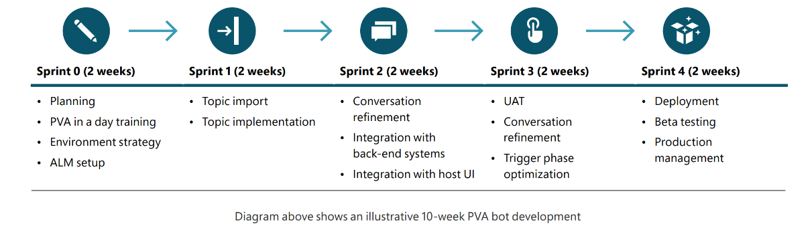
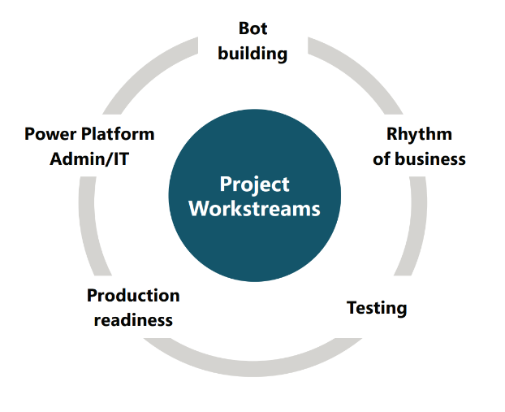

# Project Planning

**Sample Project Overview and Timelines**

Chatbot projects based on Power Virtual Agents, like any technology, can have wildly different timelines and 
specifications depending on the needs of the particular use case and organization. However, one advantage that low 
code technologies can bring, is rapid time to market as illustrated in the 10-week timeline above. The advantages in 
choosing a rapid delivery timeline as your initial project phase include:
- Developing a minimum viable product to accelerate customer adoption
- Customer feedback is generated very quickly (see Engage your flywheel section) to provide insights on what can be improved
- Return value back to your organization in an accelerated manner

Whether this is right for your use case will depend on organizational need, support, and the ability to align the necessary workstreams.

**Project Workstreams**

Setting up an adoption platform requires several workstreams that can execute in parallel, each with their own goals, timelines, and owners. These are as follows, with summary callouts on responsibilities: 
 **Bot building**
1. This workstream focuses on building out the related content for the chatbot use case.
1. Content creation/development tasks 
Please refer to the Action Development section for

