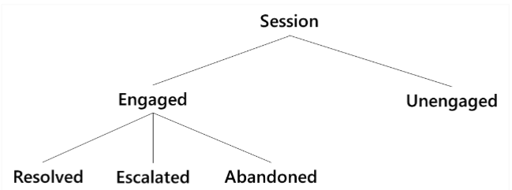

# Use chatbot analytics to drive continuous improvement

:::image type="content" source="media/topics/BestPractices.png" alt-text="best practice image":::

One of the most important best practices is to continuously invest in your chatbot throughout its life. If you don’t, the chatbot will become obsolete. Use Power Virtual Agents analytics to monitor your chatbot’s strengths and weaknesses. You must first understand what the options are for each session, such as each interaction your chatbot has with a user. Figure 7 summarizes what can happen.

