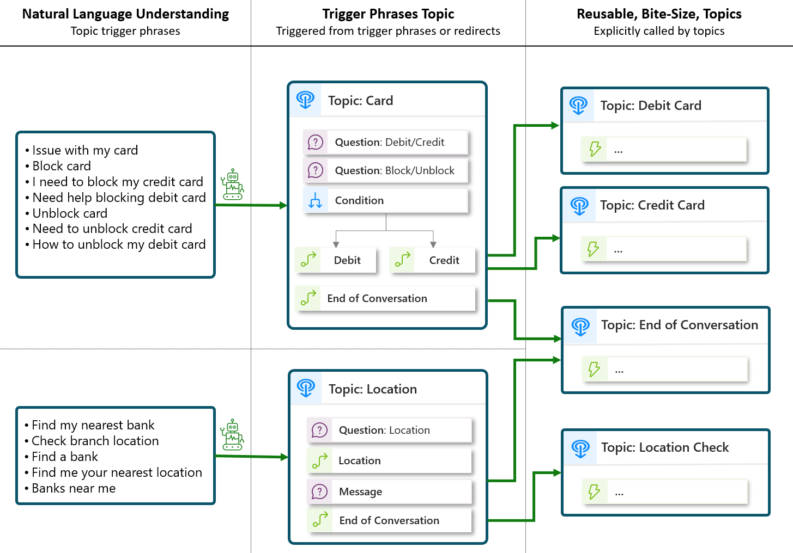

# Topic authoring best practices in Microsoft Copilot Studio

[!INCLUDE[pva-rebrand](../includes/pva-rebrand.md)]

## Create and organize topics in a way that's manageable and maintainable for your context

Microsoft Copilot Studio offers much flexibility when it comes to topic management. While there's no _one size fits all_, it's a good practice to keep in mind the different ways that topics can be triggered:
> [!div class="checklist"]
>
> - **Topics can trigger based on the user utterance** and the natural language understanding (NLU) model.  
>   These topics can almost be seen as your **entry points topics**.  
>   If you have trigger phrases that overlap multiple topics, it's good to have a catch-all topic (or _disambiguation topic_) and then redirect to other topics through slot filling and clarifying questions.  
>   Thanks to entity extraction, clarifying questions can be skipped and the conversation will directly flow to the appropriate topic, without further input from the user.  
>  
> - **Topics can trigger when called from a redirect action**.  
>   These topics can contain conversation and logic nodes, can be called by multiple topics, and can have input and output variables. They're ideally **reusable, bite-size, topics**.  
>  
> - **A topic can also be both**.  
>   For example, topics triggered through intent recognition or by an explicit redirect.
>    
>  - **Topics can be triggered by other events**.  
>    For example, custom events, inactivity, and so on.  

See [the full list of topic triggers](/power-virtual-agents/authoring-triggers) for more information.

> [!TIP]
> In the following example, trigger phrases are associated to two main topics, that then break down their logic into multiple topics that are called with redirect actions.
>  
> Some topics can be called by multiple other topics: that's typically the case with the End Of Conversation topic.
>  
> Thanks to slot filling and entity extraction, if a user says "_I need to unblock my credit card_", the `Card` topic will get triggered and both `Debit/Credit` and `Block/Unblock` questions will be skipped, as the `CardType` and `OperationType` will be deduced from the trigger phrase. That way, the appropriate `Credit Card` child topic will automatically be called, without the user providing any additional input.

## Create bite-size topics

Large topics can be challenging to maintain and update. It's a good idea to break down your chatbot logic whenever possible, especially if parts of your bot conversation logic can be shared by multiple topics.
Topics don’t need to all have trigger phrases, as topics can redirect to other topics and pass variable information back and forth.

> [!TIP]
> It’s often more manageable to create many bite-size topics rather than a few large topics. Taking this approach also helps making triggering more effective, by clearly mapping trigger phrases to the specific topics that address those areas.

The number of topics is a conversational design preference and decision. It either results in having a few bigger topics (if there's joining) or having smaller topics (if there's splitting).

> [!TIP]
> For intents that are more complex to recognize (for example, for generic words, such as "_request_" or "_issue_", as these could be about different things), then splitting the topics might be a better option, with adequate trigger phrases.

## Create reusable topics

Whenever conversation messages or logic nodes are shared by multiple topics, it's a good idea to group them in a new topic instead of duplicating their content.
That way, a single update to that topic reflects on all the topics redirecting to it.

> [!TIP]
> If you call the same Power Automate cloud flows from multiple Microsoft Copilot Studio topics with the same or similar before and after nodes, it's a good idea to group them in a dedicated topic.

## Avoid topic overlap

### Monitor and remove ambiguity between topics

When topics are triggered with NLU, it's important to avoid overlap issues. Overlap issues typically reflect through a large number of [multiple topics matched](/power-virtual-agents/preview/authoring-system-topics#multiple-topics-matched) topics (also known as "did you mean").

You can avoid these issues by reducing the overlap in intent meaning between the trigger phrases of different topics.

> [!TIP]
> For topics triggered with trigger phrases, you should:
>
> - Compare the trigger phrases across your topics and remove ambiguous pairs.
> - Try to not use the same words in different topics trigger phrases.
>
> There are multiple ways to monitor topic overlap:
>
> - Analyze the user utterances that trigger a "did you mean" topic, as it’s a key indicator that you have overlap
> - Microsoft Copilot Studio offers a [topic overlap detection](/power-virtual-agents/advanced-ai-features#topic-overlap-detection) feature, that lets bot authors discover overlapping topics to resolve accordingly (deleting/moving trigger phrases between topics).

### Create a disambiguation topic

When multiple topics have trigger phrases that are too close, you can avoid topic overlap by creating a disambiguation topic.

> [!TIP]
> To continue on the previous example, to address with certainty scenarios such as "_unblock credit card_" or "_unblock debit card_", where users might just say "_unblock card_" and the NLU model doesn’t know what specific topic and process to trigger, you can call a generic `Card` disambiguation topic, use an entity slot filling question for `CardType`, and launch the appropriate topic accordingly.

## Use entities to reduce the number of topics

You should avoid duplicating logic when the variation could be stored in a variable. For example, instead of creating similar topics, such as:

- Order Pizzas
- Order Burgers
- Order Drinks

You could create:

- One topic for `Order`
- One entity for `FoodType`, with `Pizzas`, `Burgers`, and `Drinks` as values.

> [!div class="nextstepaction"]
> [Leverage the Fallback topic](fallback-topic.md)
