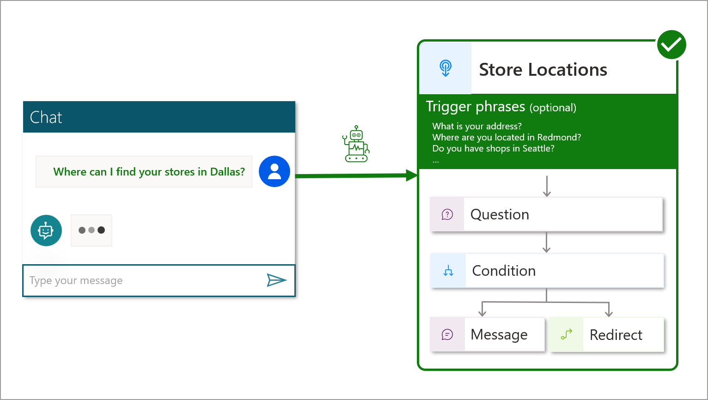
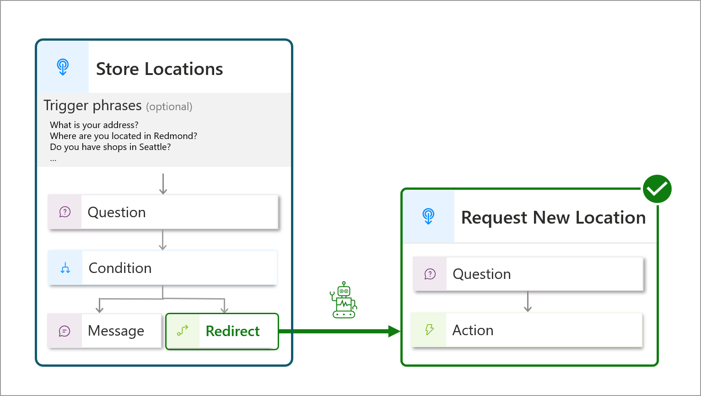

# Triggering topics

There are two main ways to trigger a topic:
> [!div class="checklist"]
>
> - **Based on the user query** (also known as _utterance_).   Topic triggering based on what an end-user writes or says is also referred to as _intent recognition_.   The AI uses its natural language understanding (NLU) model to parse the end-user utterance and finds the most relevant topic based on the configured trigger phrases that match the intent.   If multiple topics are found, the [Multiple Topics Matched](/power-virtual-agents/preview/authoring-system-topics#multiple-topics-matched) topic is triggered, so the that the user can select the appropriate topic from a list.
> - **By redirecting** to it from another topic, with a redirect node.

## Triggering topics based on a user query
>
> [!div class="checklist"]
>
> - Example: The "_Store Locations_" topic gets triggered based on the user utterance and the matching **trigger phrases**.

> [!TIP]
> Review [trigger phrases best practices](./trigger-phrases-best-practices.md).

## Redirecting to a topic
>
> [!div class="checklist"]
>
> - Example: the "_Request New Location_" topic gets triggered when it is explicitly called from an existing topic, with a **redirect** node.

> [!div class="nextstepaction"]
> [Define chatbot topics](defining-chatbot-topics.md)
