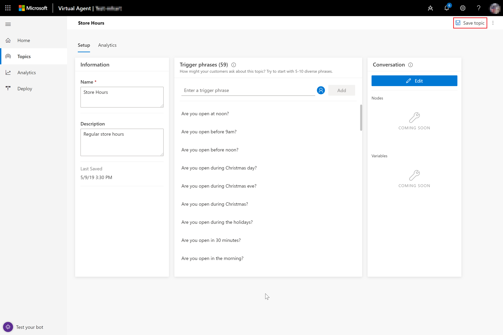
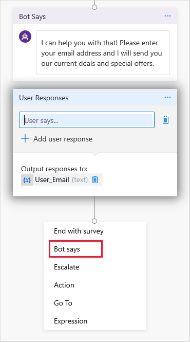
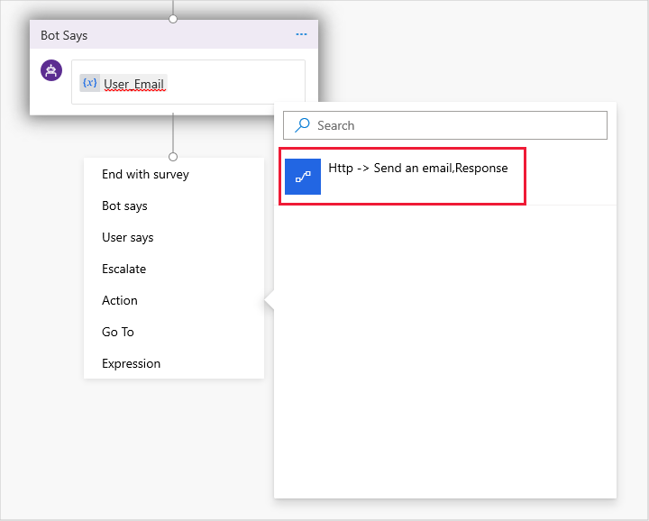
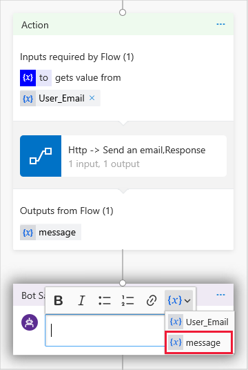
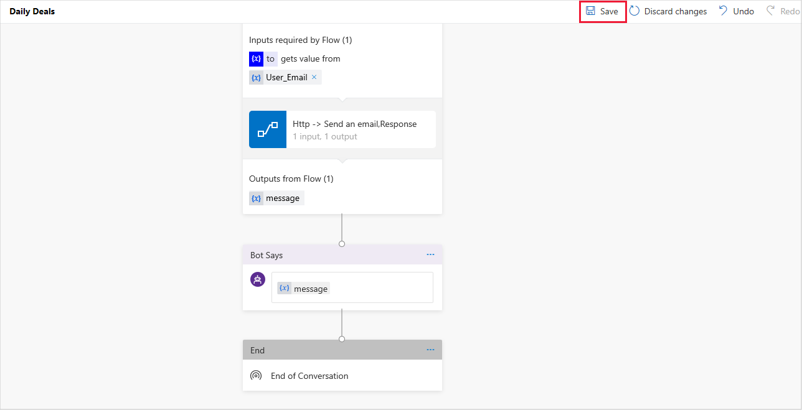
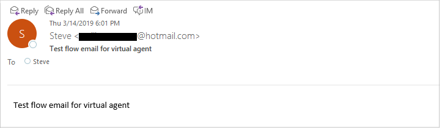

# Add actions to your bot using Power Automate

[!INCLUDE [cc-beta-prerelease-disclaimer](includes/cc-beta-prerelease-disclaimer.md)]

You can enable your bot to perform an action by invoking a flow. Use a flow that shares the same Common Data Service environment as the bot. First, create a Microsoft PowerApps environment, and then create your flow. Once you have created the flow, you can create a bot that uses an action to invoke the flow.

## To create a PowerApps environment

1. If you have not already created a PowerApps environment, create one. You must select an environment when you create your bot.

    For more information, see [Creating a PowerApps environment](getting-started-new-environment.md).

2. If you do not already have a Power Automate environment, sign in to the admin portal by entering [https://flow.microsoft.com]( https://flow.microsoft.com) in your browser. Select the icon for your account in the upper-right corner of the screen, and then select your PowerApps environment from the list.

3. Verify that the PowerApps environment database was created correctly. Select **Solutions** in the left pane to display the **Solutions** page, and then verify that the Solutions list includes **Common Data Service Default Solution**.

   
   
   > [!NOTE]
   > Since creating a new environment can take some time, the new solution might not immediately appear in the list. Sign out and check again in 30 to 60 minutes.

   Once you have created your environment, return to the Power Automate portal, and switch to the newly created environment to create your flow.

## To create a flow

1. Select **Common Data Service Default Solution** to open the solution.

2. On the **Common Data Service Default Solution** page, select **New**, and then select **Flow** from the list.

   

    You can create a variety of flows for your solution. For example, you could create a simple flow that takes an email address as an input parameter, sends an email message to that address, and returns a message that the email was successfully sent to a bot as output.

3. Select a trigger for your flow. A Power Virtual Agents bot can only invoke flows that have HTTP request interfaces. Enter **HTTP** in the search box, and select **When a HTTP request is received** to create a flow with an HTTP request trigger.

   

4. Add the following JSON code in the **Request Body JSON Schema** box. The code specifies that the flow expects an email address to receive one string input parameter. Then select **New step**.

    ``` JSON
    {  
        "type": "object",  
        "properties": {  
            "to": {  
                "type": "string"  
            }  
        }  
    }
    ```

   

5. Specify that an email message should be sent to the email address specified in the input. Enter **Outlook** in the search box, and select **Send an email** to create a connection to Microsoft Outlook. Follow the directions to specify your Outlook credentials and grant approval to access your account.

   

    Power Automate displays the **Send an email** window.

6. To use dynamic content as the recipient address, place your cursor in the **To** field to display the **Dynamic content** tab, and then select **See more**.

   

    To use the Power Automate input variable **to** as the recipient address, select **to**.

   

7. Add text to the **Subject** and **Body** fields of the message, and then select **New step**.

   

8. Use an HTTP Response to return a variable to the bot. In the **Choose an action** window, enter **Response** in the search box, and then select the **Response** action.

   

9. Specify the following information for the **Response** action, and then select **Show advanced options** to display the **Response Body JSON Schema** field.

   

    Add the following JSON code to the **Response Body JSON Schema** field, and then select **Save**.

    ``` JSON
    {  
        "type": "object",  
        "properties": {  
            "message": {  
                "type": "string"  
            }  
        }  
    }
    ```

   

## To create a bot that invokes a flow

1. Go to [https://va.ai.dynamics.com](https://va.ai.dynamics.com) in your browser to open the Power Virtual Agents environment, and then create a new bot in the same environment as your flow. To create a new bot, select the **New Bot** icon on the title bar. Then select **New bot**.

   

    For more information, see [Creating a bot](getting-started-create-bot.md).

2. On the **Create a new bot** screen, specify a template, a unique name for your bot, and the environment where your flow was created. Then select **Create**.

3. Once you have created your bot, create a topic that uses the flow. Select **Topics** in the left pane to open the **Topics** page, and then select **New topic**.

   

    For more information about creating a topic, see [Creating custom topics for your bot](getting-started-create-topics.md).

4. Specify a name, description, and trigger phrases for the topic. A trigger phrase is a phrase that a customer enters in the chat window to start a conversation with the bot. You can include punctuation in a trigger phrase, but it is best to use short phrases rather than long sentences.

    For example, for a *Daily Deals* topic, you could specify the following trigger phrases:

    - daily deals
    - deal of the day
    - current deals
    - today’s deals
    - current offers
    - today’s specials
    - current specials
    - special offers
    - today’s coupons
    - current coupons
    - today’s offers

    Then select **Save topic** to save the topic.

   

5. Once you have created the topic, you can create a conversation path that uses your flow. Select **Edit** to open the conversation editor.

   

    In the conversation editor, enter a bot response in the **Bot Says** node, and then select **User Says** to display the **User Responses** node.

   

    In the **User Responses** node, select **Add Variable** to display the **Properties** pane, where you can create a variable to save a customer's email address.

   

    In the **Properties** pane, select **Create variable** to display the **Create new variable** window.

   

    For more information on creating variables, see [Work with variables](how-to-variables.md).

6. Specify a variable name and type. For example, you could create a text variable named **User_Email**.  Select **Done** to save the variable.

   

    Power Virtual Agents adds the variable to the **User Responses** node, and creates an **Expression** node. You can delete this node if you do not want to do any validation.

   

7. Select **Bot says** to add another node with text confirming that the email will be sent.

   

    To display the specified email address in the user's conversation with the bot, place your cursor in the **Bot Says** node to display the pop-up menu. Then select the variable you created from the variable drop-down list.

   

8. To send a message to the specified email address in the user's conversation with the bot, select **Action** to display the list of available actions, and then select the flow action you created.

    

    > [!NOTE]
    > The flows and bot must be created in the same environment. Otherwise, the flow action does not appear in the list of available actions.

    Power Virtual Agents creates an **Action** node indicating that the action has one required input and one output. Select the variable you created from the drop-down list to pass it as input.

   

9. Add another **Bot Says** node to display the message from the flow to the customer. Place your cursor in the node to display the pop-up menu, and then select the **message** variable from the variable drop-down list.

   

10. Select **End with survey** to end your conversation with a survey, and then select **Save** to save the topic.

   

## To test the flow

1. In the **Test bot** pane, select **Start over with latest conversation**. Then specify a trigger phrase for the topic that contains the flow.

2. Enter your email address at the prompt.

    The bot displays the email address to the customer to confirm that it will send a message to that address and stores the message specified in the flow in the **(x) message** variable.

    The flow then sends the message to the customer.

   
