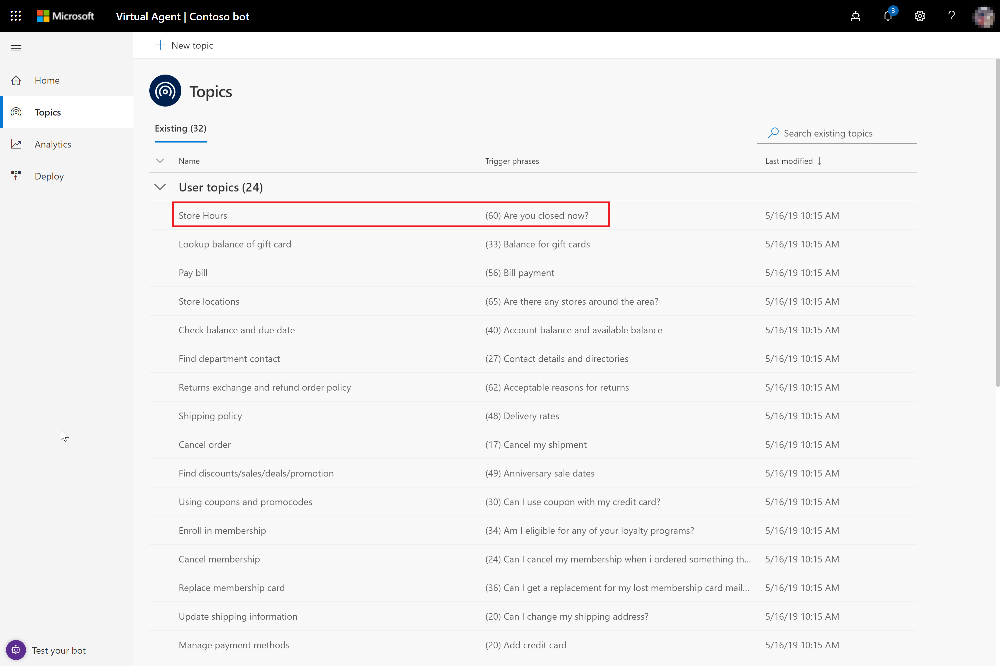

# Work with built-in topics

[!INCLUDE [cc-beta-prerelease-disclaimer](includes/cc-beta-prerelease-disclaimer.md)]

To help you create your custom bot, Power Virtual Agents includes built-in topics to be used as building blocks for developing the bot's conversation path. The built-in topics can give you a head start on developing your bot. 

For example, there are several system topics that you need to handle some key scenarios within the bot. These include:

* A customer greeting.
* Escalation to a live agent.
* The end of the conversation.
* A confirmed success.
* A confirmed failure.

There are several user topics that come with built-in content to help you visualize and test a conversation path related to a specific customer question. These are topics related to:

* Looking up store hours.
* Finding store locations.
* Paying a bill.
* Canceling an order.

For more information about creating your bot, see [Creating a bot](getting-started-create-bot.md).

## Using built-in topics as a model for building your conversation path

A good starting point for creating a bot and designing its conversation path is to view the built-in topics that come with Power Virtual Agents.

For example, to see how you might build a conversation path for helping customers find specific store information, view the Store Hours topic that is included.

To view the topic's conversation path, select the Store Hours topic in the Topics list to open the topic, and then select **Edit** to open the conversation editor.

You can view the trigger phrases and conversation-path design in the Store Hours topic and use similar techniques in your own topics.

For more information about creating topics, see [Creating custom topics for your bot](getting-started-create-topics.md).
